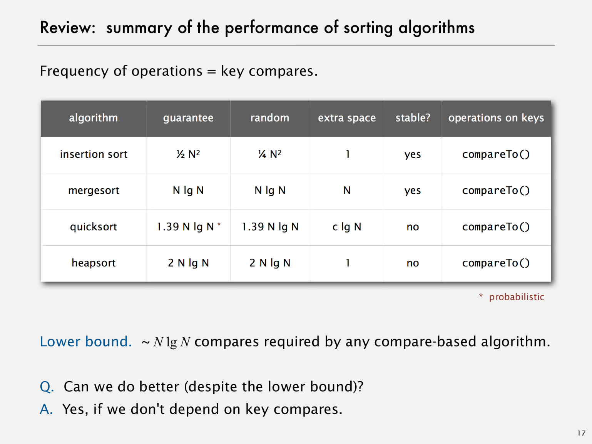

# Intro

Created: 2017-09-07 17:24:31 +0500

Modified: 2021-06-06 16:47:21 +0500

---

Searching

a.  Sequential Search / Linear Search

b.  Binary Search

c.  Ternary Search

<https://www.hackerearth.com/practice/algorithms/searching/ternary-search/tutorial

d.  Hash Table

Internal Sorts -
-   Insertion sort, selection sort, bubble sort, shaker sort
-   Quicksort, mergesort, heapsort, samplesort, shellsort
-   Solitaire sort, red-black sort, splay sort, Yaroslavskiy sort, psort

External sort -
-   Poly-phase mergesort, cascade-merge, oscillating sort

String / radix sorts - Distribution, MSD, LSD, 3-way string quicksort

Parallel sort -
-   Bitonic sort, Batcher even-odd sort
-   Smooth sort, cube sort, column sort
-   GPUsort

Type of algorithm based on sorting technique-
-   **Compare based sorting algorithms (min ~N lg N, cannot make less than these)**
-   **Key-index based sorting algorithms**

Goal - Sort any type of data

Que - How can sort() know how to compare data of type Double, String, and java.io.File without any information about the type of an item's key?

Sol - **Callback = reference to executable code**
-   Client passes array of objects to sort() function.
-   The sort() function calls back object's compareTo() method as needed.

**Implementing Callbacks -**
-   Java - Interfaces (Comparable Interface)
-   C - Function pointers
-   C++ - Class-type functions
-   C# - delegates
-   Python, Perl, ML (Meta Language), JavaScript - first-class functions()

**Rules -**
-   **Total Order**
-   

**Stability -**
-   A Stable sort preserves the relative order of items with equal keys
-   **Never move equal items pass each other**
-   Checking if there are long distance exchanges that can make equal keys pass other equal keys
-   Insertion sort and Merge sort are stable
-   Selection sort and shell sort are not stable

**Attributes that influence decision of sorting algorithms -**
-   In Place
-   Stable
-   Parallel
-   Deterministic
-   Keys all distinct
-   Multiple key types
-   Linked list or arrays
-   Large or small items
-   Is your array randomly ordered
-   Need guaranteed performance
-   Number of exchanges
-   Online Algorithms -> Items coming one at a time

**What are the key advantages of Insertion Sort, Quicksort, Heapsort and Mergesort? Discuss best, average, and worst case time and memory complexity.**

**Insertion sort**has an average and worst runtime of O(n^2), and a best runtime of O(n). It doesn't need any extra buffer, so space complexity is O(1). It is efficient at sorting extremely short arrays due to a very low constant factor in its complexity. It is also extremely good at sorting arrays that are already "almost" sorted. A common use is for re-sorting arrays that have had some small updates to their elements.

The other three algorithms have a best and average runtime complexity of O(n log n).HeapsortandMergesortmaintain that complexity even in worst case scenarios, while Quicksort has worst case performance of O(n^2).

**Quicksort**is sensitive to the data provided. Without usage of random pivots, it uses O(n^2) time for sorting a full sorted array. But by swapping random unsorted elements with the first element, and sorting afterwards, the algorithm becomes less sensitive to data would otherwise cause worst-case behavior (e.g. already sorted arrays). Even though it doesn't have lower complexity thanHeapsortorMerge sort, it has a very low constant factor to its execution speed, which generally gives it a speed advantage when working with lots of random data.

**Heapsort**has reliable time complexity and doesn't require any extra buffer space. As a result, it is useful in software that requires reliable speed over optimal average runtime, and/or has limited memory to operate with the data. Thus, systems with real time requirements and memory constraints benefit the most from this algorithm.

**Merge sort**has a much smaller constant factor than Heapsort, but requires O(n) buffer space to store intermediate data, which is very expensive. Its main selling point is that it is stable, as compared to Heapsort which isn't. In addition, its implementation is very parallelizable.

