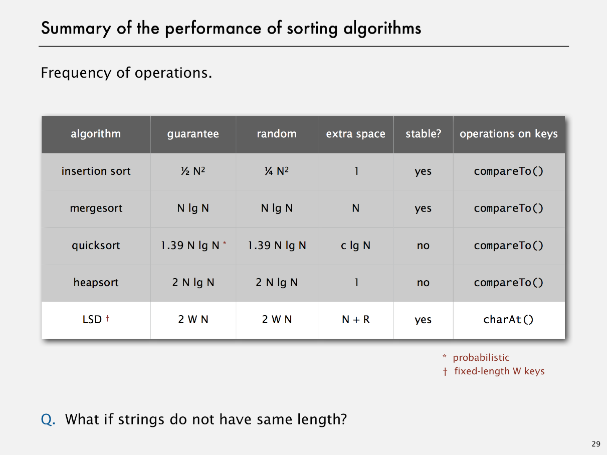
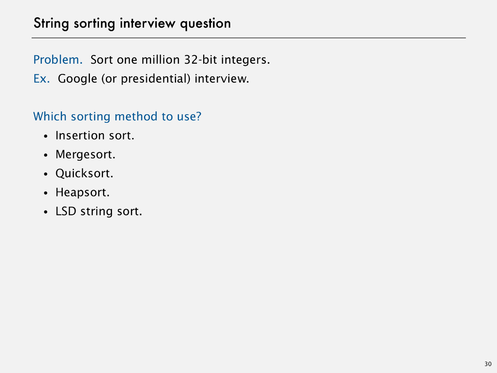

# LSD Radix Sort

Created: 2018-03-28 21:54:35 +0500

Modified: 2018-03-28 21:54:58 +0500

---

{width="5.5in" height="4.125in"}

![LSD string sort: correctness proof Proposition. LSD sorts fixed-length strings in ascending ord Pf. [by induction on i] After pass i, strings are sorted by last i characters. • If two strings differ on sort key, key-indexed sort puts them in proper relative order. • If two strings agree on sort key, stability keeps them in proper relative order. 0 1 2 3 4 5 6 7 8 9 d c b d a a b ](media/LSD-Radix-Sort-image2.png){width="5.5in" height="4.125in"}

![LSD string sort: Java implementation public class LSD public static void sort(String[] a, int R 256; int N --- a. length; String[] aux = new String[N] ; for (int d = W-1; d >= 0; d--) int [ ] count = new int[R+1] ; for (int i int W) fix rac do for ke .charAt(d) + 1]++; for (int r --- count[r+l] += count [r] ; for (int i ](media/LSD-Radix-Sort-image3.png){width="5.5in" height="4.125in"}

{width="5.5in" height="4.125in"}

{width="5.5in" height="4.125in"}

