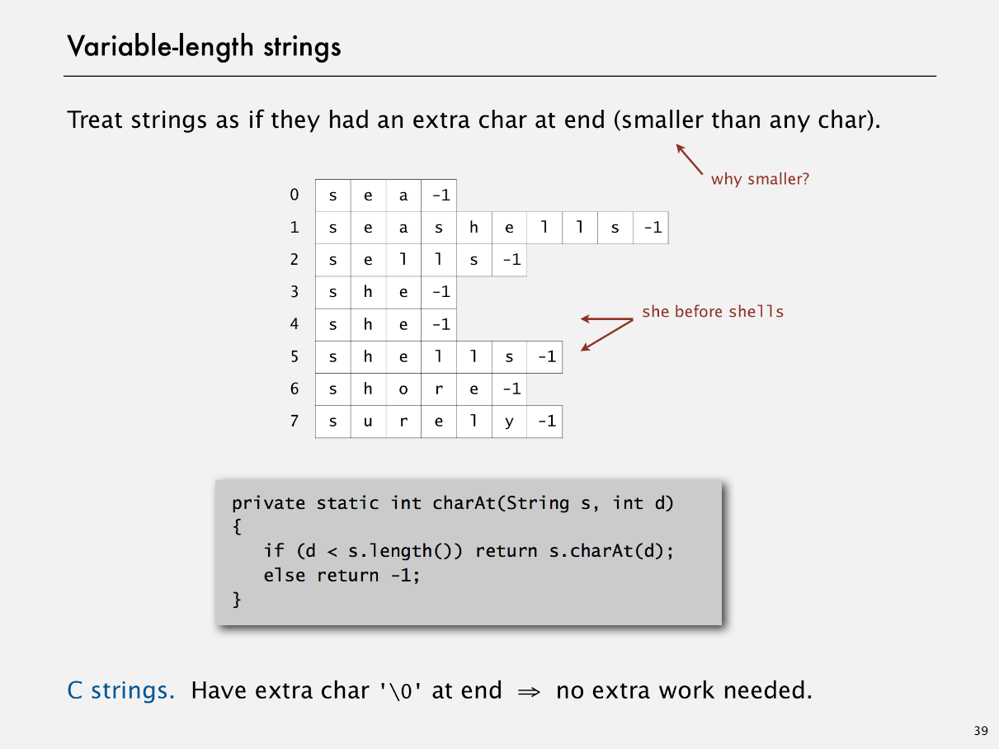
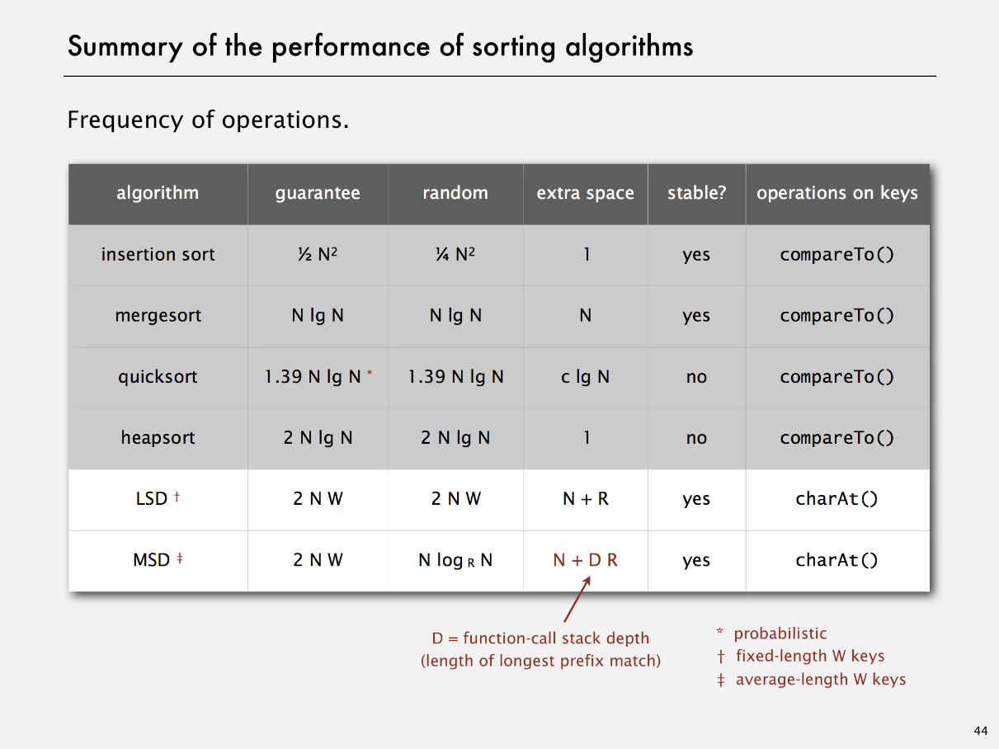

# MSD Radix Sort

Created: 2018-03-28 22:26:39 +0500

Modified: 2018-03-28 22:26:59 +0500

---

![Most-significant-digit-first string sort MSD string (radix) sort. • Partition array into R pieces according to first character (use key-indexed counting). • Recursively sort all strings that start with each character (key-indexed counts delineate subarrays to sort). 0 1 3 4 d a c f b d a d a a a a b d b d d d 0 1 4 a a b c d d d a e a a a d d d b b d count [ ] ](media/MSD-Radix-Sort-image1.png)

![MSD string input she sells seashells by the sea shore the shells she sells are surely seashells sort: example d b seashel Is sea seashells she shor she she surely the the are by a seashells seashells seashells seashells are by she se 10 seashells sea shore shells she se su seashells the hi the are by sea are by seashells sea seashells sells she shore shells she the the need to examine every character in equal keys are by sea seashells seashells Is are by sea seashells seashells sells she shore shells she surely the the are by sea seashells seashells are by sea seashells seashells sells she shore shells she the the are by sea seashells seashell are by sea seash ells seash ells sells she shore shells she surely the the are by seas seashc seashc sells sells she shore shore she sure 1  the the end of string goes before any char value are by seashells seashells are by sea seasl seasl ](media/MSD-Radix-Sort-image2.png)

![MSD string sort: Java implementation public static void sort(String[] a) = new String[a.length] ; aux sort(a, aux, 0, a. length-I, 0); private static void sort (String[] a, i f o)_ return ; int [ ] count --- new int[R+2] ; for (int i = lo; i <= hi; count [charAt(a[i], d) + 2] + + ; for (int r = count[r+l] += count [r] ; for (int i = no; i hi; aux[count[charAt(a[i], d) + 1]++] nng[] aux, can recycle but not cc int 10, ](media/MSD-Radix-Sort-image4.png)

![MSD string sort: potential for disastrous performance Much too slow for small subarrays. Observation l. • Each function call needs its own count[] array. • ASCII (256 counts): 100x slower than copy pass for N = • Unicode (65,536 counts): 32,000x slower for N = 2. Observation 2. Huge number of small subarrays because of recursion. ](media/MSD-Radix-Sort-image5.png)

![Cutoff to insertion sort Solution. Cutoff to insertion sort for small subarrays. • Insertion sort, but start at dth character. • Implement less() so that it compares starting at dth char public static void for (int i for (int j exch(a, j, sort(String[]a, int 10, int hiV i hi ; a[j-l], c private static boolean less(String v, String w, int { return v. substri ng (d) . compareTo(w. substri ng ](media/MSD-Radix-Sort-image6.png)

![MSD string sort: performance Number of characters examined. • MSD examines just enough characters to sort the keys. Number of characters examined depends on keys. • Can be sublinear in input size! compare To() based sorts can also be sublinear! Random (sublinear) IE10402 IHYL490 IROZ572 2HXE734 21YE230 2XOR846 3CDB573 3cvpno 310319 Non-random with duplicates (nearly linear) are sea seashells seashells sells sells she she Worst case (linear) IDNB377 IDNB377 IDNB377 IDNB377 IDNB377 IDNB377 IDNB377 IDNB377 IDNB377 ](media/MSD-Radix-Sort-image7.png)

![MSD string sort vs. quicksort for strings Disadvantages of MSD string sort. • Extra space for aux[]. • Extra space for count[]. • Inner loop has a lot of instructions. • Accesses memory "randomly" (cache inefficient). Disadvantage of quicksort. • Linearithmic number of string compares (not linear). • Has to rescan many characters in keys with long prefix ](media/MSD-Radix-Sort-image9.png)

