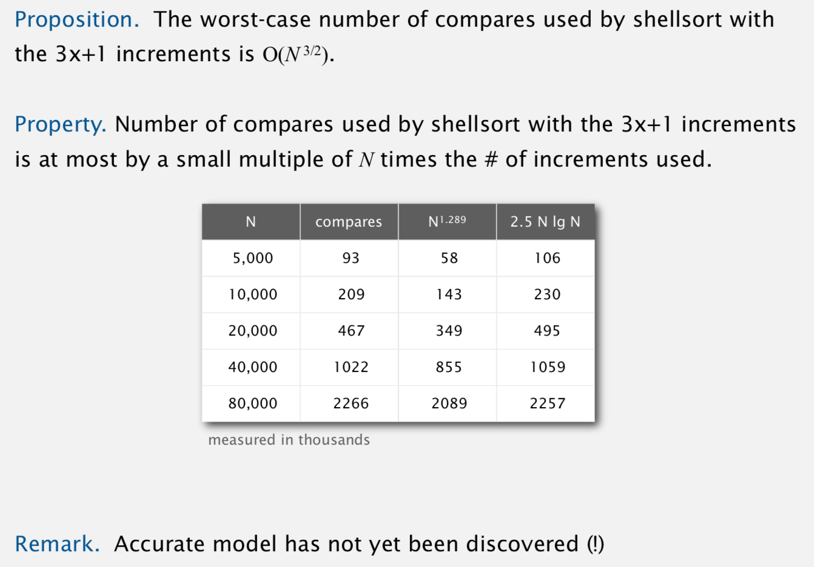

# Shell Sort

Created: 2018-02-02 10:09:54 +0500

Modified: 2019-12-23 00:02:40 +0500

---
-   In-place comparison sort
-   Not Stable

Idea: Move entries more than one position at a time by h-sorting the array
-   Insertion sort, with stride length h.
-   h - 3x+1

[ShellSort](http://en.wikipedia.org/wiki/Shellsort)is mainly a variation of[Insertion Sort](http://quiz.geeksforgeeks.org/insertion-sort/).In insertion sort, we move elements only one position ahead. When an element has to be moved far ahead, many movements are involved. The idea of shellSort is to allow exchange of far items. In shellSort, we make the array h-sorted for a large value of h. We keep reducing the value of h until it becomes 1. An array is said to be h-sorted if all sublists of every h'th element is sorted.

h-sort Can be used as -
-   Sorting by insertion (insertion sort)
-   Sorting by exchange (bubble sort)

Proposition: A g-sorted array remains g-sorted after h-sorting it.

Increment sequences (Gap sequences):
-   3x + 1 (Knuth)
-   1, 5, 19, 109, 209, 929, 2161, 3905 (Sedgewick)

<https://www.codingeek.com/algorithms/shell-sort-algorithm-explanation-implementation-and-complexity
