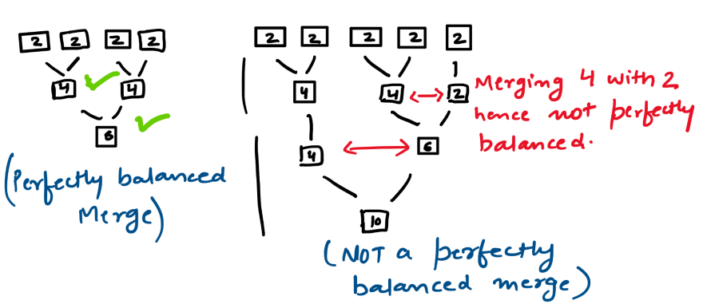
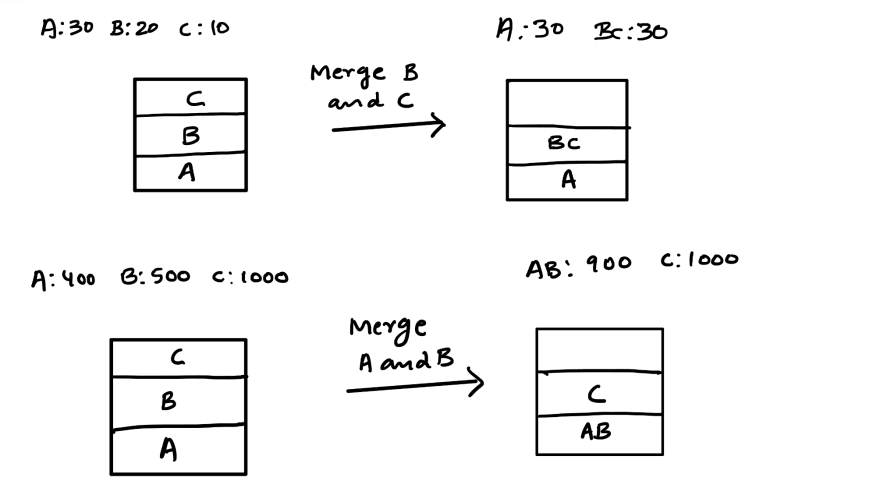
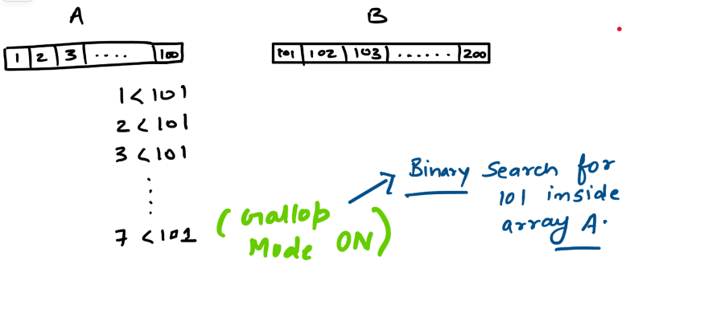

# TimSort

Created: 2018-08-21 09:44:35 +0500

Modified: 2020-02-10 11:26:29 +0500

---

- Hybrid algorithm which uses binary insertion sort and improved merge sort by using galloping in a combination.
- Stable Algorithm

Timsort was implemented by Tim Peters in 2002, it has been a standard sorting algorithm for Python since Python 2.3. Python's sorted and list.sort function uses Tim sort. Java uses Timsort in JDK for sorting non primitive types. Android platform and GNU Octave also uses it as a default sorting algorithm.

Timsort is a stable algorithm and beats every other sorting algorithm in time. It has O(n logn) time complexity for worst case unlike quick sort and O(n) for best case scenarios unlike merge sort and heap sort.

In real world scenarios, most of the times input array is naturally ordered array hence merge sort and quick sort aren't the efficient choice. Tim sort shines when data is ordered and of course when data is random.

# Why Tim sort is fast

Tim sort is a hybrid algorithm which uses Binary insertion sort and improved merge sort by using galloping in a combination. Binary insertion sort is best method to sort when data is already or partially sorted and merge sort is best when input is large.

Binary insertion sort uses Binary search to insert a new value in a sorted array. Binary search reduces number of comparisons thus more efficient than linear search.

In above example, Binary insertion sort requires 2 iteration to find location to insert 8 whereas linear search would find location in 4th iteration.

N : Number of elements inside input array.

## If N <= 64 then Tim sort uses binary insertion sort to sort the elements

# What if N is large

An input array is divided into different sub-arrays, count of elements inside a sub-array is defined as aRUN, minimum value of such runs is a MIN_RUN.

A RUN can be either ascending or strictly descending. If elements are decreasing then in place swapping converts them into ascending order, elements that have equal values aren't swapped to maintain stability

A run smaller than min run is extended to make count equal to min run. Now this new run is sorted using binary insertion sort which has a best run time on partially ordered data. Ultimately, every run should be greater or equal to the min run and it shouldn't be less than 2.

## Why Compute MIN_RUN

MIN_RUN ensures that input array is split in such a way that when merge happens, it happens in a perfectly balanced manner.

Let's understand it with an example below-:

In left diagram above, we have 4 sub-arrays of size 2 which perform perfectly balanced merge at each step. In right diagram, we have 5 sub-arrays of size 2 which doesn't allow perfect balanced merge to happen.

## Perfectly balanced merge allows one on one comparisons between items. An unbalanced merge can cause extra comparisons and impacts performance

Ideally, Timsort wants value of min run to be such that N / MIN_RUN equals to power of 2 or close to it so that when merge happens it gets a perfectly balanced merge for example When an input array has 256 elements Tim Sort would like to divide array into equal sized sub-arrays. 256 / 32 will give us 8 equal sized sub-arrays that perform perfectly balanced merge.

## Merging

At this point an input array has been divided into different sub-arrays and now they should be merged back to produce final sorted array. Unlike merge sort, Tim sort uses stack to store recent runs.

Timsort tries to delay merging as long as possible in order to exploit patterns that come up later but at the same time it likes to merge as soon as possible because all the unmerged arrays are stored inside stacks and storing consumes memory which could hurt for a large array.

If we consider three sub-arrays A, B and C from left to right then Tim sort complies with below 2 variants to call merge_collapse() function to decide whether current run should be merged with preceding runs or not.

1. A > B + C

2. B > C

Merging two sub-arrays in place efficiently is very difficult and slow but if we have a temporary array this process can be faster and easier to implement. Tim sort uses temp array to perform merge between two arrays.

# Galloping

## Galloping: (of a process or time) progress rapidly in a seemingly uncontrollable manner

Galloping is another technique used by Tim sort to further reduce comparisons while merging in order to increase efficiency of algorithm.

While merging two sub arrays in a sorted manner Tim sort perform galloping. Galloping improves merging runtime by reducing comparisons. Java uses constant value '7' before it switches to Gallop mode. Galloping utilizes binary search to make less comparisons during merge procedure.

In below example, 101 is searched inside array A for 7 times and every time array B wins after 7th time Gallop mode is switched on which forces binary search for 101 inside A.

Now we compare 101 directly with A[mid] = 50 thus save lot of comparisons.

## References

<https://dev.to/s_awdesh/timsort-fastest-sorting-algorithm-for-real-world-problems--2jhd>

<https://svn.python.org/projects/python/trunk/Objects/listsort.txt>

<https://skerritt.blog/timsort-the-fastest-sorting-algorithm-youve-never-heard-of>
