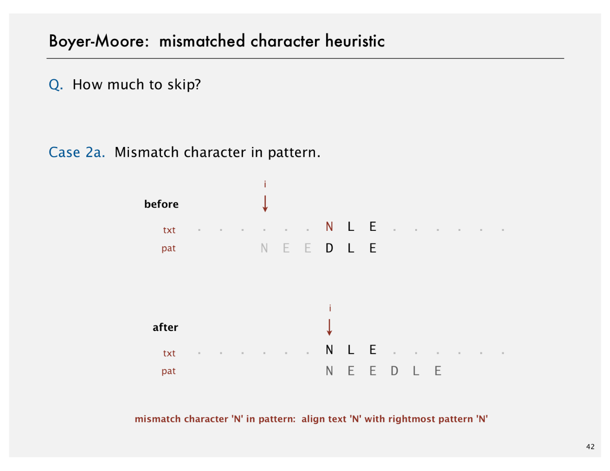
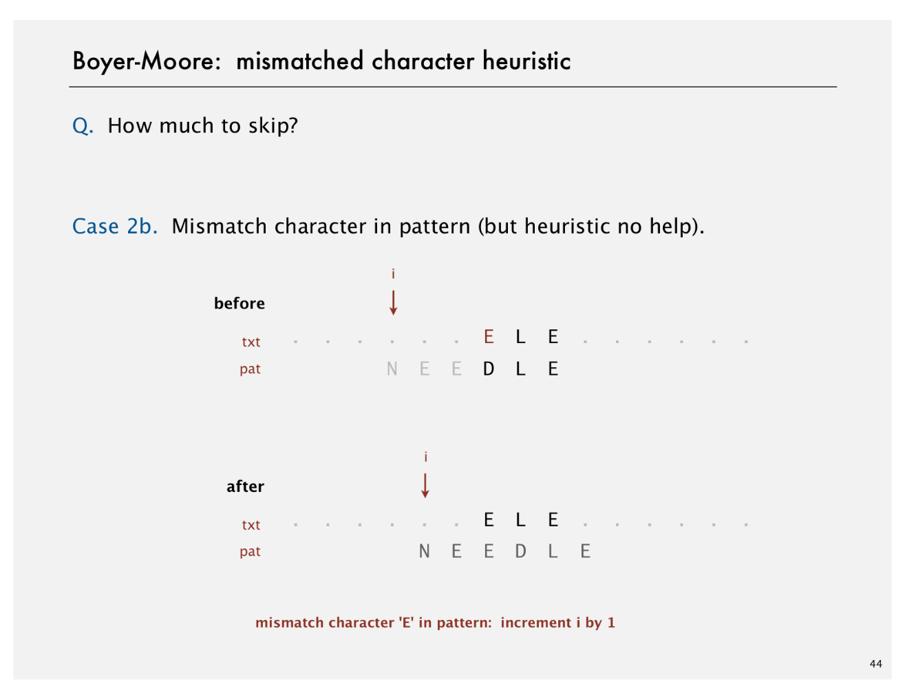

# Boyer-Moore

Created: 2018-04-16 22:05:17 +0500

Modified: 2018-04-16 22:05:26 +0500

---

{width="5.979166666666667in" height="4.614583333333333in"}

{width="5.979166666666667in" height="4.614583333333333in"}

{width="5.979166666666667in" height="4.614583333333333in"}

{width="5.979166666666667in" height="4.614583333333333in"}

{width="5.979166666666667in" height="4.614583333333333in"}

![Boyer-Moore: mismatched character heuristic How much to skip? A. Precompute index of rightmost occurrence of character c (-1 if character not in pattern). -1 = new int [R] ; ri ght for (int c right [c] = for (int j = 0; j < M; j++) right [pat. charAt(j)] = -1 2 ](media/Boyer-Moore-image6.png){width="5.979166666666667in" height="4.614583333333333in"}

{width="5.979166666666667in" height="4.614583333333333in"}

{width="5.979166666666667in" height="4.614583333333333in"}

