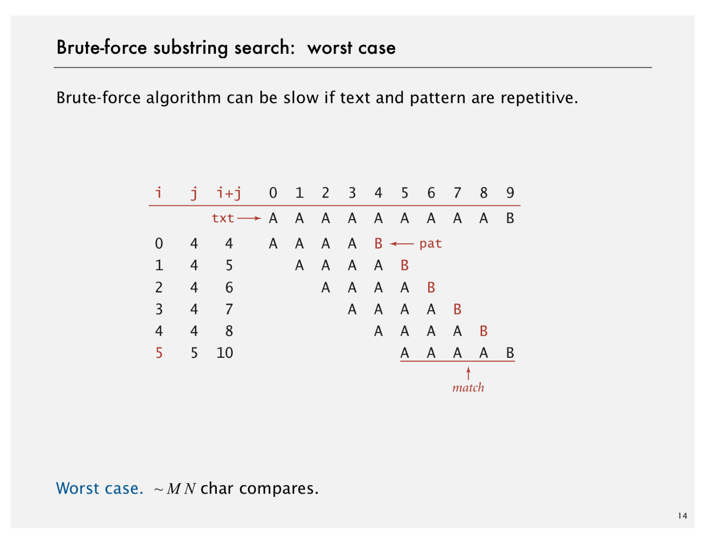

# Brute Force

Created: 2018-12-23 22:45:53 +0500

Modified: 2018-12-23 22:45:59 +0500

---

![Algorithmic challenges in substring search Brute-force is not always good enough. Theoretical challenge. Linear-time guarantee. Practical challenge. Avoid backup in text stream. fundamen often no I Now is the time for all people to come to the aid of their party. Now is the time for al come to the aid of their party. Now is the time for many good people to come to the aid Now is the time for all good people to come to the aid of their party. Now is the time fi people to come to the aid of their party. Now is the time for all of the good people to their party. Now is the time for all good people to come to the aid of their party. Now each good person to come to the aid of their party. Now is the time for all good people of their party. Now is the time for all good Republicans to come to the aid of their par time for all good people to come to the aid of their party. Now is the time for many or come to the aid of their party. Now is the time for all good people to come to the aid o is the time for all good Democrats to come to the aid of their party. Now is the time fo come to the aid of their party. Now is the time for all good people to come to the aid o is the time for many good people to come to the aid of their party. Now is the time for come to the aid of their party. Now is the time for a lot of good people to come to the party. Now is the time for all of the good people to come to the aid of their party. Now ](media/Brute-Force-image6.png)

