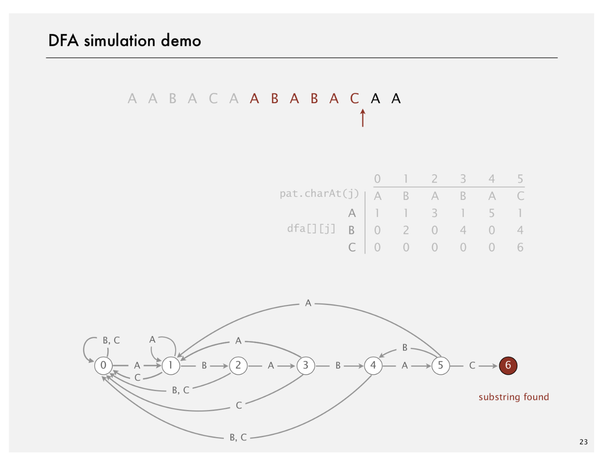
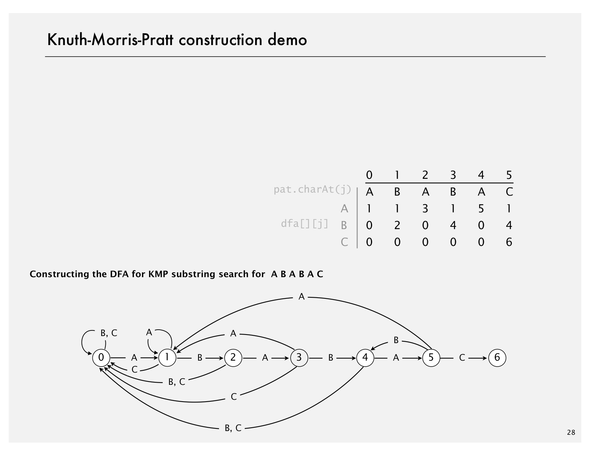
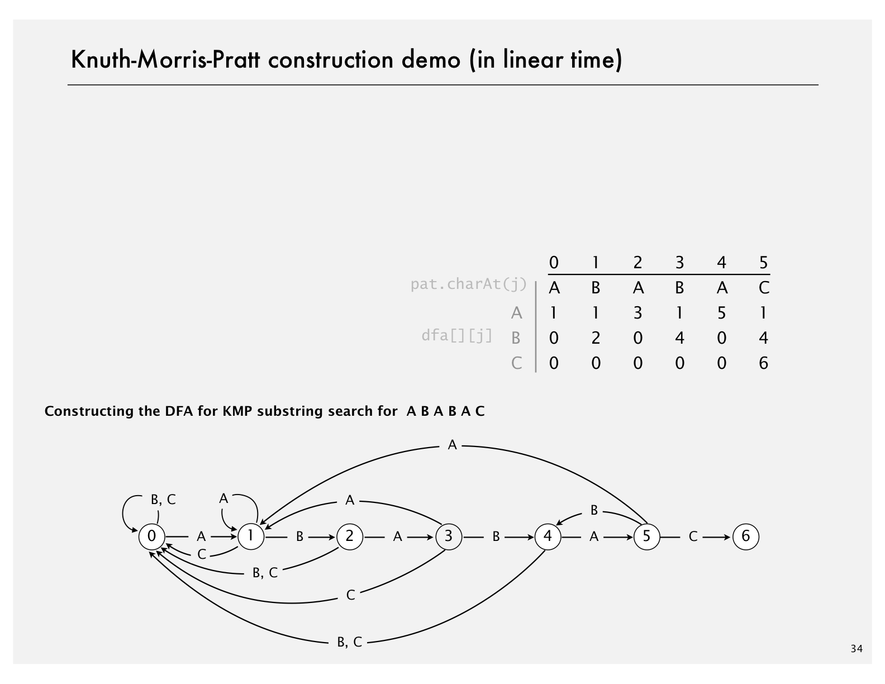

# Knuth-Morris-Pratt

Created: 2018-04-16 22:00:24 +0500

Modified: 2018-04-16 22:03:17 +0500

---

{width="5.979166666666667in" height="4.614583333333333in"}

![Deterministic finite state automaton (DFA) DFA is abstract string-searching machine. • Finite number of states (including start and halt). • Exactly one transition for each char in alphabet. • Accept if sequence of transitions leads to halt state. internal representation j pat . char At (j) dfa[] [j] B c o 1 o 0 1 1 2 o 2 3 0 o 3 1 4 o 4 A 5 0 o 5 c 1 4 6 If in state j readir if j is 6 halt a else move to graphical representation ](media/Knuth-Morris-Pratt-image2.png){width="5.979166666666667in" height="4.614583333333333in"}

![DFA simulation demo B A B A pat. charAt(j) dfa[] [j] B c A o B ](media/Knuth-Morris-Pratt-image3.png){width="5.979166666666667in" height="4.614583333333333in"}

{width="5.979166666666667in" height="4.614583333333333in"}

![Interpretation of Knuth-Morris-Pratt DFA What is interpretation of DFA state after reading in txt[i] Q. A. State = number of characters in pattern that have been m length of longest Ex. DFA is in state 3 after reading in txt[0.. 6]. o B 1 c 23456 ABA suffix of txt [0. .61 pat that is a suffix prefix o ](media/Knuth-Morris-Pratt-image5.png){width="5.979166666666667in" height="4.614583333333333in"}

![Knuth-Morris-Pratt substring search: Java implementatio Key differences from brute-force implementation. • Need to precompute dfa[] [ ] from pattern. • Text pointer i never decrements. public int search(String txt) int i, j, N = txt. length(); for (i ¯ dfa[txt. charAt(i)] [j] ; if (j = --- M) return i - M; return N; ](media/Knuth-Morris-Pratt-image6.png){width="5.979166666666667in" height="4.614583333333333in"}

![Knuth-Morris-Pratt substring search: Java implementatio Key differences from brute-force implementation. • Need to precompute dfa[] [ ] from pattern. • Text pointer i never decrements. • Could use input stream. public int search(ln in) int i, j; for (i ¯ ! in. i sEmpty() o; dfa[in. readChar()] [j] ; if (j = --- M) return i - M; return NOT FOUND; ](media/Knuth-Morris-Pratt-image7.png){width="5.979166666666667in" height="4.614583333333333in"}

![Knuth-Morris-Pratt construction demo Include one state for each character in pattern (plus accept st 2 pat. charAt(j) dfa[] [j] c Constructing the DFA for KMP substring search for A BA B A C A B ](media/Knuth-Morris-Pratt-image8.png){width="5.979166666666667in" height="4.614583333333333in"}

{width="5.979166666666667in" height="4.614583333333333in"}

![How to build DFA from pattern? Include one state for each character in pattern (plus accept st 2 pat. charAt(j) dfaC] C j] c A ](media/Knuth-Morris-Pratt-image10.png){width="5.979166666666667in" height="4.614583333333333in"}

![How to build DFA from pattern? Match transition. If in state j and next char c pat.charAt( first j characters of pattern have already been matched next char matches pat. charAt(j) dfaC] C j] c A 2 3 2 ](media/Knuth-Morris-Pratt-image11.png){width="5.979166666666667in" height="4.614583333333333in"}

![How to build DFA from pattern? Mismatch transition. If in state j and next char c pat . char then the last j-l characters of input are pat[l. .j-l], followec Simulate pat[l. .j-l] on DFA and tal« To compute dfaCc] [j]: Running time. Seems to require j steps. Ex. simulate BABA; take transition 'A' dfa['B'] [5] simulate BABA; take transition 'B' still unde j o pat. charAt(j) simulation of BABA ](media/Knuth-Morris-Pratt-image12.png){width="5.979166666666667in" height="4.614583333333333in"}

![How to build DFA from pattern? Mismatch transition. If in state j and next char c pat . char then the last j-l characters of input are pat[l. .j-l], followec state X Simulate pat[l. .j-l] on DFA and tal« To compute dfaCc] [j]: Running time. Takes only constant time if we maintain state Ex. 4; from state X, take transition 'A' from state X, take transition 'B' from state X, take transition 'C' x ](media/Knuth-Morris-Pratt-image13.png){width="5.979166666666667in" height="4.614583333333333in"}

![Knuth-Morris-Pratt construction demo (in linear time) Include one state for each character in pattern (plus accept st 2 pat. charAt(j) dfa[] [j] c Constructing the DFA for KMP substring search for A BA B A C A B ](media/Knuth-Morris-Pratt-image14.png){width="5.979166666666667in" height="4.614583333333333in"}

{width="5.979166666666667in" height="4.614583333333333in"}

![Constructing the DFA for KMP substring search: For each state j: • Copy dfa[] [X] to dfa[] [j] for mismatch case. • Set [j] to j+l for match case. • Update x. public KMP(String pat) this. pat = pat; M = pat. length(); dfa = new int[R] CM] ; dfa [pat. charAt [0] for (int X = 0, j Java in for (int c = 0; c < R; c++) dfa[c] [j] = dfa[c] [X] ; dfa [pat . charAt(j)] [J] X = dfa[pat.charAt(j)] [X] ; copy mismatch set match case update restart ](media/Knuth-Morris-Pratt-image16.png){width="5.979166666666667in" height="4.614583333333333in"}

![KMP substring search analysis Proposition. KMP substring search accesses no more than M to search for a pattern of length Min a text of length N. Pf. Each pattern char accessed once when constructing the [ each text char accessed once (in the worst case) when simul Proposition. KMP constructs dfa[] [ ] in time and space prop( Larger alphabets. Improved version of KMP constructs nfa[] space proportional to M. ](media/Knuth-Morris-Pratt-image17.png){width="5.979166666666667in" height="4.614583333333333in"}

