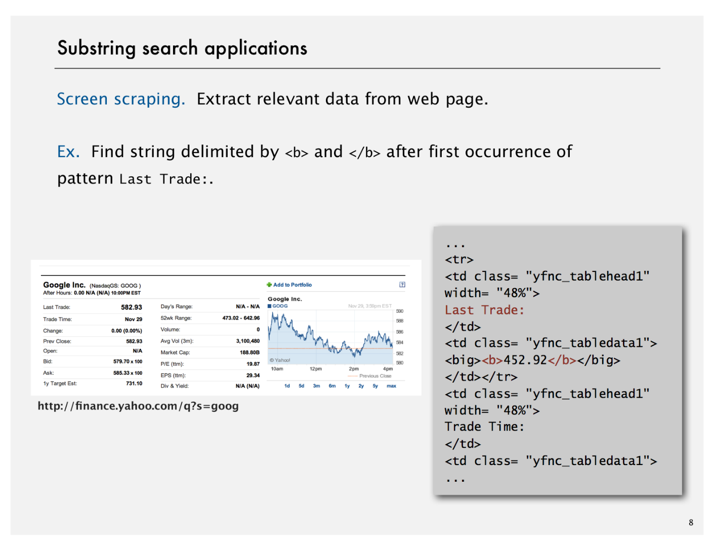
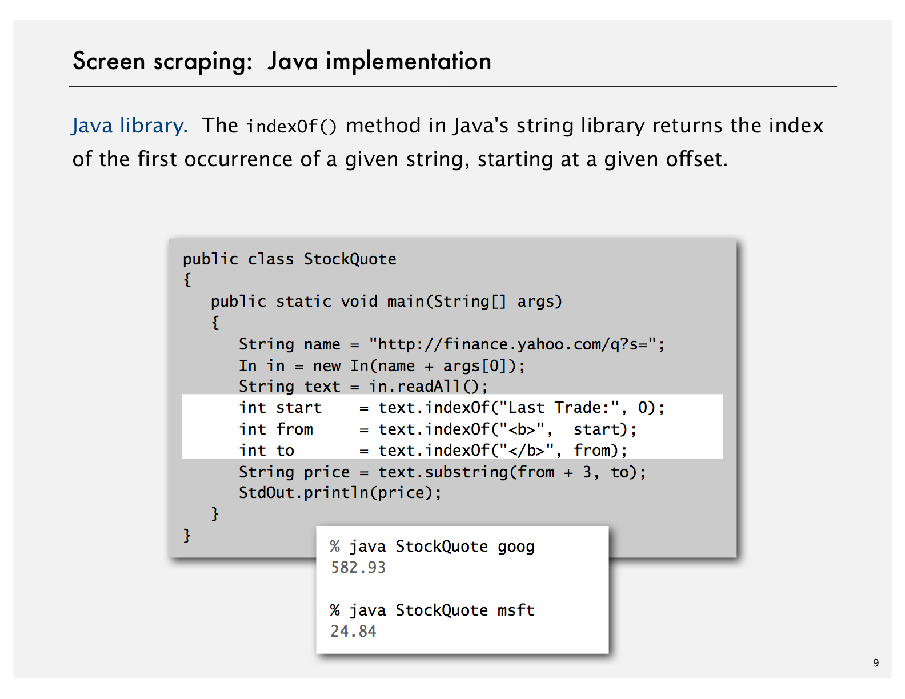

# Substring Search Intro

Created: 2018-04-05 23:23:40 +0500

Modified: 2018-12-23 22:45:49 +0500

---

**Substring Search.**In this lecture we consider algorithms for searching for a substring in a piece of text. We begin with a brute-force algorithm, whose running time is quadratic in the worst case. Next, we consider the ingenious Knuth--Morris--Pratt algorithm whose running time is guaranteed to be linear in the worst case. Then, we introduce the Boyer--Moore algorithm, whose running time is sublinear on typical inputs. Finally, we consider the Rabin--Karp fingerprint algorithm, which uses hashing in a clever way to solve the substring search and related problems.

**Goal -** Find pattern of length M in a text of length N

**Applications**
-   Find and Replace
-   Computer Forensics (Find key on disks)
-   Identify patterns indicative of spam
-   Screen scaping : Extract relevant data from web page

{width="6.40625in" height="4.947916666666667in"}

{width="6.40625in" height="4.947916666666667in"}

{width="6.40625in" height="4.947916666666667in"}

{width="6.020833333333333in" height="1.6458333333333333in"}

