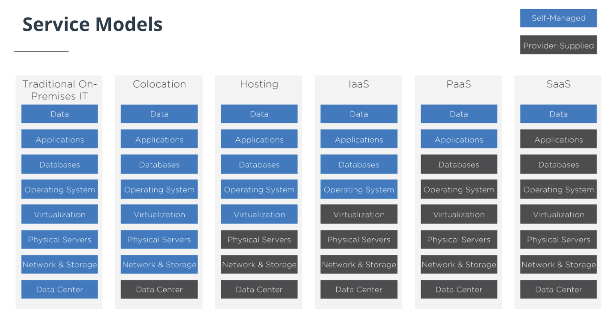
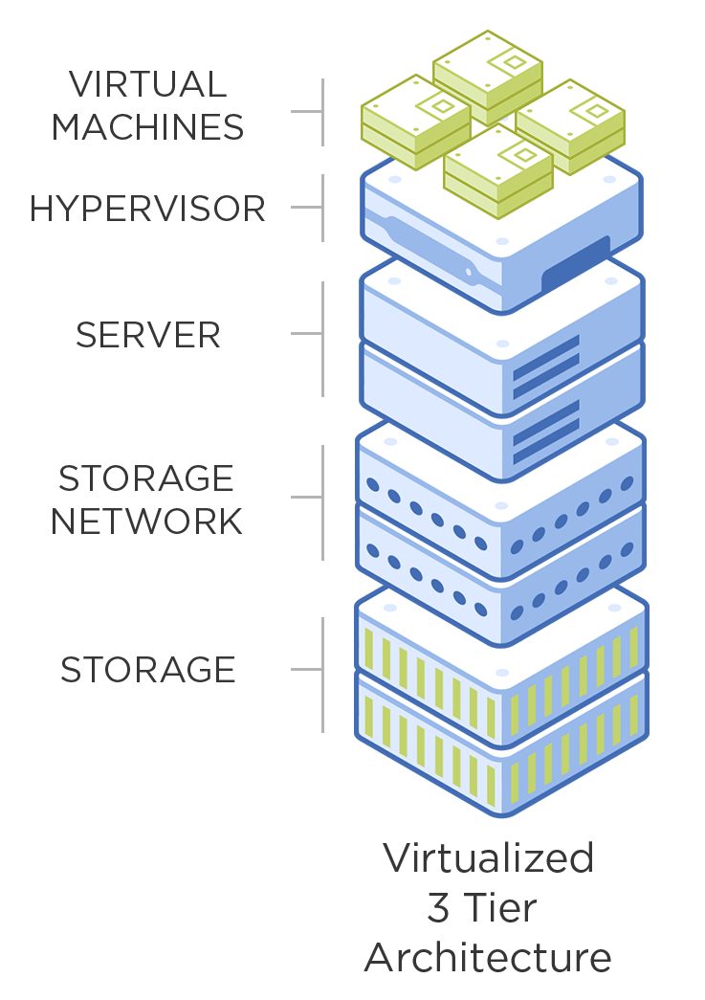
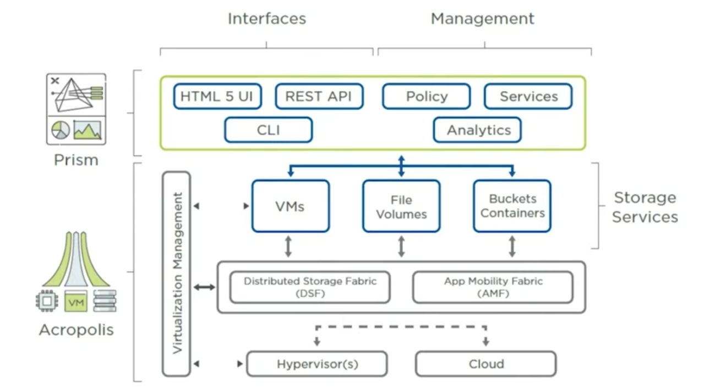

# Nutanix Hybrid Cloud

Created: 2020-06-23 20:57:11 +0500

Modified: 2021-02-28 22:22:29 +0500

---

Udacity - Hybrid Cloud Scholarship Foundation Course Nanodegree Program (23 June 2020)

<https://www.udacity.com/scholarships/nutanix-hybrid-cloud-scholarship-program>

## Hyper-converged infrastructure(HCI)**

Hyper-converged infrastructure(HCI) is a [software-defined](https://www.wikiwand.com/en/Software-defined_infrastructure)[IT infrastructure](https://www.wikiwand.com/en/IT_infrastructure) that virtualizes all of the elements of conventional "[hardware](https://www.wikiwand.com/en/Computer_hardware)-defined" systems. HCI includes, at a minimum,[virtualized computing](https://www.wikiwand.com/en/Virtualization)(a [hypervisor](https://www.wikiwand.com/en/Hypervisor)),[software-defined storage](https://www.wikiwand.com/en/Software-defined_storage) and virtualized networking ([software-defined networking](https://www.wikiwand.com/en/Software-defined_networking)).[[citation needed](https://www.wikiwand.com/en/Wikipedia:Citation_needed)]HCI typically runs on [commercial off-the-shelf](https://www.wikiwand.com/en/Commercial_off-the-shelf)(COTS) servers.
The primary difference between [converged infrastructure (CI)](https://www.wikiwand.com/en/Converged_infrastructure) and hyper-converged infrastructure is that in HCI, both the storage area network and the underlying storage abstractions are implemented virtually in software (at or via the hypervisor) rather than physically, in hardware.[[citation needed](https://www.wikiwand.com/en/Wikipedia:Citation_needed)]Because all of the software-defined elements are implemented within the context of the hypervisor, management of all resources can be [federated](https://www.wikiwand.com/en/Federation_(information_technology))(shared) across all instances of a hyper-converged infrastructure.
<https://www.wikiwand.com/en/Hyper-converged_infrastructure>

<https://github.com/rancher/harvester>

1. The Journey to the Modern Hybrid Cloud

2. Introduce you to the Nutanix HCI

3. Hybrid Cloud Security

4. Networking

5. Managing Virtual Machines in the Hybrid Cloud

6. Data Protection
NIST defines cloud computing as "a model for enabling ubiquitous, convenient, on-demand network access to a shared pool of configurable computing resources. For instance: networks, servers, storage, applications, and services that can be rapidly provisioned and released with minimal management effort or service provider interaction."
[According to NIST](https://classroom.udacity.com/nanodegrees/nd321-1/parts/cd9ca74f-cbf3-40f8-9726-289a03b5560a/modules/c1b1466d-dba6-4e06-9014-b1cca87f5ca4/lessons/81e12a4b-5f16-4a67-8da0-8fe5eea1f483/concepts/The%20cloud%20is%20an%20experience%20and%20a%20mindset%20%5bshow:%20https:/csrc.nist.gov/publications/detail/sp/800-145/final%5d), the cloud model has 5 essential characteristics, 3 service models, and 4 deployment models.

There are first two major aspects of cloud consumption that organizations need to take into consideration: fiscal consumption and workload predictability.

- Rent vs Buy

## Virtualization

Virtualizationuses an abstraction layer and resource scheduler called a hypervisor to run virtual machines on shared hardware resources. Virtual machines, or VMs, can be run at 80% or higher resource utilization without contention, solving one of the major problems of distributed and 3-tier architecture.
In addition to resource utilization efficiency, VMs offer other advantages as well. They can be moved between hosts without downtime. And cloning, backup, and recovery of both servers and applications are simpler.
x86 hardwareis a good fit for virtualization because, since the mid 2000s, each generation of the x86 processor has added features to improve virtualization performance. The latest generation supports virtualized network, storage, and server infrastructure, with performance that matches dedicated Application Specific Integrated Circuit, or ASIC-based hardware.

## Advantages

x86 virtualization dramatically changed infrastructure resource utilization for the better:

i.  The ability to utilize 80% or more of the available infrastructure resources meant that businesses also experienced huge ROI gains with drastically lower TCO.

ii. An added benefit was that VMs could be moved between hosts without downtime, and operational processes such as cloning, deployment, backup, and recovery of servers and applications were simplified.

## Disadvantages

a.  VM sprawl and the need for high availability resulted in high demands on storage and network resources.

b.  If VM sprawl goes unmanaged, it can result in more complexity and increased costs.

c.  Mixed environments -- which include both virtualized and non-virtualized workloads -- can result in even more management complexity.

## Software Defined Datacenter (SDDC)

anSDDCis an integrated abstraction layer that defines a complete datacenter by means of a layer of software that presents the resources of the datacenter as pools of virtual and physical resources and allows their composition into arbitrary user-defined services. A modern SDDC deployment is defined by virtualized, software-defined resources that can be scaled up or down as required and can be deployed as needed in a number of distinct ways.
There are three key components to the SDDC:

- Software defined computing
- Software defined networking
- Software defined storage
There's also often a fourth layer known as the orchestration management layer. Gartner's John Morency describes it as "The intelligence that enables the operations team to do the initial configuration in terms of defining the virtual machines, the storage, the network interconnections, and if they need to, support a specific application or set of applications."

## Hyperconverged Infrastructure (HCI)

Hyperconverged Infrastructure (HCI)converges the entire datacenter stack, including compute, storage, networking, and virtualization. Some key points to remember about HCI are:

- Software running on each server node distributes all operating functions across a cluster. This allows incremental scaling, so that a cluster can be grown one node at a time; performance increases as the environment grows.
- The software also creates clusters and pools local storage, eliminating the need for SAN or NAS infrastructure​.
- The removal of the physical storage fully unleashes the power of the SDDC.
- The use ofsolid state drives (SSDs), combined with data locality, provides excellent cluster performance without bottlenecks.

Note that unlike its 3-tier incarnation -- which was only 66% converged -- HCI is fully converged.

## SSDs and HCI

- SSDs improve performance of the storage tier if they are bottlenecking on read-write performance at the disk level.
- To leverage the extreme advances in performance, the controllers and network need to be able to handle the vast I/O capabilities of SSDs.
- Data locality is a key component of HCI; not having to transit the network provides better utilization of an SSDs capabilities.

## HCI and Private Cloud

Out of the box, HCI isn't a true private cloud. To have a fully operational private cloud, you also need to have:

- Unified management support
- One-click upgrades
- Customizable security
- Built-in data services for file, block, and object storage
- Sophisticated backup and disaster recovery solutions
- Tools for automation and self-service; and cost governance

## Compliance and Security

Companies are subject to many regulations regarding security and data-handling---and these regulations can have a significant impact on how you utilize the cloud. These are some of the main regulations that it's important to be familiar with:

- **GDPR:** TheGeneral Data Protection Regulation (GDPR)protects EU citizens from data breaches and misuse. It applies to all companies with data for EU citizens, even if those companies are not located in the EU.
- **HIPAA:** TheHealth Insurance Portability and Accountability Act (HIPAA)regulates the data security of healthcare patients. Companies that handle healthcare data (e.g., hospitals, clinics and insurance companies) are required to comply with HIPAA regulations.
- **Sarbanes-Oxley Act (SOX):** TheSarbanes-Oxley Act (SOX)requires U.S. company boards, management, and accounting firms to follow best practices and maintain financial records for seven years. The intent is to prevent incidents like the Enron scandal.
- **FISMA:**The Federal Information Security Management Act of 2002 (FISMA)treats information security as a matter of national security. All federal agencies are required to develop compliant data protection methods.
- **PCI-DSS:** ThePayment Card Industry Data Security Standard (PCI-DSS)regulations reduce fraud by protecting customer credit card information. PCI-DSS compliance is required for all companies handling credit card information.
- **GPG13:** TheProtective Monitoring for HMG ICT Systems regulation (GPG13)is a U.K. general data-protection regulation for business processes. It is compulsory for businesses managing high-impact data.

## Introduction to Nutanix HCI

Nutanix provides the public cloud benefits that organizations want with the control that they need on-prem. There aresixmajor benefits to Nutanix HCI specifically:

a.  **Full-cloud:**It's a full-cloud stack that integrates all compute, storage, virtualization, and networking resources to run any application.

b.  **One-click simplicity:**This entire stack is managed via a single pane of glass that streamlines IT lifecycle management and makes hybrid and multi-cloud management easy .

c.  **Deployed in minutes:**The applications themselves can be deployed in minutes, instead of weeks or months. This is true for new infrastructure as well.

d.  **Automation application management:**Application management can also be automated, along with other common IT tasks. Application owners and developers can also be given on-demand IT services.

e.  **Lower cloud costs:**You can also reduce your datacenter TCO by up to 60%. This will help optimize your public cloud spend with lower cloud costs.

f.  **True hybrid cloud:**This refers to the ability for you to combine both public and private cloud operations with unified management.

1. Acropolis:The data plane

2. Prism:The management plane

## Hybrid Cloud Security

## Networking

## Managing Virtual Machines in the Hybrid Cloud

## Data Protection
