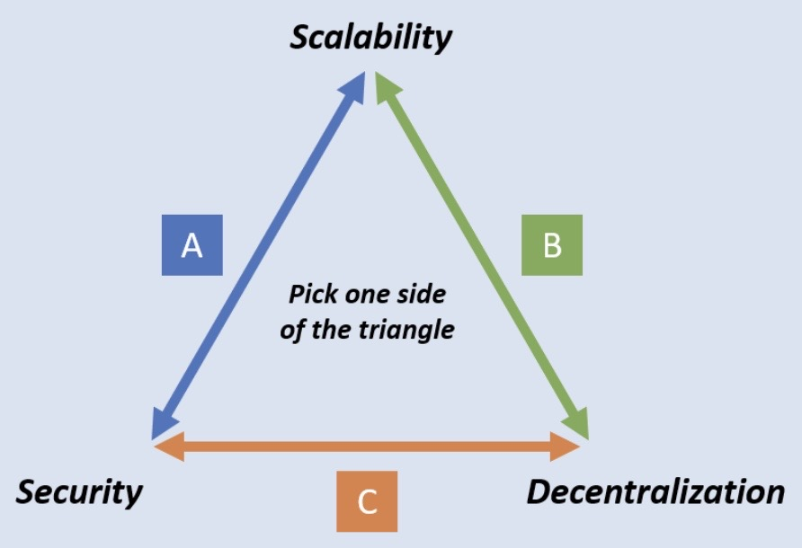
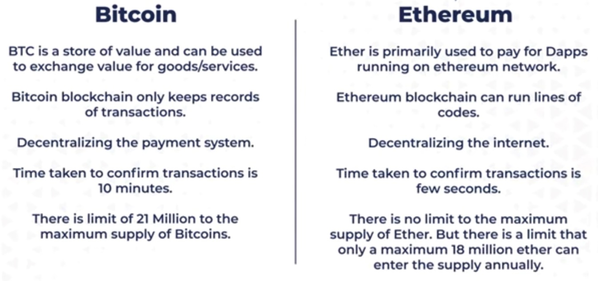

# Bitcoin / Cryptocurrency / Web3

---

## Web3

<https://www.notboring.co/p/braintrust-fighting-capitalism-with>

## Bitcoin (2008): first combination of proof-of-work / distributed ledger / hashchain

- Solves Byzantine agreemeent, permissionless, Sybil-proof, reasonable cryptographic assumptions
- Elegant in its simplicity
- Limited scripting for transaction confirmation

## Ethereum (2015): full-blown, Turing-complete smart contracts

- Built-in currency caller **Ether**
- Operations in smart contracts have a **gas cost** that gets paid to the miners

## Cryptocurrency

<https://hackernoon.com/crypto-baby-talk-first-50-terms-that-you-should-know-about-30a829320b4b>

## Scaling Problem

Bitcoin has a scaling problem. Bitcoin is designed to store all transactions in a data structure called a [block](https://en.bitcoin.it/wiki/Block). A block contains information about the previous block, miscellaneous data about mining rewards, and most of the block is just transaction data. Blocks are also fixed at a maximum of 1 MB in size. This last bit is where the trouble is.
Because blocks are 1 MB in size, and a block is created every 10 minutes, assuming the transactions are not SegWit (coming up later) the network can process a maximum of [between 3.3 and 7 transactions per second](https://link.springer.com/chapter/10.1007/978-3-662-53357-4_8). For a currency designed for mass use by billions of humans and their machines, 7 transactions a second just isn't up to par. Visa, on the other hand, claims to be able to process [24,000 transactions](https://web.archive.org/web/20181023104241/https:/usa.visa.com/run-your-business/small-business-tools/retail.html) per second.
<https://towardsdatascience.com/the-blockchain-scalability-problem-the-race-for-visa-like-transaction-speed-5cce48f9d44>

## Bitcoin Lightning Network

Lightning Network is a second-layer network that transmits signed, but unbroadcast, transactions among peers and relies on the Bitcoin blockchain only for final settlement of funds.

## How BLN work?

The Lightning Network uses a network of nodes that hold funds in multi-sig wallets ("channels") and exchange signed, but unbroadcast, transactions.

## Blockchain Trilemma

The blockchain trilemma is a concept coined by [Vitalik Buterin](https://coinmarketcap.com/alexandria/glossary/vitalik-buterin) that proposes a set of three main issues - decentralization, security and scalability - that developers encounter when building blockchains, forcing them to ultimately sacrifice one "aspect" for as a trade-off to accommodatethe other two

## The Scalability Trilemma

<https://medium.com/logos-network/everything-you-know-about-the-scalability-trilemma-is-probably-wrong-bc4f4b7a7ef>
<https://www.toptal.com/bitcoin/intro-to-bitcoin-lightning-network>

<https://www.freecodecamp.org/news/create-cryptocurrency-using-python>

[ETHEREUM 2.0 - A GAME CHANGER? Proof Of Stake, The Beacon Chain, Sharding, Docking Explained](https://youtu.be/ctzGr58_jeI)

- Solidity
- Ether = Token (is the fuel to run this Dapps)
- Ethereum - Platform to develop our own Dapps
- Gas fees
- Smart contracts
- DeFi - Decentralized Finance
- Proof of work -> Proof of stake
- Sharding will increasing 1000 TPS
- EIP 1559

## Is a greener, faster and more decentralised alternative to Bitcoin possible?

This piece is a counter of sorts to this week's Long Read 3 about how tech is taking over geopolitics, at the core of whose argument lies smart contracts (self-executing rules, not enforced by an intermediary or an authority) that run on blockchains (decentralised or distributed databases). The most popular application of this concept so far has been cryptocurrencies. This article argues that even cryptocurrencies including the popular Bitcoin has flaws which threaten not only its own sustainability but the larger extension to other spheres of life, let alone replacement of nation states.
The three main issues the article points to are that the technology is energy intensive and hence not particularly eco-friendly, that they are not fast enough to claim supremacy over the status quo and finally that it is not decentralised enough as mining is still done by a few large pools (as access to resources is an edge).
"Hence the quest to come up with better blockchains. Chia, for instance, is a system based on "proof of space and time". As with Bitcoin, the carrot is that participating users earn coins. Yet the stick is different: instead of wasting computing power, Chia wastes digital storage. It is not yet clear, though, whether Chia will prove more sustainable and less centralised than Bitcoin if it becomes widely used.
The smart digital money is therefore on another approach: proof of stake. Here decisions about updating the blockchain are made not through a computing arms race, but by a vote among the holders of a cryptocurrency. Voting power as well as the share of the rewards depend on how much holders are willing to bet on the outcome. This stake can be destroyed if a participant misbehaves. In this system both carrot and stick are the cryptocurrency itself.
Proof of stake does use much less energy. And its latest incarnations are much faster than Bitcoin: Avalanche, a blockchain that uses the approach, processes thousands of transactions a second. But it still has big problems. Coders have been attempting to shift Ethereum, the preferred blockchain for DeFi apps, from proof of work to proof of stake. Even Vitalik Buterin, one of the inventors of Ethereum, admits that proof of stake is "surprisingly complex". That means that lots can go wrong, especially when nearly $100bn in capital in DeFi apps must switch over. After several delays, the coders hope to make the move in 2022.
Yet this system would still tend towards centralisation. Bigger holders can reap more rewards, increasing their holdings further. This concentrates power among early buyers of a cryptocurrency and could allow them to take control of the blockchain. Newer projects that use proof of stake are trying to find ways to avoid this. Hedera Hashgraph is governed by a consortium, much like the one that runs Visa, a credit-card network. Avalanche and Tezos seek to ensure decentralisation by making it easy for "validators", participants who maintain the blockchain, to join.
To critics, centralisation is inevitable, even if energy inefficiency and complexity are not. The problem of increasing returns to scale will raise its head for any popular blockchain, predicts David Rosenthal, an early practitioner. "You waste all these resources only to end up with a system that is controlled by people you have even less reason to trust than those who run conventional financial institutions," he says.
To others, a degree of centralisation may simply be a price to pay for the other advantages of blockchains. Emin Gün Sirer of Cornell University, who co-founded Ava Labs, which created Avalanche, says that the main benefit is that governments will find it harder to influence blockchains than they do conventional banks. Kevin Werbach of the Wharton School of the University of Pennsylvania says that the openness of blockchains makes it easier to develop innovative financial services. Still, if the quest to come up with better blockchains shows one thing, it is that even in crypto-paradise there is no free lunch."
[https://www.economist.com/finance-and-economics/2022/01/01/is-a-greener-faster-and-more-decentralised-alternative-to-bitcoin-possible](https://linkedin.us19.list-manage.com/track/click?u=52ada2ee20240692fbeb44407&id=bb6a2a2c5c&e=153268bbf0)

## Crypto Investing / Investment (Party Fund)

- **Only invest 1 lakh i.e. 10K for 12 weeks (3 months) and hold it long term for like years**-  **Coins**
  - Bitcoin (BTH)
  - Ethereum (ETH)
  - Tether (USDT) - stable coin, it will be always $1
  - Binance (BNB)
  - USD Coin (USDC) - stable coin

USDC is the world's fastest-growing, fully regulated dollar digital stablecoin.

- Solana (SOL)
  - Scalable - 50,000 TPS
  - Low transaction fees
- Cardano (ADA)
- CRO Coin (bitcoin.com)
- Alt coins (Alternative coins - coins apart from Bitcoin)
- Meme coin
- Portfolio
  - 40% - Ethereum
  - 20% - Polygon
  - 20% - Cardano
  - 10% - Cartezi
  - 10% - Litecoin-  40% - Bitcoin
- 15% - Ethereum
- 15% - DeFi
- 10% - Centralized Exchanges
- 10% - Smart Contract Projects
- 5% - NFT (Mana / Chiliz / Axie infinity)
- 5% - Shitcoins/Memecoins-  **NFT (Non Fungible Token)**-  **Platforms**
  - <https://coinmarketcap.com/rankings/exchanges>
  - **Binance (Sagar)**
  - Crypto.com
  - Vauld (FDs)
  - Wazirx (Vishal)
  - CoinDCX
  - **coinbase (us based)**
  - Bitfinex (Exchange)
  - Metamask (A crypto wallet & gateway to blockchain apps)-  **Chains**
  - Blockchain
  - Smart chain
  - Smart contract
  - Ronin (Side Chain)
  - Lightning network-  **Others**
  - NFT
  - DeFi wallet-  **Tools**
  - <https://coinmarketcap.com>
  - <https://www.coingecko.com/en>
  - <https://www.intotheblock.com>
  - <https://interest.coinmarketcap.com> (Earn crypto from crypto)
  - **<https://cryptopanic.com> (All news in one page)**
  - <https://coinmarketcal.com/en> (Events)
  - <https://studio.glassnode.com/metrics> (Analytics)
  - <https://messari.io> (Analytics)-  **Technical Analysis**
  - Total Market Cap
  - 24 hours volume
  - BTC Dominance (if BTC dominance decreases, alt coins take lead)
  - On-chain metrics-  Thoughts
  - Blockchain is important bitcoin not
  - Focus on fundamentals
- Pros
  - Huge Upside
- Cons
  - Currently a pyramid scheme
    - No one is accepting it
  - Gambling
  - Highly volatile
  - Very new
  - Speculation
  - Lot of new companies
  - Advertisements (Paid influencer marketing campaigns)
  - No regulation
  - Non productive asset - doesn't generate anything
  - Timing the market is very important
  - More cannot be generated (printing currency)
  - Cannot be taken from one person to give to other person
  - Doesn't increase productivity of the world
  - Doesn't create value (invest in businesses that creates value)
  - Source code managed by Blockstream
  - [Why I lost faith in Bitcoin (as an early adopter and software engineer)](https://www.youtube.com/watch?v=vjwVtl-VBDw)
  - [The Money Flower and why Bitcoin is a ponzi scheme | Morten Bech | TEDxBasel](https://www.youtube.com/watch?v=UK0ATammdRo)-  **References**

whiteboardcrypto

<https://www.youtube.com/playlist?list=PLU52pNodXIGdM6XDgHVG7DsPytlsrR_6b>
