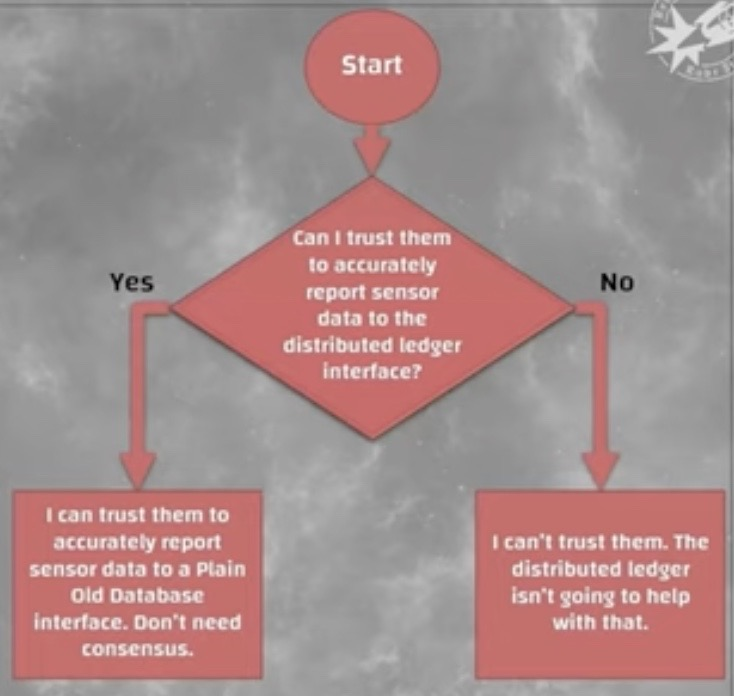

# Blockchain

Inventor - Satoshi Nakamoto

"Most technologies tend to automate workers on the periphery who are doing menial tasks. But blockchains automate away the center. Instead of putting taxi drivers out of a job, blockchain puts Uber out of a job, and lets the taxi drivers work with the customer directly." --- Vitalik Buterin, Creator of Ethereum

A blockchain is a data structure that enables identifying and tracking transactions digitally and sharing this information across a distributed network of computers, creating a distributed trust network.

A blockchain is a **shared public ledger that exists and is digitally distributed across a network.**

## Key Points

### Trapdoor function

A trapdoor function is a function that is easy to compute in one direction but difficult to compute in the opposite direction unless you have special information. Trapdoor functions are essential for public key encryption - that's why they are commonly used in blockchain development to represent the ideas of addresses and private keys.

### Chain Fork

Blocks in the ledger are included in such a way as to build the longest chain, i.e., the chain with the greatest cumulative difficulty. Forking is a situation where there are two candidate blocks competing to form the longest blockchain and two miners discover a solution to the proof-of-work problem within a short period of time from each other. The network is then divided, because some nodes get blocks from miner #1 and some from miner #2.

A fork usually gets resolved in one block, because the probability that this situation happens again gets extremely lower with the next blocks that arise, so soon there is a new longest chain that will be considered as main.

(Note: This type of fork is distinct from ahard fork, which is where some developers decide to create a backward-incompatible change to the blockchain protocol, resulting in two forever-distinct blockchains.)

## Featues of Blockchain

- **Distributed / Decentralized -** Data is replicated on all the nodes in a distributed P2P network, and each copy of the ledger is identical to others. It can also be decentralised with some lighter nodes not having full data storage with limited connection.
- **Consensus mechanism -** All users in the network can come to a pre-determined programmable agreement on the method of validation and can be by consensus.
- **Irreversibility and crypto security -** One would need to command at least 51% of the computing power (or nodes or stake) to take control of the bitcoin blockchain.
- **Cryptographically secure -** That means that the minting of digital currency is secured by mathematical algorithms that make it very difficult to break. It prevents bad actors from creating fake transactions, erasing transactions, stealing funds, etc.
- **Finite-state machines -** In Computer Science, a state machine is a machine that will analyze a series of inputs and based on those inputs will transition to a new state. Blockchains have one instance responsible for all the transactions being created by the system. There's one global truth that all nodes adhere to, they all share the same state.

## Points

- Blockchains all start with a **genesis state**.
- Each transaction in the Ethereum network is grouped into what are called blocks. A single block contains a set of transactions and each block points to the next block. This makes a chain of blocks aka blockchain.
- Mining is when a specific group of nodes (miners) uses their computing power to create a block of valid transactions.
- The processes of validating each block by having a miner provide a mathematical proof are called the 'proof of work' algorithm.
- Miners who validate new blocks get rewarded with an intrinsic digital token called 'Ether'. Every single time a miner proves a block as valid, the network generates new Ethers and awards the miner.
- In scenarios where multiple paths are generated by miners, a 'fork' happens. Forks are to be avoided since they are disruptive to the system and force nodes to choose which chain they believe to be the most valid.
- Ethereum's mechanism to choose the most valid chain is called the "GHOST protocol". GHOST stands for "Greedy Heaviest Observed Subtree". Essentially, it picks the path that has had the most computation done on it. The protocol uses the block number of the most recent block, this represents the total number of blocks in the current path. The higher the block number, the longer the path and as such the larger the mining effort that had to have gone into arriving at the most recent block. This allows the network to agree on the correct version of the current state.

## Components

### Accounts

- Externally Owned Account
  - Ether Balance
- Smart Contract Account
  - Ether Balance
  - Contract Code
- Every account has a state
  - nonce
    - represents number of transactions sent from the address of the account
  - balance
    - amount of Ether owned by the address
  - storageRoot
    - root node of its Merkle tree
  - codeHash
    - hash of the Ethereum Virtual Machine code
- Merkle Tree

### Fees

- Every single computation/transaction on the Ethereum blockchain requires a fee. That fee is paid in whats called 'gas'. Gas is the unit Ethereum uses to measure computation fees. Gas price is an amount of Ether a node is willing to spend on every gas unit, measured in 'gwei' (since 'wei' is the smallest unit of Ether).
- For each transaction, a sender sets a gas limit and a gas price. The gas limit represents the maximum gas the sender is willing to pay. If the sender doesn't provide the necessary gas to execute a transaction, the transaction is considered invalid. And since the Ethereum network had to expend computational effort to run the calculations before running out of gas, none of the gas gets refunded to the sender. The money spent on gas by the sender is sent to some miners address since miners are expanding the computational effort to validate transactions. The gas fee acts as a reward for the miners. Importantly, gas is used to pay for storage usage as well.
- Fees help prevent users from overtaxing the Ethereum network. Its very computationally expensive to run computational steps on the Ethereum Virtual Machine, so smart contracts should be used for simple tasks like verifying ownership instead of more complex tasks like machine learning or file storage. Fees also help protect the network from malicious attacks. Ethereum has its own Turing complete programming language called Solidity for creating smart contracts. Turing complete means it can simulate any computer algorithm. It allows for-loops, so a bad actor could disrupt the network by executing an infinite loop within a transaction, but thanks to fees this becomes infeasible.
- There are two types of transactions in Ethereum, the message call and the contract creation (creates new smart contracts). Both are initiated by externally owned accounts and submitted to the blockchain. They are what bridge the external world to the internal state of Ethereum. Contracts can talk to other contracts via messages. Messages are like internal transactions. These messages are generated by contracts, and when one contract sends a message to another, the code that exists on the recipient contract account is executed.

### Ethereum Virtual Machine

The EVM is a complete virtual machine, and its only limitation is that its bound by gas. Meaning the total amount of computation it can do is limited by the amount of gas provided. Its a stack-based architecture (last-in, first-out). It has temporary memory and long-term storage. It even has its own language! (called EVM bytecode). When we write smart contracts, it's in a higher level language like Solidity, but this compiles down to EVM bytecode.

## Hyperledger

Hyperledger is an open source community focused on developing a suite of stable frameworks, tools and libraries for enterprise-grade blockchain deployments.
It serves as a neutral home for various distributed ledger frameworks including Hyperledger Fabric, Sawtooth, Indy, as well as tools like Hyperledger Caliper and libraries like Hyperledger Ursa.
<https://www.hyperledger.org>

### Hyperledger Fabric

**Type: Distributed ledger software**

Hyperledger Fabric is intended as a foundation for developing applications or solutions with a modular architecture. Hyperledger Fabric allows components, such as consensus and membership services, to be plug-and-play. Its modular and versatile design satisfies a broad range of industry use cases. It offers a unique approach to consensus that enables performance at scale while preserving privacy.
<https://www.hyperledger.org/use/fabric>
Below are some of the key features of Hyperledger Fabric and what differentiates it from other distributed ledger technologies

- Permissioned architecture
- Highly modular
- Pluggable consensus
- Open smart contract model - flexibility to implement any desired solution model (account model, UTXO model, structured data, unstructured data, etc)
- Low latency of finality/confirmation
- Flexible approach to data privacy : data isolation using 'channels', or share private data on a need-to-know basis using private data 'collections'
- Multi-language smart contract support: Go, Java, Javascript
- Support for EVM and Solidity
- Designed for continuous operations, including rolling upgrades and asymmetric version sup-port
- Governance and versioning of smart contracts
- Flexible endorsement model for achieving consensus across required organizations
- Queryable data (key-based queries and JSON queries)
[Blockchain 102 and The Dark Side of Blockchain](https://www.youtube.com/watch?v=-so3AtnToek)

## DAO - Decentralized Autonomous Organization

- Governance implemented in Ethereum smart contracts. **Code is Law**, etc
- Own token: DAO
- Crowdfunding in June 2016: $150 million
- Vulnerability in the split function: time-of-check/time-of-use vs recursive calls
  - Anyone can propose to create a child DAO
  - Contract first retrieves Ether from main DAO, then checks against proponent balance
  - Recursive call allows this to be nested/magnified
  - Mid June 2016: $60 million worth in rogue child DAO
  - Build in 48 day period before funds can be transferred out
- Heated discussion led to hard fork of the entire Ethereum Blockchain

## ERC-20 tokens

- Principal mechanism to create custom money-like tokens on Ethereum
- Specifies a smart contract API that allows balance query and transfer of amounts
- All details (ICO, governance, etc) left to the creator of the contract
- May have own value independent of Ether, traded on several different platforms

## Crypto-enabled financial trickery

- Smart contracts allow automatic execution of contract stipulations, no matter their form
- Classic: Arbitrage between different platforms
- New: Uncollateralized flash loans

## Self-soverign identities (SSI)

- Self-sovereign identity (SSI) is an approach to digital identity that gives individuals control of their digital identities
- No single standard, specification, or shared understanding **what** that may be

## Oracle problem

- Cryptography works only within the system
- Any interface to the real world requires trust in a node other than self
  - In which case no distributed consensus is required
- Cryptocurrencies have, more or less by definition, only one use case: **Ponzi schemes and other scams**
- A pure timestamping hash chain/Merkle tree (without consensus overhead) can be useful

<https://blog.chain.link/what-is-the-blockchain-oracle-problem>
