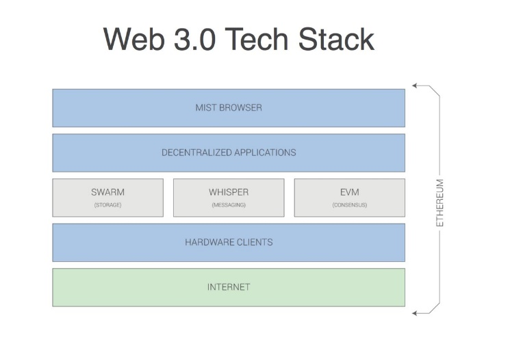
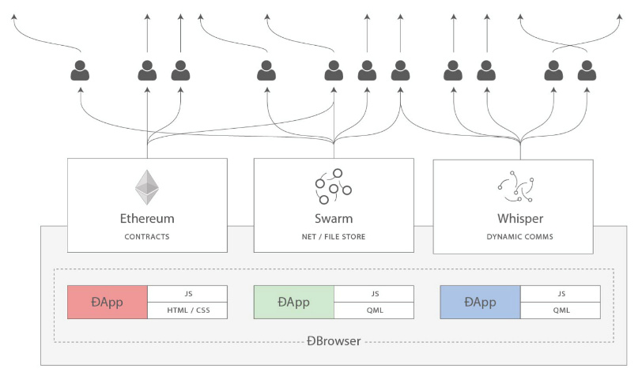

# Intro

Created: 2018-09-20 18:13:12 +0500

Modified: 2022-04-07 20:49:34 +0500

---

1.  Centralized

2.  Decentralised

3.  Distributed
**2.0 stack**
-   AWS S3 for storage
-   Aws EC2 for compute
-   Stripe for payments
-   Third party services for other services
**Web 3.0 stack (dApps)**
-   Etherium, truebit (scalable computation)
-   IPFS (inter planetary file system) / FileCoin (storage)
-   Oracles (External data)
-   Token Model (Monetization)
-   Bitcoin (payments)
**Features of decentralised application**
-   Open source
-   Use of cryptocurrency
    -   Allocate a scarce resource to monetize.
    -   Example - Steemit
-   Decentralised consensus
    -   Ability of a network to agree about on something
    -   Proof of work algorithm
    -   51% of all the nodes must approve the work
    -   Big files are stored in a distributed hash table (DHT) (IPFS)
    -   Block chain helps the DHT reach consensus
    -   Smart contracts which are crypoeconomically secured code
    -   Etherium has a tiring complete block chain
-   No central point of failure (IPFS Stack)
    -   Instead of IP addressing our content, we should content address it
    -   Merkel DAG
    -   Resiliency happening with bits and shards of data replicated across network (multiple nodes)
**Decentralized Chat (Whisper)**

1.  Building first whisper chat app

2.  Sending messages with Geth + Whisper

3.  Off chain P2P communication protocol

4.  Scalability issues

5.  Peer to peer chat

**What is Whisper**

-   Darkness as a feature
<https://github.com/llSourcell/Decentralized_Chat/blob/master/Decentralized%20Chat.ipynb>
Decentralized News

Decentralized Games

Decentralized Rides

Decentralized Music

Decentralized Search Engine App

Decentralized Marketplace

Decentralized Social Network

Decentralized Artificial Intelligence
**References**

<https://www.toptal.com/blockchain/interview-questions>

<https://www.youtube.com/channel/UCY0xL8V6NzzFcwzHCgB8orQ>