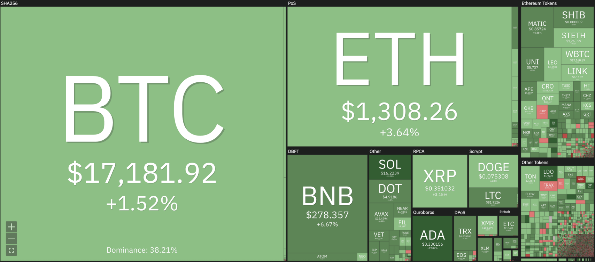

# Crypto News

- crypto winter

### Cake DeFi CEO briefing, 2nd week of 2023

1. The calm week 53 in 2022 and week 1 in 2023 played out as expected. For this week, I am expecting the pent-up demand to buy and/or sell cryptos or equities to happen this week… So, get ready for lots of volatility in the upcoming days. IMPORTANT: This is NOT a new up- or down-trend. It is just the supply and demand of the past 2-3 weeks.

2. The key things in crypto to watch is the DCG/Genesis/Gemini story… Let me know if you want me to explain this in greater detail, but you can read up on it here: <https://twitter.com/julianhosp/status/1609953125254709251> The short version is: Did DCG do the same embezzlement with Genesis, as FTX did with Alameda?! If it turns out as yes, we may see struggle in crypto. Otherwise I am not too bearish.

3. In the macro economy we have US CPI numbers on Thursday. I am expecting inflation to get lower than the general market expects. This will be bullish in the mid-term.

4. In the general markets, banks are starting to report Q4 2022 earnings this week. Get ready for a roller coaster!!

]

### The Fall of Terra: A Timeline of the Meteoric Rise and Crash of UST and LUNA

The Terra network and its leader, Do Kwon, rose to the highest tier of the crypto world thanks to big-shot investors, only to fall apart within a few days in May 2022.

On May 7, the price of the then-$18-billion algorithmic stablecoin terraUSD (UST), which is supposed to maintain a $1 peg, started to wobble and fell to 35 cents on May 9. Its companion token, LUNA, which was meant to stabilize UST's price, fell from $80 to a few cents by May 12.

<https://www.coindesk.com/learn/the-fall-of-terra-a-timeline-of-the-meteoric-rise-and-crash-of-ust-and-luna/>
