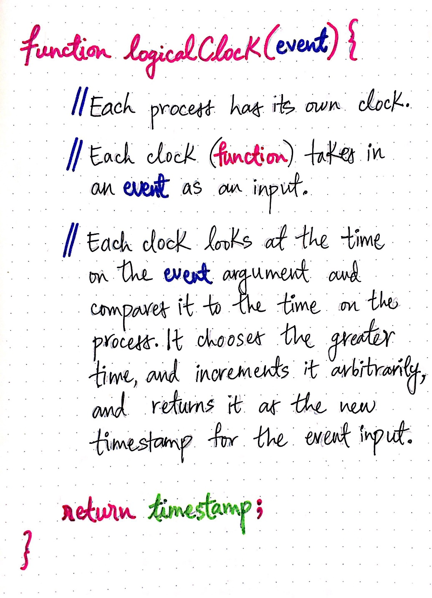

# Clocks

Created: 2020-03-17 09:29:04 +0500

Modified: 2020-03-18 18:49:53 +0500

---

## Atomic Broadcast

In [fault-tolerant](https://en.m.wikipedia.org/wiki/Fault-tolerant)[distributed computing](https://en.m.wikipedia.org/wiki/Distributed_systems), anatomic broadcastortotal order broadcastis a [broadcast](https://en.m.wikipedia.org/wiki/Broadcasting_(networking)) where all correct processes in a system of multiple processes receive the same set of messages in the same order; that is, the same sequence of messages.The broadcast is termed "[atomic](https://en.m.wikipedia.org/wiki/Atomic_(computer_science))" because it either eventually completes correctly at all participants, or all participants abort without side effects. Atomic broadcasts are an important distributed computing primitive.

## Total Order and Partial Order, Causal ordering

When events in a system follow a total order, then every event in that system has a specific order in which it occurred. In other words, when we know exactly wheneachof the events occurred, we know the total order of all the events in a system.
In apartial order, we can't be sure of the exact order ofallthe events in the system. Instead, all we can be sure about is the order of events that are reliant upon one another.
In a distributed system, we mostly deal with partially ordered events, simply because individual nodes can be sure about how to order local events, but they can't always be sure about how to order events that are happening on a different node. A node in our distributed system will send messages out to other nodes, who can't necessarily be sure of when they occurred. Similarly a node in our system will receive its own set of incoming messages, and it can't be sure of what time those messages were sent, either!
So how do we reconcile this lack of knowledge throughout our system? Well, it involves some reframing of how we think about time...and whether we even need it at all (?!).
The answer to this mystery is**causal ordering**, which helps us order events not based on thetimethat they occurred, but rather, based on cause and effect. Causal ordering reframes how we think about events. If we can just figure out which events causeotherevents, we can come up with a loose ordering of how those events occurred.
<https://medium.com/baseds/ordering-distributed-events-29c1dd9d1eff>

## Lamport Timestamps

The algorithm of**Lamport timestamps** is a simple algorithm used to determine the order of events in a [distributed computer system](https://en.wikipedia.org/wiki/Distributed_computer_system). As different nodes or processes will typically not be perfectly synchronized, this algorithm is used to provide a [partial ordering](https://en.wikipedia.org/wiki/Partially_ordered_set) of events with minimal overhead, and conceptually provide a starting point for the more advanced [vector clock](https://en.wikipedia.org/wiki/Vector_clock) method. They are named after their creator, [Leslie Lamport](https://en.wikipedia.org/wiki/Leslie_Lamport).
Lamport's solution is to shift our thinking. He presents a novel idea: we don't actually need to think about causality in the context of total ordering to start. Instead, he says that we can start with a partial ordering of events, and then just deal with figuring out which events happened before other events. Once we figure out a partial ordering, we can turn it into a consistent total ordering.
Lamport's logical clocks allow us to shift from happened **when** to happened **before**

we need to shift from thinking about **when** an event happened to what the event happened **before**
The idea of one event happening before another is central to Lamport's paper. He uses the→shorthand notation to indicate the**happens before** relationship, or the fact that one event happened before another. For example, if we know that one event, a, happened before another event, b, then we can say thata→b, orahappened beforeb.
<https://en.wikipedia.org/wiki/Lamport_timestamps>

<https://medium.com/baseds/logical-time-and-lamport-clocks-part-1-d0317e407112>

## Logical Clock

Alogical clockis a mechanism for capturing chronological and causal relationships in a [distributed system](https://en.wikipedia.org/wiki/Distributed_system). Distributed systems may have no physically synchronous global clock, so a logical clock allows global ordering on events from different processes in such systems.
In logical clock systems each process has two data structures:*logical local time*and*logical global time*. Logical local time is used by the process to mark its own events, and logical global time is the local information about global time. A special protocol is used to update logical local time after each local event, and logical global time when processes exchange data.
Lamport suggests using something different from the typical physical clock that we all think of. Instead of using each process's physical clock to track the order of events, we can instead use acounter. The counter can start with an initial time (like 0), and we can treat that counter as the processes own local clock.
Lamport continues with this idea by proposing that, not only will every process within a distributed system have its own counter clock, but eacheventthat is recorded on a process should also have avalueon that process's local clock. Furthermore, the value of each of these events on the clock must mirror any happened before relationships. For example, if eventa→ b, then the clock time for when eventaoccurred must be less than the clock time for whenever eventboccurred; in other words, clock(a) < clock(b).
By using basic counters instead of physical clocks, Lamport simplifies clocks into something a little easier to deal with. These counter clocks are called logical clocks. Alogical clockis quite different from a physical clock in that there is no central notion of time, and the clock is just a counter that increments based on events in the system.

<https://en.wikipedia.org/wiki/Logical_clock>

<https://medium.com/baseds/ticking-clocks-in-a-distributed-system-ef2aa4df07a3>

<https://medium.com/baseds/logical-time-and-lamport-clocks-part-2-272c097dcdda>

## Interval Tree Clocks: A Logical Clock for Dynamic Systems

<https://github.com/catwell/itc.lua>

## Leap Second

Before we dive into the details of our NTP service, we need to look at a phenomenon called a leap second. Because of the Earth's rotation irregularities, we occasionally need to add or remove a second from time, or a [leap second](https://caps.gsfc.nasa.gov/simpson/time/leapseconds.html). For humans, adding or removing a second creates an almost unnoticeable hiccup when watching a clock. Servers, however, can miss a ton of transactions or events or experience a serious software malfunction when they expect time to go forward continuously. One of the most popular approaches for addressing that is to "[smear" the leap second](https://docs.ntpsec.org/latest/leapsmear.html), which means to change the time in very small increments across multiple hours.
