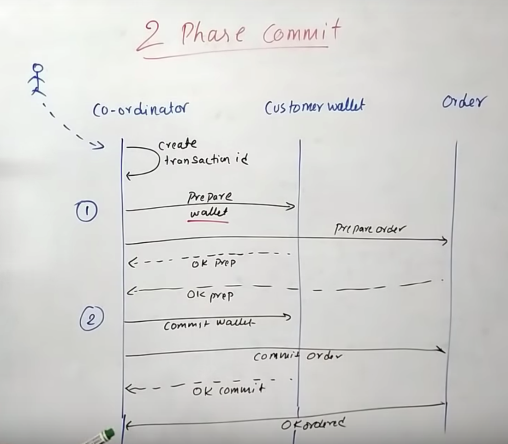
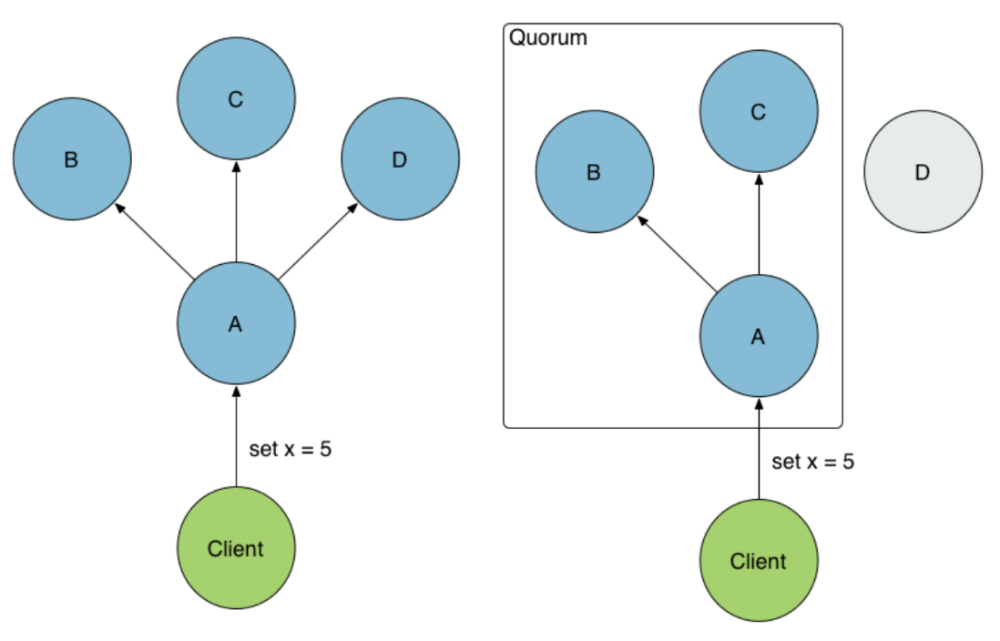

# Consensus Protocols

Created: 2019-06-24 06:31:57 +0500

Modified: 2022-03-09 22:19:23 +0500

---

There are a number of ways we can go about replicating the log data. Broadly speaking, we can group the techniques into two different categories:

## Gossip/Multicast Protocols

These tend to be eventually consistent and/or stochastic.

- Epidemic broadcast trees
- Bimodal multicast
- SWIM
- HyParView
- NeEM

## Consensus Protocols

These tend to favor strong consistency over availability.

- 2PC/3PC
- Paxos
- Raft
- Zab (Zookeeper atomic broadcast)
- Chain replication

## Paxos - Consensus over distributed hosts

Ex - doing a leader election among a distributed host.

Multi-paxos - models the log as a series of consensus problems, one for each slot in the log
[Paxos](https://lamport.azurewebsites.net/pubs/paxos-simple.pdf)is the original distributed consensus algorithm, with modified versions used by[Chubby](https://static.googleusercontent.com/media/research.google.com/en/archive/chubby-osdi06.pdf)and many others. (Zookeeper's[ZAB](https://cwiki.apache.org/confluence/display/ZOOKEEPER/Zab+vs.+Paxos)is similar to Paxos as well.)
<https://lamport.azurewebsites.net/tla/paxos-algorithm.html>

[Paxos lecture (Raft user study)](https://www.youtube.com/watch?v=JEpsBg0AO6o)

<https://engineering.fb.com/2022/03/07/core-data/augmenting-flexible-paxos-logdevice>

## Raft - Consensus Algorithm**

[RAFT](https://raft.github.io/raft.pdf)is a much simpler consensus algorithm.
Used by -

- Consul
- Used by etcd (distributed key value store)
<https://raft.github.io>

<http://thesecretlivesofdata.com/raft>

## SWIM**

[SWIM](https://www.cs.cornell.edu/projects/Quicksilver/public_pdfs/SWIM.pdf)is a distributed gossip protocol for group membership (e.g. for determining members of a caching ring, etc)

## Two-Phase Commit Protocol

In[transaction processing](https://en.wikipedia.org/wiki/Transaction_processing),[databases](https://en.wikipedia.org/wiki/Database), and[computer networking](https://en.wikipedia.org/wiki/Computer_networking), thetwo-phase commit protocol(2PC) is a type of[atomic commitment protocol](https://en.wikipedia.org/wiki/Atomic_commit)(ACP). It is a[distributed algorithm](https://en.wikipedia.org/wiki/Distributed_algorithm)that coordinates all the processes that participate in a[distributed atomic transaction](https://en.wikipedia.org/wiki/Distributed_transaction)on whether to[commit](https://en.wikipedia.org/wiki/Commit_(data_management))orabort(roll back) the transaction (it is a specialized type of[consensus](https://en.wikipedia.org/wiki/Consensus_(computer_science))protocol). The protocol achieves its goal even in many cases of temporary system failure (involving either process, network node, communication, etc. failures), and is thus widely used.However, it is not resilient to all possible failure configurations, and in rare cases, manual intervention is needed to remedy an outcome. To accommodate recovery from failure (automatic in most cases) the protocol's participants use[logging](https://en.wikipedia.org/wiki/Server_log)of the protocol's states. Log records, which are typically slow to generate but survive failures, are used by the protocol's[recovery procedures](https://en.wikipedia.org/wiki/Recovery_procedure). Many protocol variants exist that primarily differ in logging strategies and recovery mechanisms. Though usually intended to be used infrequently, recovery procedures compose a substantial portion of the protocol, due to many possible failure scenarios to be considered and supported by the protocol.
In a "normal execution" of any single[distributed transaction](https://en.wikipedia.org/wiki/Distributed_transaction)(i.e., when no failure occurs, which is typically the most frequent situation), the protocol consists of two phases:

a.  **Thecommit-request phase(orvoting phase / prepare phase)**, in which acoordinatorprocess attempts to prepare all the transaction's participating processes (namedparticipants,cohorts, orworkers) to take the necessary steps for either committing or aborting the transaction and tovote, either "Yes": commit (if the transaction participant's local portion execution has ended properly), or "No": abort (if a problem has been detected with the local portion), and

b.  **Thecommit phase**, in which, based onvotingof the participants, the coordinator decides whether to commit (only ifallhave voted "Yes") or abort the transaction (otherwise), and notifies the result to all the participants. The participants then follow with the needed actions (commit or abort) with their local transactional resources (also calledrecoverable resources; e.g., database data) and their respective portions in the transaction's other output (if applicable).

Two-phase commit is a blocking protocol. The coordinator blocks waiting for votes from its cohorts, and cohorts block waiting for a commit/rollback message from the coordinator. Unfortunately, this means 2PC can, in some circumstances, result in a deadlock, e.g. the coordinator dies while cohorts wait or a cohort dies while the coordinator waits. Another problematic scenario is when a coordinator and cohort simultaneously fail. Even if another coordinatortakes its place, it won't be able to determine whether to commit or rollback.
<https://en.wikipedia.org/wiki/Two-phase_commit_protocol>

[**https://bravenewgeek.com/understanding-consensus/**](https://bravenewgeek.com/understanding-consensus/)

## 3 Phase Commit

Three-phase commit (3PC) is designed to solve the problems identified in two-phase by implementing a non-blocking protocol with an added "prepare" phase. Like 2PC, it relies on a coordinator which relays messages to its cohorts.
Unlike 2PC, cohorts do not executea transaction during the voting phase. Rather, they simply indicate if they are prepared to perform the transaction. If cohorts timeout during this phase or there is one or more "no" vote, the transaction is aborted. If the vote is unanimously "yes," the coordinator moves on to the "prepare" phase, sending a message to its cohorts to acknowledge the transaction will be committed. Again, if an ack times out, the transactionis aborted. Once all cohorts have acknowledged the commit, we are guaranteed to be in a state where*all*cohorts have agreed to commit. At this point, if the commit message from the coordinator is not received in the third phase, the cohort will go ahead and commit anyway. This solves the deadlocking problems described earlier. However, 3PC is still susceptible to network partitions. If a partition occurs, the coordinator will timeout and progress will not be made.
<https://bravenewgeek.com/understanding-consensus>

## State Replication**

Protocols like[Raft](https://ramcloud.stanford.edu/raft.pdf),[Paxos](http://research.microsoft.com/en-us/um/people/lamport/pubs/paxos-simple.pdf), and[Zab](http://web.stanford.edu/class/cs347/reading/zab.pdf)are popular and widely used solutions to the problem of distributed consensus. These implement state replication or primary-backup using leaders, quorums, and replicas of operation logs or incremental delta states.

These protocols workby electing a leader (coordinator). Like multi-phase commit, all changes must go through thatleader, who then broadcasts the changes to the group. Changes occur by appending a log entry, and each node has its own log replica. Where multi-phase commit falls down in the face of network partitions, these protocols are able to continue working by relying on a quorum (majority). The leader commits the change once the quorum has acknowledged it.
The use of quorums provide partition tolerance by fencing minority partitions while the majority continues to operate.This is the pessimistic approach to solving split-brain, so it comes with an inherent availability trade-off. This problem is mitigated by the fact that each node hosts a replicated state machine which can be rebuilt or reconciled once the partition is healed.
Google relies on Paxos for its high-replication datastore in App Engine as well as its[Chubby lock service](http://static.googleusercontent.com/media/research.google.com/en/us/archive/chubby-osdi06.pdf). The distributed key-value store[etcd](https://github.com/coreos/etcd)uses Raft to manage highly available replicated logs. Zab, which differentiates itself from the former by implementing a primary-backup protocol, was designed for the[ZooKeeper](http://zookeeper.apache.org/)coordination service. In general, there are several different implementations of these protocols, such as the[Go implementation](https://github.com/goraft/raft)of Raft.
<https://bravenewgeek.com/understanding-consensus>

## SAGA (Asynchronous Distributed Transactions)**

## Context

You have applied the[Database per Service](https://microservices.io/patterns/data/database-per-service.html)pattern. Each service has its own database. Some business transactions, however, span multiple service so you need a mechanism to implement transactions that span services. For example, let's imagine that you are building an e-commerce store where customers have a credit limit. The application must ensure that a new order will not exceed the customer's credit limit. Since Orders and Customers are in different databases owned by different services the application cannot simply use a local ACID transaction.

## Solution

Implement each business transaction that spans multiple services is a saga. A saga is a sequence of local transactions. Each local transaction updates the database and publishes a message or event to trigger the next local transaction in the saga. If a local transaction fails because it violates a business rule then the saga executes a series of compensating transactions that undo the changes that were made by the preceding local transactions.

## Types of SAGA Implementation

1. Choreography - Event based

Each local transaction publishes domain events that trigger local transactions in other services

2.  Orchestration - Command based

An orchestrator (object) tells the participants what local transactions to execute

Youtube - [SAGA | Microservices Architecture Patterns | Tech Primers](https://www.youtube.com/watch?v=WnZ7IcaN_JA)

Youtube - [Do you know Distributed transactions?](https://www.youtube.com/watch?v=S4FnmSeRpAY)

<https://microservices.io/patterns/data/saga.html>

## Gossip / Gossiping**

Agossip protocolis a procedure or process of computer peer-to-peer communication that is based on the way that[epidemics](https://en.wikipedia.org/wiki/Epidemic)spread. Some[distributed systems](https://en.wikipedia.org/wiki/Distributed_computing)use peer-to-peer gossip to ensure that data is routed to all members of an ad-hoc network. Some ad-hoc networks have no central registry and the only way to spread common data is to rely to each member to pass it along to their neighbors.

The termepidemic protocolis sometimes used as a synonym for a gossip protocol, because gossip spreads information in a manner similar to the spread of a[virus](https://en.wikipedia.org/wiki/Virus)in a biological community.
<https://en.wikipedia.org/wiki/Gossip_protocol>

## FLP Impossibility**

States that reaching a multi-party consensus in a asynchronous system is not possible and, in order for consensus to be reachable, we need**Failure Detectors**.
In order for processes to agree, several invariants have to be persevered:

- value that's being agreed on has to be "proposed" by one of the participants
- all active (non-crashed) participants have to decide on the value
- value they eventually decide on has to be the same for all processes
In a[paper](https://groups.csail.mit.edu/tds/papers/Lynch/jacm85.pdf)by Fisher, Lynch and Paterson, famously known asFLP Impossibility Problem(derived from the first letters of authors' last names), authors discuss a weak form of consensus in which processes start with an initial value and have to achieve an agreement on a new value. This new value has to be the same for all non-faulty processes.
Paper concludes that in anasynchronous system, no consensus protocol can be totally correct in presence of even a single fault. If we do not consider an upper time bound for process to complete the algorithm steps and if process failures can't be reliably detected, FLP paper shows that there's no deterministic algorithm to reach a consensus.
However, FLP proof does not mean we have to pack our things and go home, as reaching consensus is not possible. It only means that it can't always be reached in bounded time. In practice, systems exhibit partial synchronicity, which puts partially synchronous system between the cases of asynchronous and synchronous ones. Nancy Lynch, one of the FLP proof authors, has later authored[Consensus in the Presence of Partial Synchrony](http://groups.csail.mit.edu/tds/papers/Lynch/jacm88.pdf)paper, where several partially synchronous models are discussed, one of them holding timing assumptions that are not known in advance and the other one, where timing assumptions are known, but start holding up at an unknown time.
<https://medium.com/databasss/on-ways-to-agree-part-1-links-and-flp-impossibility-f6bd8a6a0980>
