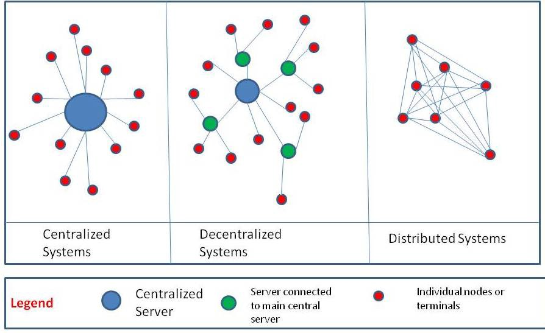

# Intro

Created: 2018-04-19 17:48:38 +0500

Modified: 2021-06-11 00:18:38 +0500

---

Andrew S. Tanenbaum - A Collection of independent computers that appears to its users as one computer.
-   In**Centralized Systems**there is one central authority or server and all the other nodes act like clients or entities who accept message and enact accordingly
-   In**Decentralized Systems**there are multiple servers who receive messages from one central server. The individual nodes are connected to the secondary servers.However, in some systems, all servers can be of equal in hierarchy with no central server as well.
-   In**Distributed systems**there is no central authority. Each node is connected to every other node and has the exact same authority. Of course, in terms of computing distributed systems the processing power of each node might vary to a huge extent.
**Characteristics**
-   The computers operate concurrently
-   The computers fail independently
-   The computers do not share a global clock
**Main Topics**

1.  Distributed Storage

Single Master Storage - Database lives in one server

In a typical system there are always more read than write.

Relational database have reads cheaper than writes

To scale up we do following things -

1.  Read Replication - Can cause inconsistency
    -   Create a master database that handle all the writes and there will be multiple databases where data can be read from. Master will synchronize all databases with each other.

2.  Sharding - Find a key and break-up the database into multiple databases using that key. (Like a-k, k-s, s-z)
    -   Broke data modal
    -   Cannot join across shards

3.  Add index to the database

4.  De-normalize

5.  Consistent Hashing

6.  CAP Theorem (can only have 2 of these 3)
    -   Consistency
    -   Availability
    -   Partition Tolerance2.  Distributed Computation

    a.  MapReduce

        1.  Map (Tokenize words and count using key-value pairs)

        2.  Shuffle (Get same words near each other)

        3.  Reduce

        4.  Hadoop

        5.  Spark

        6.  Kafka

3.  Messaging

    a.  Means of loosely coupling subsystems

    b.  Messages consumed by subscribers

    c.  Created by one or more producers

    d.  Organized into topics

    e.  Processed by brokers

    f.  Usually persistent over the short term
**Problems**

1.  What if a topic gets too big for one computer?

2.  What if one computer is not reliable enough?

3.  How strongly can be guarantee delivery?

**Solution - Apache Kafka**

1.  Messaging broker

2.  Message: an immutable array of bytes

3.  Topic: a feed of messages

4.  Producer: a process that publishes messages to a topic

5.  Consumer: a single-threaded process that subscribes to a topic

6.  Broker: one of the servers that comprises a cluster
**Links**

1.  **Fair-Loss Link**

Does not give any visibility in terms of delivery for a sender

2.  **Stubborn Link**

Keep re-transmitting messages indefinitely, hoping that eventually one of the messages will get delivered

3.  **Perfect Link**

Eventually deliver messages and make sure this delivery is done at most once
**Questions while designing a distributed system**

The following qualities are all important in the design of a realtime data system

1.  Ease of use

How complex are the processing requirements? Is SQL enough? Or is a general-purpose procedural language (such as C++ or Java) essential? How fast can a user write, test, and deploy a new application?

2.  Performance

How much latency is ok? Milliseconds? Seconds? Or minutes? How much throughput is required, per machine and in aggregate?

3.  Fault-tolerance

What kinds of failures are tolerated?What semantics are guaranteed for the number of times that data is processed or output? How does the system store and recover in-memory state?

4.  Scalability

Can data be sharded and resharded to pro-cess partitions of it in parallel? How easily can the system adapt to changes in volume, both up and down?Can it reprocess weeks worth of old data?

5.  Correctness

Are ACID guarantees required? Must all data that is sent to an entry point be processed and appear in results at the exit point?
**Principles of Distributed System Design**

[From the March 14, 2006, press release for the S3 (Simple Storage Service) launch](https://press.aboutamazon.com/news-releases/news-release-details/amazon-web-services-launches-amazon-s3-simple-storage-service)2
Amazon used the following principles of distributed system design to meet Amazon S3 requirements:
-   **Decentralization.** Use fully decentralized techniques to remove scaling bottlenecks and single points of failure.
-   **Asynchrony.** The system makes progress under all circumstances.
-   **Autonomy.** The system is designed such that individual components can make decisions based on local information.
-   **Local responsibility.** Each individual component is responsible for achieving its consistency; this is never the burden of its peers.
-   **Controlled concurrency.** Operations are designed such that no or limited concurrency control is required.
-   **Failure tolerant.** The system considers the failure of components to be a normal mode of operation and continues operation with no or minimal interruption.
-   **Controlled parallelism.** Abstractions used in the system are of such granularity that parallelism can be used to improve performance and robustness of recovery or the introduction of new nodes.
-   **Decompose into small, well-understood building blocks.** Do not try to provide a single service that does everything for everyone, but instead build small components that can be used as building blocks for other services.
-   **Symmetry.** Nodes in the system are identical in terms of functionality, and require no or minimal node-specific configuration to function.
-   **Simplicity.** The system should be made as simple as possible, but no simpler.
**References -**

<https://www.youtube.com/watch?v=Y6Ev8GIlbxc>
<https://www.researchgate.net/publication/282914203_A_comparative_evaluation_of_AMQP_and_MQTT_protocols_over_unstable_and_mobile_networks>

<https://dev.to/uyouthe/scalable-architecture-without-magic-and-how-to-build-it-if-youre-not-google-336a>
<https://en.wikipedia.org/wiki/High_availability>
<https://lethain.com/distributed-systems-vocabulary/>
<https://www.kislayverma.com/post/code-review-checklist-for-distributed-systems>

