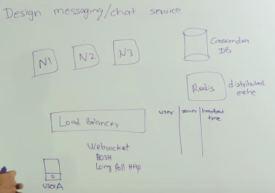
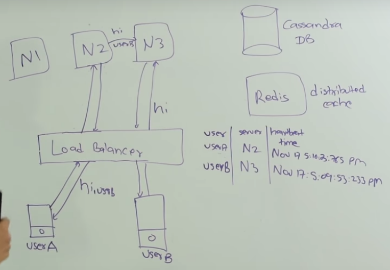
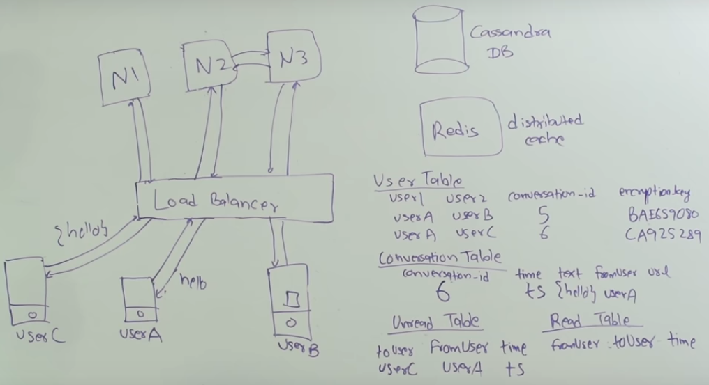
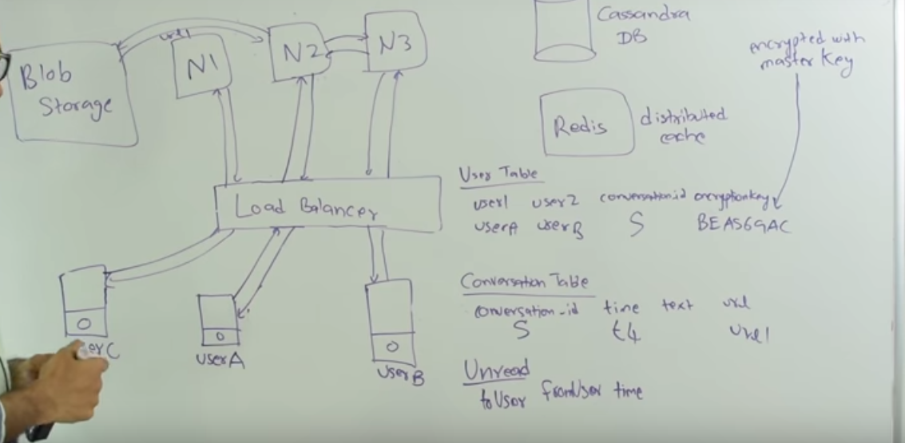

# System Design - Messenger / WhatsApp

Created: 2018-04-06 22:30:44 +0500

Modified: 2021-08-27 19:59:58 +0500

---

[System Design : Design messaging/chat service like Facebook Messenger or Whatsapp](https://www.youtube.com/watch?v=zKPNUMkwOJE)

[System Design: Messenger service like Whatsapp or WeChat - Interview Question](https://www.youtube.com/watch?v=5m0L0k8ZtEs)
**WhatsApp tech stack**
-   variant of XMPP for signaling.
-   Opus voice codec, but in 16Khz
-   **Opus/SILK audio codec**and**NAT (Network Address Translation)**techniques. The STUN server and Peer to Peer connection are the key elements included to boost and maintain authentication to the users.
-   WhatsApp is using the[PJSIP library](http://www.pjsip.org/)to implement Voice over IP (VoIP) functionality. The captures shows no signs of DTLS, which suggests the use of SDES encryption (see[here](https://webrtchacks.com/webrtc-must-implement-dtls-srtp-but-must-not-implement-sdes/)for Victor's past post on this). Even though[STUN](https://webrtchacks.com/stun-helps-webrtc-traverse-nats/)is used, the binding requests do not contain ICE-specific attributes. RTP and RTCP are multiplexed on the same port.
<https://webrtchacks.com/whats-up-with-whatsapp-and-webrtc/>
**Design a Messaging Service**
-   **Messaging**

    a.  One to one message

    b.  Group message

    c.  Broadcast message-   Timeline
-   Sharing

    a.  text / stickers

    b.  image / gifs

    c.  video

    d.  status (text / image / video)-   **Delivery**

    a.  Sent notification

    b.  Delivered notification

    c.  Read notification (can be sent like a regular message [like an acknowledgement])
-   **Push notifications**

    a.  Only delivering, because there cannot be interaction with the message

    b.  Uses GCM-   Backup

    a.  Local

    b.  Cloud
-   Storage

    a.  Store messages

    b.  Store analytics

    c.  Send and delete
-   Network

    a.  **Ephermeral**
    b.  TCP - Handshake

    c.  Load balancing (layers of load balancing and caching)
-   Scaling

    a.  Horizontally

    b.  Messages can be delivered out of order because different messages can be used to handle message requests.
-   Caching
-   Database

    a.  storing logs

    b.  analytics data

    c.  history
-   Database replication
-   Database sharding
-   Queuing

    a.  Messages Queue
-   Security

    a.  End to end encryption
-   How to monetize the application

    a.  sell stickers, emojis

    b.  permium services
**Two Types of Chatting**

Facebook -
-   Keep all the messages
-   Can read the message if end to end encryption is not turned on

WhatsApp / Signal -
-   only keeps the messages till the receiver doesn't receive the message, then delete it
-   End to end encryption enabled, cannot read messages
**Facebook Messengers**

Features -
-   One to one chatting
-   Online / Sent / Read
-   Sending pictures or other files
-   Database
-   Security
User talks to Load Balancer (which can operate at Level-3, Level-4 or Level-7)

Load Balancer then talks to one of the node servers

Networking - HTTP, WebSockets
-   User will login using username and password at that time server will know that user is online
-   User A will send request to a load balancer, Load balancer will redirect the request to one of the hosts using FIFO or number of connections or load average of these hosts.
-   Bidirectional connection is needed for heartbeat
-   We store all the data of heartbeat in in-memory cache i.e. redis
-   Using the last heartbeat user can know when a user was last online (like 45 mins ago)
-   All the messages will be stored in Cassandra DB
-   If user is not online then text message will be stored in unread table

**Sending messages when user is offline**

**Sending Images**
-   Use thumbnail to send image
-   Save into blob storage and pass down url

**Optimizations**
-   Persisting messages
-   Convert old data messages to blob structure and save it in blob storage
-   Search everytime someone searches
-   Since, search is very expensive and done so rarely
-   Group Table for group chat

