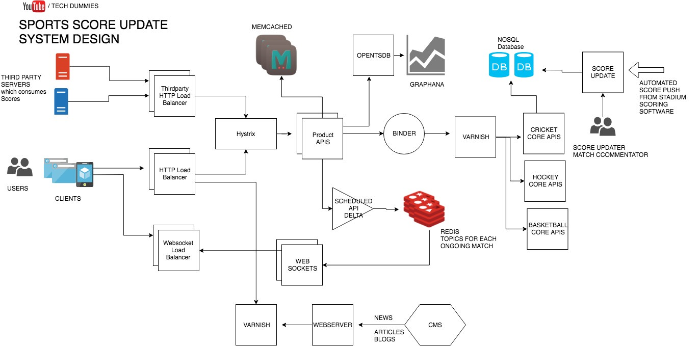
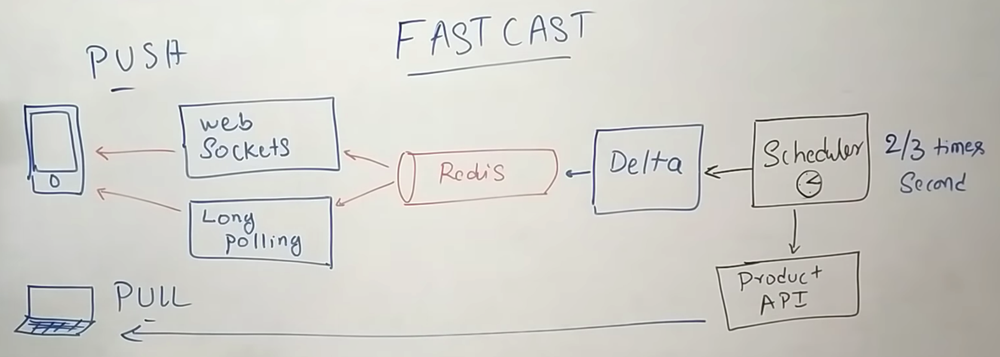
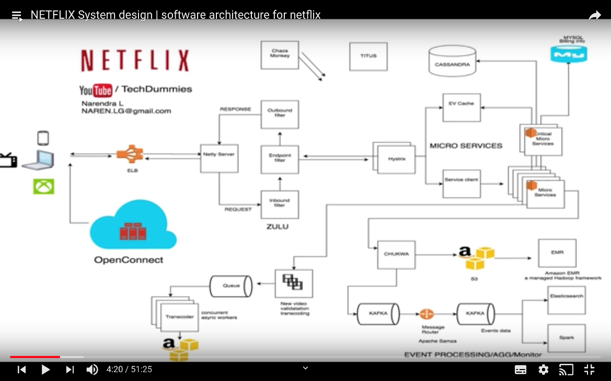
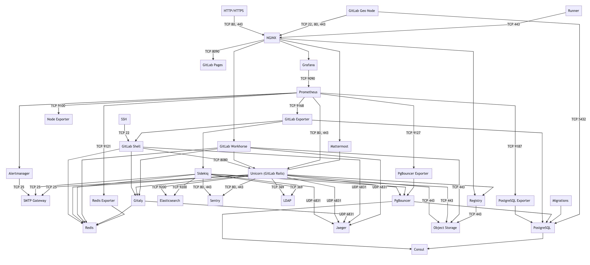
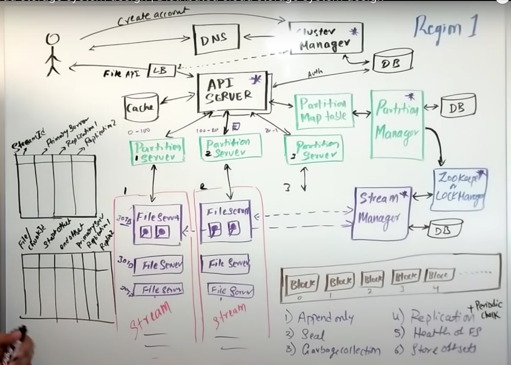
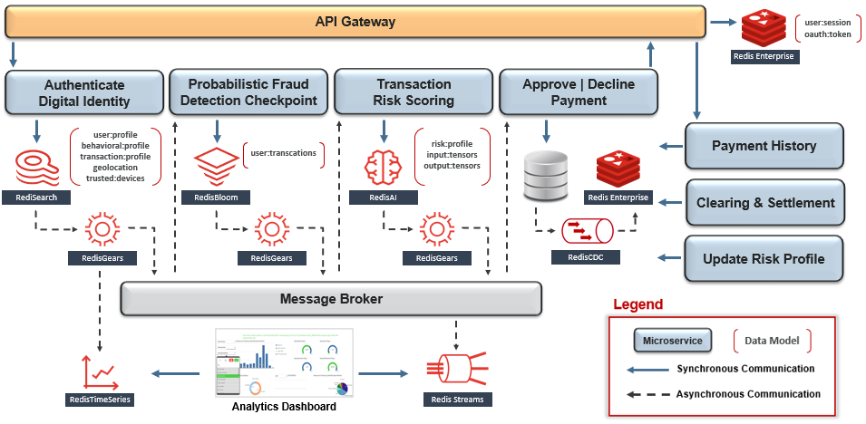

# System Design - Others

Created: 2020-01-03 23:44:06 +0500

Modified: 2022-07-15 17:39:32 +0500

---

**CricInfo**

[CRICINFO system design | CRICBUZZ System desi](http://youtube.com/watch?v=exSwQtMxGd4)gn
{width="8.135416666666666in" height="4.020833333333333in"}
{width="6.03125in" height="2.15625in"}
**Netflix**

1.  AWS

2.  OpenConnect (Netflix CDN)
1.  OC

2.  Backend

3.  Client
{width="5.3125in" height="3.3229166666666665in"}
<https://www.linkedin.com/pulse/system-design-netflix-narendra-l/>

<https://netflixtechblog.com/netflixs-viewing-data-how-we-know-where-you-are-in-house-of-cards-608dd61077da>

[NETFLIX System design | software architecture for netflix](https://www.youtube.com/watch?v=psQzyFfsUGU)
**Gitlab**

{width="10.416666666666666in" height="4.677083333333333in"}

**S3 system design (distributed cloud storage)**

**Cluster Manager**

1.  Allocates account

2.  Disaster recovery

3.  Resource track

4.  Holds policies Authentication + Authorization

5.  Manages Cluster-   **Hash(UUID) - Partition Map Table**
-   **Consistent Hashing**
-   **1 hit wonder (don't cache any request till a threshold)**
    -   Maybe the request is only once/twice for a day
**Streaming layer (Stream Manager)**

1.  Append only

2.  Seal

3.  Garbage collection

4.  Replication

5.  Health of FS

6.  Store offsets
{width="5.0in" height="3.5729166666666665in"}
<https://www.youtube.com/watch?v=UmWtcgC96X8>
**Web Crawlers**

**Use Case**
-   Search engine
-   Copywrite violation detection
-   Keyword based finding
    -   New analysis (share market)
-   Web malware detection
-   Web analytics
-   Data science data crawlers
**Features**
-   Politeness / Crawl rate
-   DNS query
-   Distributed crawling
-   Priority crawling
-   Duplicate detection
    -   Bruteforce
    -   Hashing (MD5-SHA1)
    -   MinHash
    -   SimHash (Google uses this)
    -   Fuzzy search
    -   Latent semantic indexing
    -   Standard boolean model
[System Design distributed web crawler to crawl Billions of web pages | web crawler system design](https://www.youtube.com/watch?v=BKZxZwUgL3Y)
**Financial System**

{width="6.96875in" height="3.4166666666666665in"}

**TikTok**

[System Design Interview: TikTok architecture with @sudoCODE](https://www.youtube.com/watch?v=07BVxmVFDGY&ab_channel=GauravSen)
-   Intagram Reels
-   Short TikTok Videos
**Challenges**

a.  Ingestion

b.  Storage

c.  Distribution
Functional requirements
-   Upload videos
-   Feed
-   Profiles

Non-functional requirements
-   Scalability
-   Availability
-   Fault tolerant
-   Performance
**Others**

HTTP + json is not good (because contract is not upheld from developers while sending apis)
