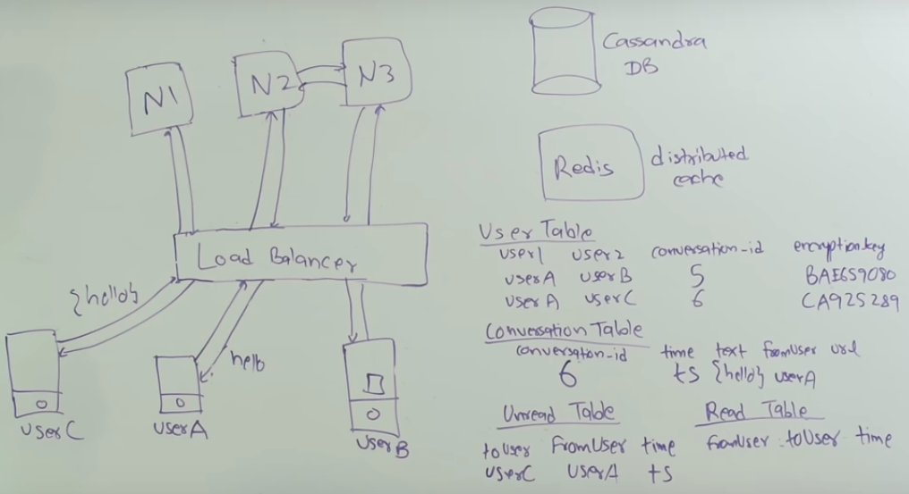
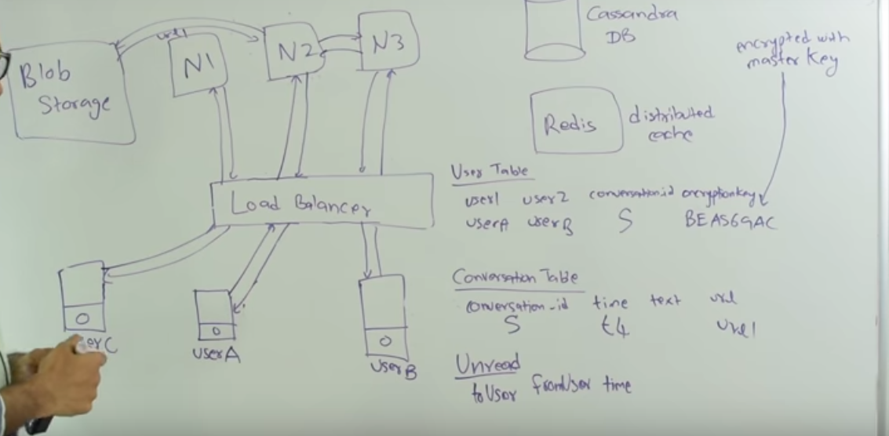

# System Design - Messenger / WhatsApp

[System Design : Design messaging/chat service like Facebook Messenger or Whatsapp](https://www.youtube.com/watch?v=zKPNUMkwOJE)

[System Design: Messenger service like Whatsapp or WeChat - Interview Question](https://www.youtube.com/watch?v=5m0L0k8ZtEs)

## WhatsApp tech stack

- variant of XMPP for signaling.
- Opus voice codec, but in 16Khz
- **Opus/SILK audio codec** and **NAT (Network Address Translation)** techniques. The STUN server and Peer to Peer connection are the key elements included to boost and maintain authentication to the users.
- WhatsApp is using the [PJSIP library](http://www.pjsip.org/) to implement Voice over IP (VoIP) functionality. The captures shows no signs of DTLS, which suggests the use of SDES encryption (see [here](https://webrtchacks.com/webrtc-must-implement-dtls-srtp-but-must-not-implement-sdes/) for Victor's past post on this). Even though [STUN](https://webrtchacks.com/stun-helps-webrtc-traverse-nats/) is used, the binding requests do not contain ICE-specific attributes. RTP and RTCP are multiplexed on the same port.

<https://webrtchacks.com/whats-up-with-whatsapp-and-webrtc>

## Design a Messaging Service

- **Messaging**
  - One to one message
  - Group message
  - Broadcast message-  Timeline
- Sharing
  - text / stickers
  - image / gifs
  - video
  - status (text / image / video)-  **Delivery**
  - Sent notification
  - Delivered notification
  - Read notification (can be sent like a regular message [like an acknowledgement])
- **Push notifications**
  - Only delivering, because there cannot be interaction with the message
  - Uses GCM-  Backup
  - Local
  - Cloud
- Storage
  - Store messages
  - Store analytics
  - Send and delete
- Network
  - **Ephermeral**
  - TCP - Handshake
  - Load balancing (layers of load balancing and caching)
- Scaling
  - Horizontally
  - Messages can be delivered out of order because different messages can be used to handle message requests.
- Caching
- Database
  - storing logs
  - analytics data
  - history
- Database replication
- Database sharding
- Queuing
  - Messages Queue
- Security
  - End to end encryption
- How to monetize the application
  - sell stickers, emojis
  - permium services

## Two Types of Chatting

Facebook -

- Keep all the messages
- Can read the message if end to end encryption is not turned on

WhatsApp / Signal -

- only keeps the messages till the receiver doesn't receive the message, then delete it
- End to end encryption enabled, cannot read messages

## Facebook Messengers

Features -

- One to one chatting
- Online / Sent / Read
- Sending pictures or other files
- Database
- Security
User talks to Load Balancer (which can operate at Level-3, Level-4 or Level-7)

Load Balancer then talks to one of the node servers

Networking - HTTP, WebSockets
-  User will login using username and password at that time server will know that user is online

- User A will send request to a load balancer, Load balancer will redirect the request to one of the hosts using FIFO or number of connections or load average of these hosts.
- Bidirectional connection is needed for heartbeat
- We store all the data of heartbeat in in-memory cache i.e. redis
- Using the last heartbeat user can know when a user was last online (like 45 mins ago)
- All the messages will be stored in Cassandra DB
- If user is not online then text message will be stored in unread table

## Sending messages when user is offline

## Sending Images

- Use thumbnail to send image
- Save into blob storage and pass down url

## Optimizations

- Persisting messages
- Convert old data messages to blob structure and save it in blob storage
- Search everytime someone searches
- Since, search is very expensive and done so rarely
- Group Table for group chat
