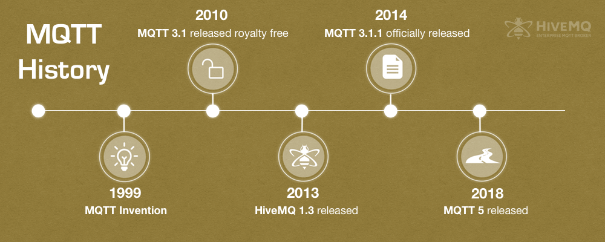

# Intro

Created: 2018-04-24 11:27:12 +0500

Modified: 2021-06-06 16:48:35 +0500

---

**Outline**

**Basic**
-   Publish and Subscribe Basics
-   Client, Broker and Connection Establishment
-   Publish, Subscribe and Unsubscribe
-   Topics and Best Practices
**Features**
-   Quality of Service Levels
-   Persistent Sessions and Queuing messages
-   Retained Messages
-   Last Will and Testament
-   Keep Alive and Client Take-Over
**Specials**
-   MQTT over Websockets
MQTT is a Client Server publish/subscribe messaging transport protocol. It is light weight, open, simple, and designed so as to be easy to implement. These characteristics make it ideal for use in many situations, including constrained environments such as for communication in Machine to Machine (M2M) and Internet of Things (IoT) contexts where a small code footprint is required and/or network bandwidth is at a premium.
**MQTT**(**MQ Telemetry Transport**) is an[ISO standard](https://en.wikipedia.org/wiki/International_Organization_for_Standardization)(ISO/IEC PRF 20922)[publish-subscribe](https://en.wikipedia.org/wiki/Publish%E2%80%93subscribe_pattern)-based messaging protocol. It works on top of the[TCP/IP protocol](https://en.wikipedia.org/wiki/TCP/IP). The[publish-subscribe messaging pattern](https://en.wikipedia.org/wiki/Publish%E2%80%93subscribe_pattern)requires a[message broker](https://en.wikipedia.org/wiki/Message_broker).
MQTT Utilizes many characteristics of the TCP transport, so the minimum requirement for using MQTT is a working TCP stack, which is now available for even the smallest microcontrollers. A variant,MQTT-SN, is used over other transports such asUDPor Bluetooth.MQTTsends connection credentials in plain text format and does not include any measures for security or authentication.
It is a very light weight and binary protocol, and due to its minimal packet overhead, MQTTexcels when transferring data over the wire in comparison to protocols like HTTP.
**Features**
-   Open source
-   simple and lightweight protocol
-   small code footprint
-   Designed for resource-contrained devices and low bandwidth, high latency networks such as dial up lines and satellite links (embedded systems)
-   publish-and-subscribe messaging (no queues)
-   3 quality of services
    -   fire-and-forget / unreliable
    -   "at least once" to ensure it is sent a minimum of one time (but can be sent more than one time)
    -   "exactly once"
-   ideal for machine-to-machine (M2M) or Internet of Things and for mobile applications
**Usage**

MQTT excels in scenarios where reliable message delivery is crucial for an application but a reliable network connection is not necessarily available, e.g. mobile networks. Typical use cases of MQTT include:
-   Telemetry
-   Automotive
-   Smart Home
-   Energy Monitoring
-   Chat Applications
-   Notification Services
-   Healthcare Applications
**History**

The MQTT protocol was invented in 1999 by Andy Stanford-Clark (IBM) and Arlen Nipper (Arcom, now Cirrus Link). They needed a protocol for minimal battery loss and minimal bandwidth to[connect with oil pipelines via satellite](http://www.ibm.com/podcasts/software/websphere/connectivity/piper_diaz_nipper_mq_tt_11182011.pdf).
{width="5.958333333333333in" height="2.3854166666666665in"}
**Real world deployments**
-   Facebook mobile application
**See also**
-   Message Oriented Architecture (MOM)
**References**
-   Getting started with MQTT by DZone Refcardz
-   <https://www.hivemq.com/blog/6-facts-why-its-worth-upgrading-to-mqtt-3-1-1>
-   <https://www.hivemq.com/mqtt-essentials/>
-   <https://www.hivemq.com/blog/mqtt-essentials-part-1-introducing-mqtt/>

