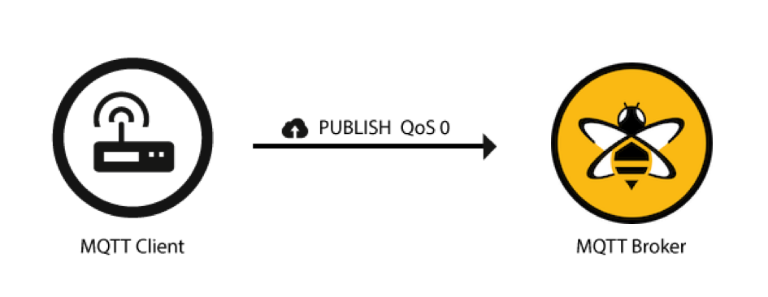
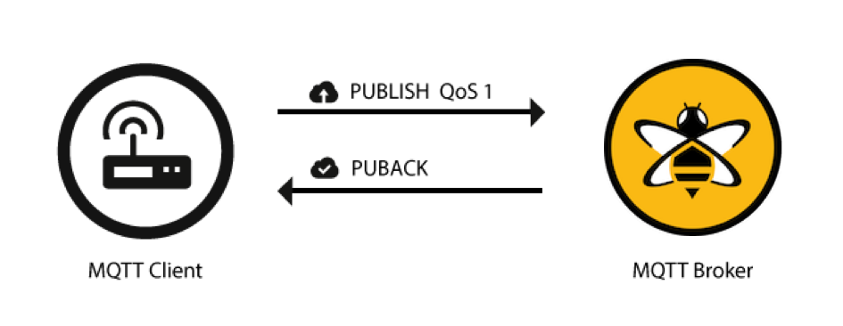
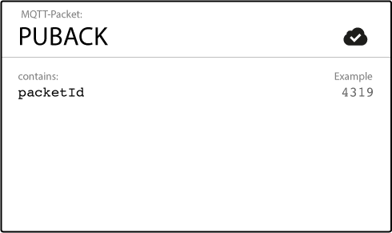

# QoS Levels

Created: 2019-03-12 18:21:07 +0500

Modified: 2019-09-23 10:48:16 +0500

---

## What is Quality of Service?

TheQuality of Service(QoS) level is an agreement between the sender of a message and the receiver of a message that defines the guarantee of delivery for a specific message.
| QOS LEVEL | Name                                     | DESCRIPTION                                                                                                                                                                                                                          |
|----------|----------------|----------------------------------------------|
| 0         | At most once (fire and forget)           | The sender tries with best effort to send the message and relies on the reliability of TCP. No retransmission takes place.                                                                                                           |
| 1         | At least once (acknowledged delivery)    | The receiver will get the message at least once. If the receiver does not acknowledge the message or the acknowledge gets lost on the way, it will be resent until the sender gets an acknowledgement. Duplicate messages can occur. |
| 2         | Exactly once delivery (assured delivery) | The protocol makes sure that the message will arrive exactly once at the receiver. This increases communication overhead but is the best option when neither loss nor duplication of messages are acceptable.                        |
When you talk about QoS in MQTT, you need to consider the two sides of message delivery:

a.  **Message delivery form the publishing client to the broker.**

b.  **Message delivery from the broker to the subscribing client.**
We will look at the two sides of the message delivery separately because there are subtle differences between the two. The client that publishes the message to the broker defines the QoS level of the message when it sends the message to the broker. The broker transmits this message to subscribing clients using the QoS level that each subscribing client defines during the subscription process. If the subscribing client defines a lower QoS than the publishing client, the broker transmits the message with the lower quality of service.

## Why is Quality of Service important?

QoS is a key feature of the MQTT protocol. QoS gives the client the power to choose a level of service that matches its network reliability and application logic. Because MQTT manages the re-transmission of messages and guarantees delivery (even when the underlying transport is not reliable), QoS makes communication in unreliable networks a lot easier.

## QoS 0 - at most once

The minimal QoS level is zero. This service level guarantees a best-effort delivery. There is no guarantee of delivery. The recipient does not acknowledge receipt of the message and the message is not stored and re-transmitted by the sender. QoS level 0 is often called "fire and forget" and provides the same guarantee as the underlying TCP protocol.

## QoS 1 - at least once

QoS level 1 guarantees that a message is delivered at least one time to the receiver. The sender stores the message until it gets a [PUBACK](http://docs.oasis-open.org/mqtt/mqtt/v3.1.1/os/mqtt-v3.1.1-os.html#_Toc398718043) packet from the receiver that acknowledges receipt of the message. It is possible for a message to be sent or delivered multiple times.

The sender uses the packet identifier in each packet to match the PUBLISH packet to the corresponding PUBACK packet. If the sender does not receive a PUBACK packet in a reasonable amount of time, the sender resends the PUBLISH packet. When a receiver gets a message with QoS 1, it can process it immediately. For example, if the receiver is a broker, the broker sends the message to all subscribing clients and then replies with a PUBACK packet. If the publishing client sends the message again it sets a duplicate (DUP) flag. In QoS 1, this DUP flag is only used for internal purposes and is not processed by broker or client. The receiver of the message sends a PUBACK, regardless of the DUP flag.

## QoS 2 - exactly once

- PUBLISH
- PUBREC (Publish Received)
- PUBREL (Publish Release)
- PUBCOMP (Publish Complete)

QoS 2 is the highest level of service in MQTT. This level guarantees that each message is received only once by the intended recipients. QoS 2 is the safest and slowest quality of service level. The guarantee is provided by at least two request/response flows (a four-part handshake) between the sender and the receiver. The sender and receiver use the packet identifier of the original PUBLISH message to coordinate delivery of the message.

When a receiver gets a QoS 2 PUBLISH packet from a sender, it processes the publish message accordingly and replies to the sender with a [PUBREC](http://docs.oasis-open.org/mqtt/mqtt/v3.1.1/os/mqtt-v3.1.1-os.html#_Toc398718048) packet that acknowledges the PUBLISH packet. If the sender does not get a PUBREC packet from the receiver, it sends the PUBLISH packet again with a duplicate (DUP) flag until it receives an acknowledgement.

Once the sender receives a PUBREC packet from the receiver, the sender can safely discard the initial PUBLISH packet. The sender stores the PUBREC packet from the receiver and responds with a [PUBREL](http://docs.oasis-open.org/mqtt/mqtt/v3.1.1/os/mqtt-v3.1.1-os.html#_Toc398718053) packet.

After the receiver gets the PUBREL packet, it can discard all stored states and answer with a [PUBCOMP](http://docs.oasis-open.org/mqtt/mqtt/v3.1.1/os/mqtt-v3.1.1-os.html#_Toc398718058) packet (the same is true when the sender receives the PUBCOMP). Until the receiver completes processing and sends the PUBCOMP packet back to the sender, the receiver stores a reference to the packet identifier of the original PUBLISH packet. This step is important to avoid processing the message a second time. After the sender receives the PUBCOMP packet, the packet identifier of the published message becomes available for reuse.

When the QoS 2 flow is complete, both parties are sure that the message is delivered and the sender has confirmation of the delivery..

If a packet gets lost along the way, the sender is responsible to retransmit the message within a reasonable amount of time. This is equally true if the sender is an MQTT client or an MQTT broker. The recipient has the responsibility to respond to each command message accordingly.

## Good to know

Some aspects of QoS are not very obvious at first glance. Here are a few things to keep in mind when you use QoS:

## Downgrade of QoS

As we already mentioned, the QoS definition and levels between the client that sends (publishes) the message and the client that receives the message are two different things. The QoS levels of these two interactions can also be different. The client that sends the PUBLISH message to the broker defines the QoS of the message. However, when the broker delivers the message to recipients (subscribers), the broker uses the QoS that the receiver (subscriber) defined during subscription. For example, client A is the sender of the message. Client B is the receiver of the message. If client B subscribes to the broker with QoS 1 and client A sends the message to the broker with QoS 2, the broker delivers the message to client B (receiver/subscriber) with QoS 1. The message can be delivered more than once to client B, because QoS 1 guarantees delivery of the message at least one time and does not prevent multiple deliveries of the same message.

## Packet identifiers are unique per client

The packet identifier that MQTT uses for QoS 1 and QoS 2 is unique between a specific client and a broker within an interaction. This identifier is not unique between all clients. Once the flow is complete, the packet identifier is available for reuse. This reuse is the reason why the packet identifier does not need to exceed 65535. It is unrealistic that a client can send more than this number of messages without completing an interaction.

## Best Practice

## Use QoS 0 when

- You have a completely or mostly stable connection between sender and receiver. A classic use case for QoS 0 is connecting a test client or a front end application to an MQTT broker over a wired connection.
- You don't mind if a few messages are lost occasionally. The loss of some messages can be acceptable if the data is not that important or when data is sent at short intervals
- You don't need message queuing. Messages are only queued for disconnected clients if they have QoS 1 or 2 and a [persistent session](https://www.hivemq.com/blog/mqtt-essentials-part-7-persistent-session-queuing-messages).

## Use QoS 1 when

- You need to get every message and your use case can handle duplicates. QoS level 1 is the most frequently used service level because it guarantees the message arrives at least once but allows for multiple deliveries. Of course, your application must tolerate duplicates and be able to process them accordingly.
- You can't bear the overhead of QoS 2. QoS 1 delivers messages much faster than QoS 2.

## Use QoS 2 when

- It is critical to your application to receive all messages exactly once. This is often the case if a duplicate delivery can harm application users or subscribing clients. Be aware of the overhead and that the QoS 2 interaction takes more time to complete.

## Queuing of QoS 1 and 2 messages

All messages sent with QoS 1 and 2 are queued for offline clients until the client is available again. However, this queuing is only possible if the client has a [persistent session](https://www.hivemq.com/blog/mqtt-essentials-part-7-persistent-session-queuing-messages/).

## References

<https://www.hivemq.com/blog/mqtt-essentials-part-6-mqtt-quality-of-service-levels>
