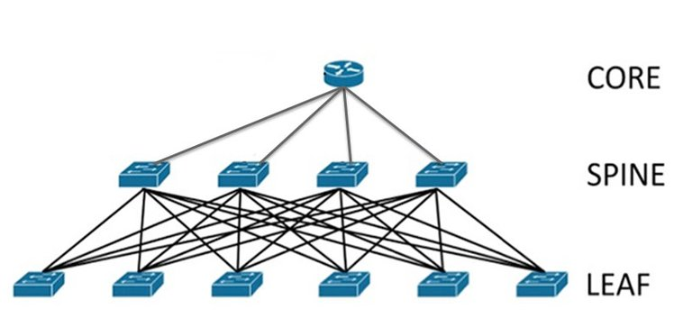
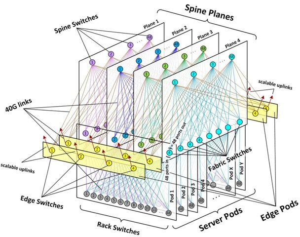

# Others

Created: 2018-03-27 01:07:52 +0500

Modified: 2022-01-27 18:29:02 +0500

---

## Interface Definition Languages

- Apache Thrift (donated by Facebook)
- Google Protocol Buffer (ProtoBuf)
- AIDL (Android Interface Definition Language)

## Spine Switches

In recent years, an architecture known as leaf and spine, or distributed core, has emerged as a leading design for data centers. This design requires spine specially designed [spine switches](https://www.sdxcentral.com/data-center/what-is-networking-switch-fabric/) in order to work.
All spine switches can handle Layer 3 (L3) with high port density, which allows for scalability. In a [software-defined network](https://www.sdxcentral.com/networking/sdn/)([SDN](https://www.sdxcentral.com/networking/sdn/definitions/what-the-definition-of-software-defined-networking-sdn/)), the spine switch is directly connected to a network control system with a virtual Layer 2 switch on top of the leaf-spine system. This controller is not a part of the data path but remains the central network engine, also known as an [SDN Controller](https://www.sdxcentral.com/networking/sdn/definitions/sdn-controllers/).

<https://www.sdxcentral.com/data-center/definitions/what-are-spine-switches>

## NAS

Network-attached storage(NAS) is a file-level (as opposed to [block-level](https://en.wikipedia.org/wiki/Block_device))[computer data storage](https://en.wikipedia.org/wiki/Computer_data_storage) server connected to a [computer network](https://en.wikipedia.org/wiki/Computer_network) providing data access to a [heterogeneous](https://en.wikipedia.org/wiki/Heterogeneous_computing) group of clients. NAS is specialized for [serving files](https://en.wikipedia.org/wiki/File_server) either by its hardware, software, or configuration. It is often manufactured as a [computer appliance](https://en.wikipedia.org/wiki/Computer_appliance)-- a purpose-built specialized computer. NAS systems are networked appliances which contain one or more [storage drives](https://en.wikipedia.org/wiki/Hard_disk_drive), often arranged into logical, redundant storage containers or [RAID](https://en.wikipedia.org/wiki/RAID). Network-attached storage removes the responsibility of file serving from other servers on the network. They typically provide access to files using network file sharing protocols such as [NFS](https://en.wikipedia.org/wiki/Network_File_System_(protocol)), [SMB](https://en.wikipedia.org/wiki/Server_Message_Block), or [AFP](https://en.wikipedia.org/wiki/Apple_Filing_Protocol). From the mid-1990s, NAS devices began gaining popularity as a convenient method of sharing files among multiple computers. Potential benefits of dedicated network-attached storage, compared to general-purpose servers also serving files, include faster data access, easier administration, and simple configuration.
The hard disk drives with "NAS" in their name are functionally similar to other drives but may have different firmware, vibration tolerance, or power dissipation to make them more suitable for use in RAID arrays, which are often used in NAS implementations.For example, some NAS versions of drives support a command extension to allow extended error recovery to be disabled. In a non-RAID application, it may be important for a disk drive to go to great lengths to successfully read a problematic storage block, even if it takes several seconds. In an appropriately configured RAID array, a single bad block on a single drive can be recovered completely via the redundancy encoded across the RAID set. If a drive spends several seconds executing extensive retries it might cause the RAID controller to flag the drive as "down" whereas if it simply replied promptly that the block of data had a checksum error, the RAID controller would use the redundant data on the other drives to correct the error and continue without any problem. Such a "NAS" SATA hard disk drive can be used as an internal PC hard drive, without any problems or adjustments needed, as it simply supports additional options and may possibly be built to a higher quality standard (particularly if accompanied by a higher quoted [MTBF](https://en.wikipedia.org/wiki/MTBF) figure and higher price) than a regular consumer drive.
<https://en.wikipedia.org/wiki/Network-attached_storage>

## Peer to Peer Networks

<https://skerritt.blog/designing-effective-peer-to-peer-networks>

## VPC / RDP

ssh -i ec2_ssh_key.pem -X ubuntu@13.233.36.211
mac - cmd+space

vnc://13.233.36.211:5901
<https://ubuntu.com/tutorials/tutorial-ubuntu-desktop-aws#1-overview>

<https://datawookie.netlify.app/blog/2017/08/remote-desktop-on-an-ubuntu-ec2-instance>

## NoMachine

<https://www.nomachine.com>

## Windows remote desktop (RDP)

## Multi user access

This will launch theGroup Policy Editor(gpedit.msc), which is a management console through which you can configure many Windows system properties or run scripts.
Once the Group Policy Editor is running, navigate to:

Computer Configuration > Administrative Templates > Windows Components > Remote Desktop Services > Remote Desktop Session Host > Connections.
From here, first set theRestrict Remote Desktop Services user to a single Remote Desktop Services sessionparameter toDisabled.
Next, double-click onLimit number of connectionsand then set theRD Maximum Connections allowedto 999999.
<https://www.serverwatch.com/server-tutorials/multiple-remote-desktop-connections-on-windows-server-2016-and-windows-server-2012.html>

Download - chrome using Powershell (not cmd)

$LocalTempDir = $env:TEMP; $ChromeInstaller = "ChromeInstaller.exe"; (new-object System.Net.WebClient).DownloadFile('http://dl.google.com/chrome/install/375.126/chrome_installer.exe', "$LocalTempDir$ChromeInstaller"); & "$LocalTempDir$ChromeInstaller" /silent /install; $Process2Monitor = "ChromeInstaller"; Do { $ProcessesFound = Get-Process | ?{$Process2Monitor -contains $_.Name} | Select-Object -ExpandProperty Name; If ($ProcessesFound) { "Still running: $($ProcessesFound -join ', ')" | Write-Host; Start-Sleep -Seconds 2 } else { rm "$LocalTempDir$ChromeInstaller" -ErrorAction SilentlyContinue -Verbose } } Until (!$ProcessesFound)

## ONAP

ONAP is a comprehensive platform for orchestration, management, and automation of network and edge computing services for network operators, cloud providers, and enterprises. Real-time, policy-driven orchestration and automation of physical and virtual network functions enables rapid automation of new services and complete lifecycle management critical for 5G and next-generation networks.
<https://www.onap.org>

## IPVS

IPVS(IP Virtual Server) implements transport-layer [load balancing](https://en.wikipedia.org/wiki/Load_balancing_(computing)), usually called [Layer 4](https://en.wikipedia.org/wiki/Layer_4)[LAN switching](https://en.wikipedia.org/wiki/LAN_switching), as part of the [Linux kernel](https://en.wikipedia.org/wiki/Linux_kernel). It's configured via the user-space utility [ipvsadm(8)](https://man.cx/?page=ipvsadm(8)) tool.
IPVS is incorporated into the [Linux Virtual Server](https://en.wikipedia.org/wiki/Linux_Virtual_Server)(LVS), where it runs on a host and acts as a load balancer in front of a cluster of real servers. IPVS can direct requests for TCP- and UDP-based services to the real servers, and make services of the real servers appear as virtual services on a single [IP address](https://en.wikipedia.org/wiki/IP_address). IPVS is built on top of the [Netfilter](https://en.wikipedia.org/wiki/Netfilter).
IPVS is merged into versions 2.4.x and newer of the Linux kernel mainline.
In a nutshell, IPVS is used to expose an entrypoint service with a unique virtual IP. All TCP/UPD traffic going through thisendpoint is load-balanced between physical servers.
<https://en.wikipedia.org/wiki/IP_Virtual_Server>

## REST GraphQL Grpc

<https://www.redhat.com/architect/apis-rest-graphql-grpc>

## RFID vs NFC

RFID is the process by which items are uniquely identified using radio waves, and NFC is a specialized subset within the family of RFID technology. Specifically, NFC is a branch of High-Frequency (HF) RFID, and both operate at the 13.56 MHz frequency. NFC is designed to be a secure form of data exchange, and an NFC device is capable of being both an NFC reader and an [NFC tag](https://www.atlasrfidstore.com/near-field-communication/). This unique feature allows NFC devices to communicate peer-to-peer.
RFID tags are either [Active or Passive](https://blog.atlasrfidstore.com/active-rfid-vs-passive-rfid).

- **Active RFID tags** contain their own power source giving them the ability to broadcast with a read range of up to 100 meters. Their long read range makes active RFID tags ideal for many industries where asset location and other improvements in logistics are important.-  [**Passive RFID tags**](https://www.atlasrfidstore.com/rfid-tags/) do not have their own power source. Instead, they are powered by the electromagnetic energy transmitted from the RFID reader. Because the radio waves must be strong enough to power the tags, passive RFID tags have a read range from near contact and up to 25 meters.
<https://www.atlasrfidstore.com/rfid-insider/rfid-vs-nfc>

## Mobile Cell Service

[How Cell Service Actually Works](https://youtu.be/0faCad2kKeg)
