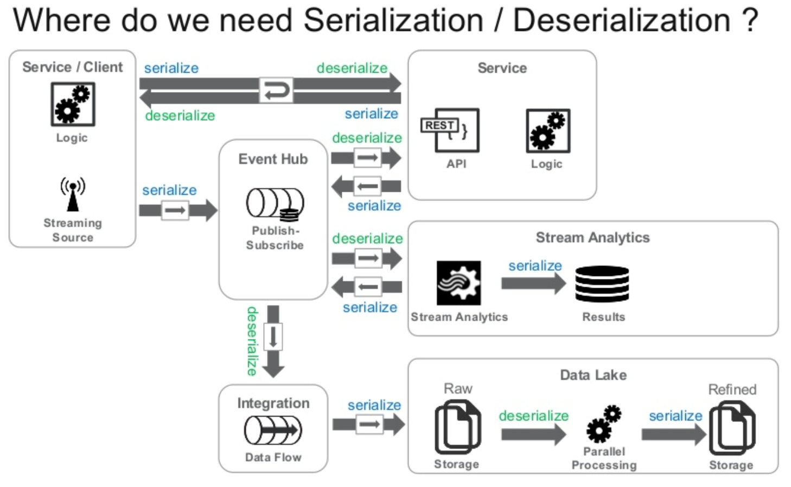

# Serialization/Deserialization

Created: 2020-05-02 23:14:51 +0500

Modified: 2020-05-03 02:06:51 +0500

---

Serialization is the process of turning structured in-memory objects into a byte stream for transmission over a network or for writing to persistent storage
Deserialization is the reverse process from a byte stream back to a series of structured in-memory objects
When selecting a data serialization format, the following characteristic should be evaluated:
-   Schema support and Schema evolution
-   Code generation
-   Language support / Interoperability
-   Transparent compression
-   Splitability
-   Support in Big Data / Fast Data Ecosystem

{width="6.635416666666667in" height="4.083333333333333in"}
**Forward Compatibility**

Forwards compatibility means that consumers can read data produced from a client using a later version of the schema than that consumer. In the case where a new field is added to a Protobuf message, the message will be decoded by the consumer but it will have no knowledge of that new field until it moves to the later version.
Fields that have been deleted in the new schema will be deserialised as default values for the relevant types in the consumer programming language. In both cases no deserialisation errors occur as a result of the schema mismatch.
**Backward Compatiblity**

Backwards compatibility means that consumers using a newer version of the schema can read the data produced by a client with an earlier version of the schema. In a similar but reversed fashion as described above, fields that have been added in the newer version will be deserialised, but because the producer has no knowledge of the new fields, messages are transmitted with no data in those fields, and are subsequently deserialised with default values in the consumer.
Fields that have been deleted in the new schema will naturally require that any subsequent code that was in place to handle that data be refactored to cope.

