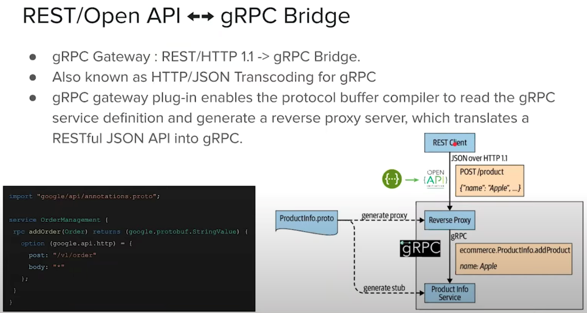
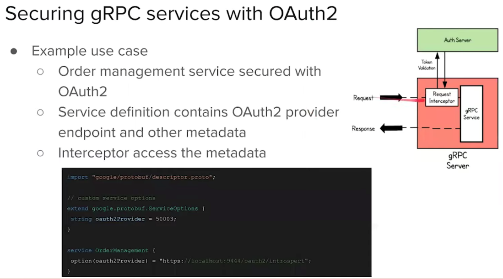
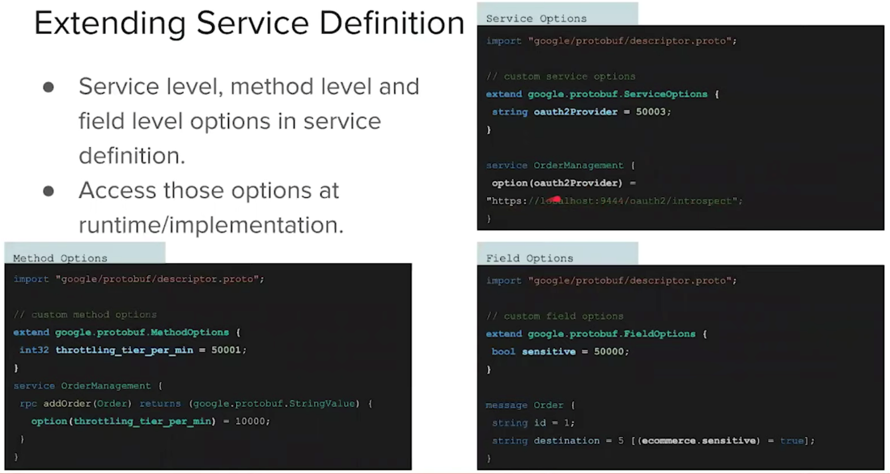

# Others

Created: 2020-05-06 09:13:38 +0500

Modified: 2020-11-02 23:16:07 +0500

---

**How to automate grpc generation using git hooks, why grpc over REST + JSON**

<https://medium.com/red-crane/grpc-and-why-it-can-save-you-development-time-436168fd0cbc>
JSON is not useful where:
-   Readability doesn't makes any sense and performance matters
-   A standard API contract between machines
-   No type safety
**Python**

<https://grpc.github.io/grpc/python>

<https://medium.com/@biplav.nep/grpc-using-flask-restful-code-2ed5607ae9a>

## grpc-web**

<https://www.freecodecamp.org/news/how-to-use-grpc-web-with-react-1c93feb691b5>

<https://medium.com/@karandeepahluwalia/grpc-web-and-react-a-match-made-in-heaven-51a7a8ec86e6>
<https://www.youtube.com/watch?v=_RiZkNR__60&ab_channel=GOTOConferences>

