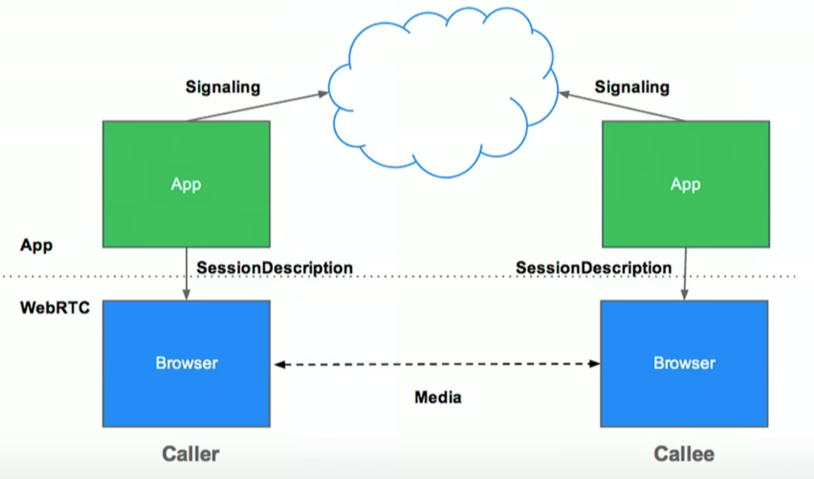
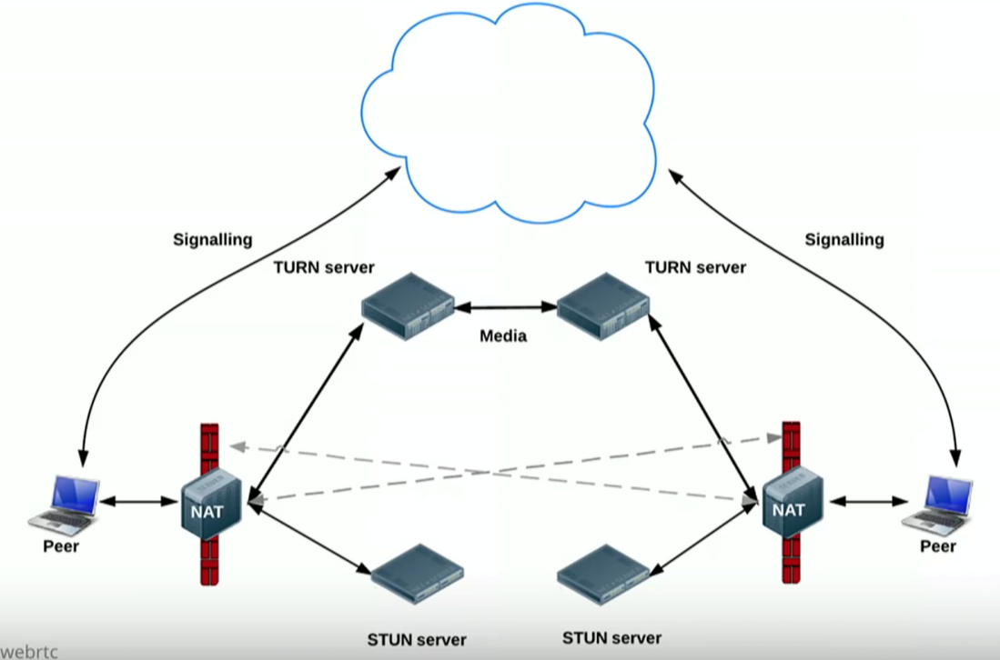
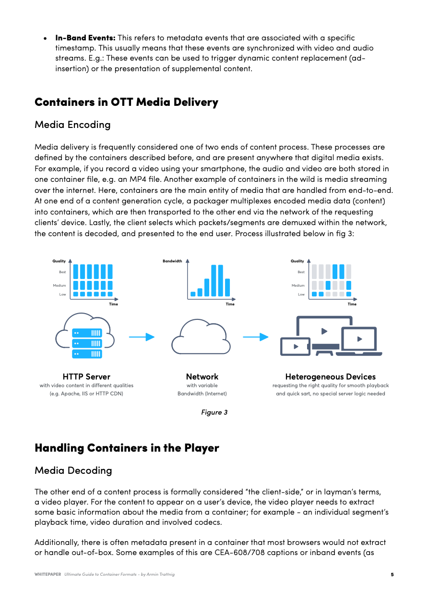
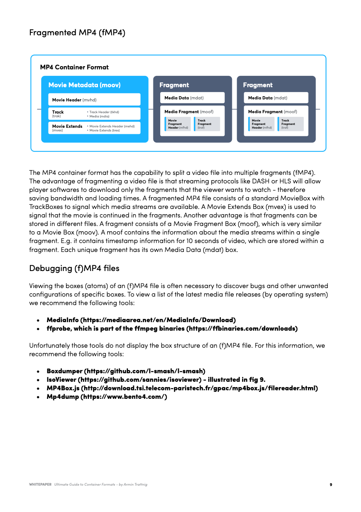
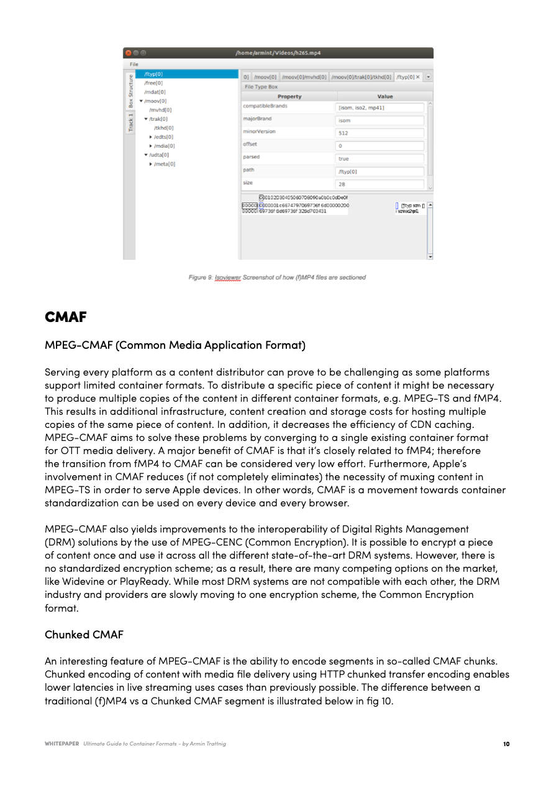
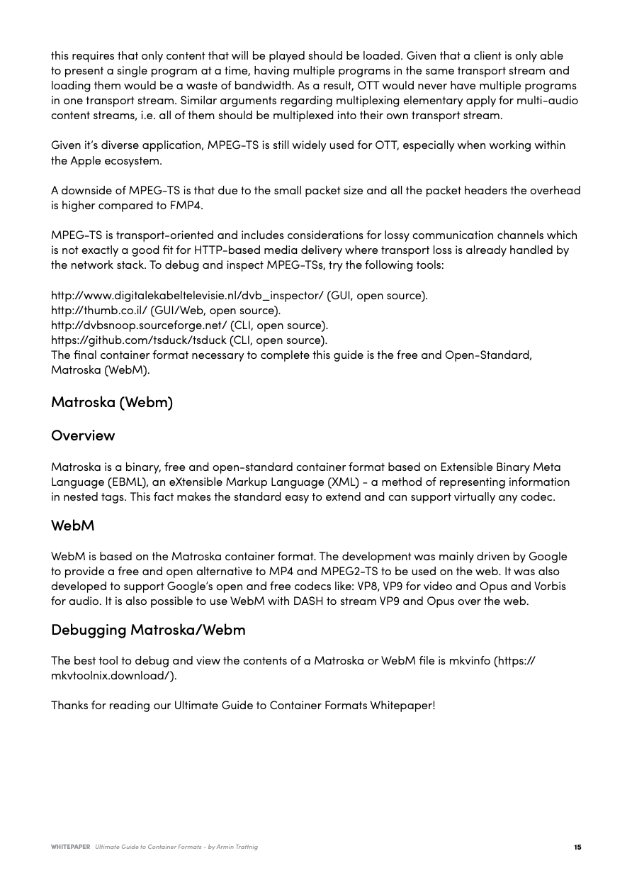

# Video / Live Streaming

Created: 2018-06-25 01:09:35 +0500

Modified: 2022-08-18 15:27:11 +0500

---

**Tools**
-   **Zoom**
-   <https://meet.jit.si>
-   <https://jitsi.org>
-   Google Meet
-   Skype
-   <https://goodmeetings.ai>
RTMP - Real-Time Messaging Protocol

<https://github.com/facebookincubator/rtmp-go-away>
HLS - <https://www.toptal.com/apple/introduction-to-http-live-streaming-hls>
MPEG-DASH - Dynamic Adaptive Streaming over HTTP
**WebRTC**

**Peer to peer live streaming protocol**

**ICE - Interactivity Connection Establishment**
-   A framework for connecting peers
-   Tries to find the best path for each call
-   Vast majority of calls can use STUN
-   ICE Agent
-   ICE Candidates

**SDP - Session Description Protocol**
-   What capabilities are there in a call (Audio/Video)
-   What codecs can be used
-   What bandwidth is available for the call

**STUN - Session Traversals Utility for NAT**
-   What is my public IP address (because of NAT)
-   NAT Hole punching
-   A server that is publicly available on internet and that server will respond with your public ip and port that you requested with.
-   Google/Twilio hosts STUN server / CoTurn/ Xirsys (<https://xirsys.com>)

**TURN - Traversal Using Relay around NAT**
-   Provide a cloud fallback if peer-to-peer communication fails
-   Data is sent through server, uses server environment
-   Ensures the call works in almost all environments
-   Relays packet from point A to point B
-   All TURN servers are also STUN servers

[WebRTC Crash Course](https://youtu.be/FExZvpVvYxA)
**FFMPEG Streaming**

ffmpeg (fast forward motion pictures expert group) for streaming videos over rtp to any number of different locations using multicasting
**Commands**

ffmpeg -i demo.mp4 -v 0 -vcodec mpeg4 -f mpegts udp://192.168.1.119:1234

ffplay udp://192.168.1.119:1234

ffmpeg -i rtp://@239.35.10.4:10000 -map 0:0 -map 0:2 -vcodec copy -acodec

copy -t 10 -y test.mkv-   Wowza Streaming Server
-   Red5 FOSS Streaming Server
FFMPEG stitching multiple files into one

<https://trac.ffmpeg.org/wiki/Concatenate>
**References**

<https://www.wowza.com/docs/tutorials>

<http://red5.org>

<https://www.wowza.com/docs/how-to-publish-a-video-file-as-a-live-stream>
<https://s3-ap-southeast-1.amazonaws.com/shivamzenatix/Test-Deepak/demo.mp4>
<https://aws.amazon.com/cloudfront/streaming>

<https://aws.amazon.com/answers/media-entertainment/live-streaming>
<https://trac.ffmpeg.org/wiki/Map>

<https://trac.ffmpeg.org/wiki/StreamingGuide>

<https://trac.ffmpeg.org/wiki/Capture/Webcam>
[**https://go.bitmovin.com/ultimate-guide-container-formats**](https://go.bitmovin.com/ultimate-guide-container-formats)

![Chapter 1 Welcome to the ultimate guide to Container Formats. This all---inclusive whitepaper covers the four most common container formats (as of 2019) and it matters to you, The first chapter defines key terminology and how containers function Within Video players. Container Basics & Terminology Definition Of Codecs Codecs are an internet protocol used to store media Signals in binary form. The goal Of most CO-docs 'o compress the raw media Signal in a IOSSY Way. meaning 'hot the compression is irreversible. Partial data is discarded from the media Signal and approximations ore made. The most cornrnon media signals are Video, audio and Specific examples Of Video COdøcs include: AVI, 4264. HEVC, and VP9: The most commonly used audio codecs AAC MP3, and Opus. There ore many different for each media Signal (as illustrated in fig l). Subtitles SRI SCC Video Audio AAC MP3 opus A Single media Signal is Often called an Elementary Stream or more Simply - Stream. The video development/broodcast industry will Often use terms Such Media, or H (or H interchangeably with • Video Streams: What is a media container? Media Containers (also known as Container Formats) are a metafile format specification describing how different multimedia data elements (streams) and metadata coexist in Some of the elements specified by a container format are; Stream Encapsulation Allowance of one or more media streams to exist in a single Timing/ Synchrmization --- The container adds dota on how the different streams in the file can be used together, Ex; Affixing correct timestamps to synchronize lip-movement in a video stream with sounds in the audio stream, Seeking --- The container provides additional time-oriented information that determines a specific point which a viewer can jump to in a video file/stream, Ex; A viewer wants to watch a movie from a specific scene or would like to Skip the Intro of their favorite series ](media/Video---Live-Streaming-image3.png)

![afa - There many types Of and one con easily add them to a Video file using a container formot_ Ex: Language Of an audio - subtitles are Olso sometimes considered as metadata. The most cornrnon container formvats are: MPd, MPEG2-TS and Motroska, and con represent different Video and audio Each container forrnaf has ifs Strengths and weaknesses defined by o Video'S compatibility, streaming and Size overhead. Encoding Demuxing REVC H .264 Data Conversion The following terms are used to describe to most common transfo"nations for media assets. A transformation reduces the Size Of the media 'o Odd compatibility or to enrich media data with additional data. like metadata or rnedia data. The Of converting a raw Signal to a binary file Of a codec. example encoding a series of raw images to the video codec H ,264_ Encoding can also refer to the of converting a very high quality raw He into fom-.at for Simpler Sharing transmission - Ex: taking On uncompressed RGg IE-bit frame , with a Size Of 12.4MB, for 50 seconds (measured at 24 frames/sec) totalling 17.96B - and compressing it into a-bit frames with a size of 3.11Mg per frame, which for the same video Of 60 at 24fps is 2AGB in total Compæssing the siæ of the file down by 15GB! The opposite Of encoding; decoding is the process Of converting binary files back into raw medio Signols_ Ex: H .25' codec Streams into viewable images. Tran«oding: The process Of converting one codec to another (Or the some) codec. Both & encoding Ore necessary steps to achieving a successful trorwtode. gest described as: decoding the source codec Stream and then encoding it again to a new target codec stream. Although encoding is typically lossy, additional tochniquos like frame interpolation and upscaling increase the quality of tho conversion of a compressed video format. Muxing: The process of adding one or rmro codec streams into a container format. D•muxing: Extracting a codec stream from a container format. Transmuxing: Extracting streams from one container format and putting them in a different (or the same) container format. Multiplexing: The process of interweaving audio and video into ono data stream. Ex: An elementary stream (audio & video) from the encoder are turned into Packotized Elementary Streams (PES) and then converted into Transport Streams CTS). Demultiplexing: The reverse operation of multiplexing. This moans extracting an elementary stream from a media container. E.g.: Extracting the mp3 audio dota from an mp4 music video. ](media/Video---Live-Streaming-image4.png)

![seen in fig EMSG boxes Of fMPd segments), Where the player has to parse relevant data from the media container forma' file, keep track Of a timeline and process the dato Ot 'he Correct time Within the content (like displaying the right captions 'he right time). This requires the player implementation to have desired handling in place. For player logic Custom Handling CEA-608 DRY i n it doto (p "h Segment EG. fMP4 Client-side Transmuxing In scenarios where a simple encode-deccnde cycle doesn't work, the process of transmuxing comes into play. This is most commonly seen within various brcmsers that often lack for certain container formats. A prime example Of this issue is that web Chrome, Firefox, Edge and Internet Explorer not (properly) supporting the MPEG-TS container format. The MPEG (Motion Picture Experts Group) Transport Stream format was specifically designed for Digital Video Broadcasting (OVB) applications. You can find more details on this format in chapter three (p. X). Since MPEG-TS is very commonly used container format. the only solution is to convert media from MPEG-TS to a container format that these browsers do support (ex: fMP4). This conversion step can take place at the client directly before the content is forwarded to the browser's media stack for demuxing and decoding. This process includes demultiplexing the MPEG-TS and then re---multiplexing the elementary streams to fMP4, This process is visualized below in fig 5: Transmuxing packets, Figwes ](media/Video---Live-Streaming-image6.png)

![Chapter 2 With the basic terminology behind container formats covered, the following chapter will dive into specific container formats. namely, MP4 and CMAF. This includes additional terminology around as well as the use and application of fragmentation or chunking of files. MP4 --- Overview Of Standards Base Formats Terminology (Ffyp) - A four-letter code found Within the structure Of a Video file to identify the Of encoding being using, it'S •compa'ibility•, or its •intended --- Contains either audio or Video track. - Contains the box header information the TrackBoxes. Movie BOX --- Contains header and information to Signal that the movie continues in Fragments usually only contain a fraction Of the Whole mv3vie. Movie BOX --- Contains movie fragment header data and track fragment data. MPEG-4 Part 14 MPEG-4 Part 14 (MP4) is one Of the most commonly used container formats Ond Often has a file ending. It is used for Dynamic Adaptive Streaming over H TIP (DASH) a red can also be used for Apple's BLS streaming. MP4 is based on the ISO Base Media File Form-at (MPEG-4 Part 12), Which is based on tho QuickTime File MPEG-4 Part 14 ISO Base Media File (MPEG-4 part 12) - MP4 File Format MP' extension MPEG stands for Moving Pictures Exports Group and is a cooperation of the International Organization for Standardization (ISO) and the International Eloctrotochnical Commission (IEC). MPEG was initially formed to creato and maintain a set of standards for audio and video compression and transmission. MPEG-4 ho.vovor, applies specifically towards tho standards of coding of audio-visual (AV) objects. The MP4 container format supports a wide range of codecs, most commonly: H.264 or HEVC for ](media/Video---Live-Streaming-image7.png)

![Video Advanced Audio Coding (AAC) for audiO_ AAC wos designed os the Successor fo the for-no us MP3 codec. ISO Base Media File Format ISO Base Media File Format (ISOBMFF, MPEG-4 Part 12) is the of the MP4 container format. ISOBMFF is a standard that defines time-based multimedia Time---base multimedia usual* refers to audio and video, often delivered as a steady stream. It is designed to be flexible and easy to extend, enabling interchangeability, management, editing and presentability of nultimedia data. The component of ISOBMFF are boxes, atoms. These are defined using classes and an oriented approach - there are cu"ently hundreds of different class types, please refer to the public* available standards lists by the International Organization of Standards (ISO) for relevant class information, using inheritance, all boxes extend a base class and can be made specific in their purpose by adding new class properties. An example Of this could be a class 'car' which then has a specific subclass which is 'SUV', the 'SUV' class inherits an the properties Of 'car' plus defines some new ones, In the same way a box in the context of MP4 is a general class which then a Movieaox is inheriting all the properties of ISOBMFF and then defining some of a The structure of an ISOBMFF is defined below in fig 7 • Base Class - Example A (ftyp) is used to identify the purpose and usage Of an ISOBMFF file and is most commonly applied in the beginning Of o file A box Can have Children and form a Of boxes (illustrated above). example: o MovieBox (me-ov) can have NWtiple TrackB-Oxes (track). A track in the Context Of ISOBMFF is o Single media Stream and typically references its binary CO-dec data. E.g. a Moviegox contains a track box for video and one track box for The binary data Con be Stored in o Media Data BOX (mdat)_ ](media/Video---Live-Streaming-image8.png)

![from Encoder MOAT Still being encoded/rruxed Traditional fMP4 Segment to Decoder Chunked CMAF Segment "DAT Can already be loaded and player Playback of segment can only start once fully downloaded. Playback can be started once first chunk is received. Player already plays on one end while encoder Still writes on the other. In traditional (f)MP4 the whole segment has to be fully downloaded to be played out. With chunked encoding, any completely loaded chunks of the segment can be decoded and played, while loading the rest of the segment. Hereby, the achievable live latency is no longer dependent on the segment duration as muxed chunks of an incomplete segment can be loaded and played at the client. With (f)MP4, MPEG-CMAF, and Chunked CMAF have been covered, you're ready for the complex container functions: MPEG-TS & Matroska (WebM) ](media/Video---Live-Streaming-image11.jpg)

![Muxing multiple Elementary Streams A single elernentary stream represents either audio or video content. Most video elementary streams aro accompanied by ot least ono audio elementary stream. These correlated ES•s are muxed into the same transport stream with separate PI DS for each ES and it's packets. Illustrated in fig 12; Vide E Muxing multiple Programs The most complex variation Of muxing a stream is the process Of multiple programs. With MPEG-TS, a program is o set Of related elementary streams 'hat belong together, e.g. Video and the matching audio. A Single transport can Carry multiple programs, e.g. o different TV channel. This process Can be seen in Fig 13: program I Program 2 PES PES ](media/Video---Live-Streaming-image13.png)

![Program Association From a Icnn-level perspective a transport stream is just a sequence of 188 byte Bng TS packets. As previously mentioned, there can be many programs with multiple elementary streams, but a client is usually only capable of presenting one program ot a time. It must therefore determine which packets to consume and which to discard upon receiving tho transport stream. For this purpose there aro two kinds of special pockets: program Association Tab l. (PAT) --- PAT packet. the PID O and contains the PID. for program Map tables of all programs within the transport stream. program Map Table (PMT) - PMT represent. a and PID. for The prcn:ess by which PATS and PMTS determine which packets to consume takes four steps, as defined in fig 14 and elaborated below: TS Packet PID 202 PID 102 TS Packet PID 200 PID 100 PID O 202 Inspect the TS Pocket With PID O, Which contains the PAT _ 2_ Find the PMT---PID Of the Program the player Should play back in the PAT (in this example: 200), 3. Get the TS Pocket with the relevant PMT- PID, which the PMT (200). _ The PMT contains the PID for all the media tracks, which are part Of the Program to play. A client receiving the transport Stream would first read the PAT packet it received and pick a program to be played depending on o user'S selection. The Client pulls the selected program's PMT (including the ESS and AIDS) from the PAL Then, the Client filters for the specified ADS, each representing a separate ES Of the chosen program, and Consumes deco-des and plays them for the user. OTT---specific aspects and Conclusion MPEG-TS is very broadcast---oriented, in OTT, however, there additional special considerations. OTT clients hove network connections that are unstable and do not have guaranteed bandwidth: ](media/Video---Live-Streaming-image14.png)

