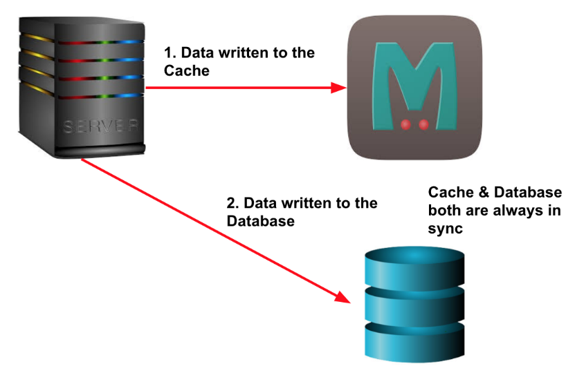
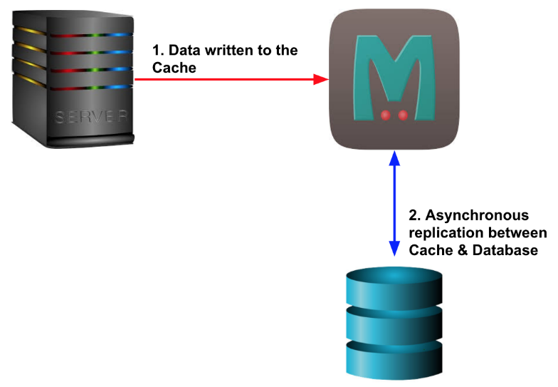
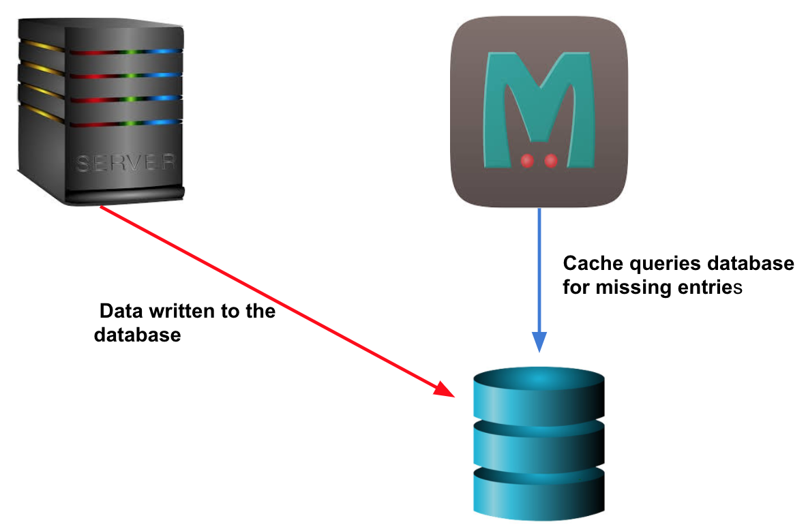
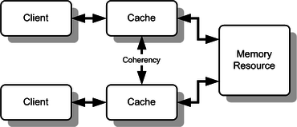

# Caches / Caching

Created: 2019-01-09 12:33:37 +0500

Modified: 2021-11-07 17:15:50 +0500

---

## Points to remeber about cache

a.  Cache data cannot be the source of truth

b.  Cache data has to be pretty small because cache tends to keep all the data in-memory

c.  Consider Eviction policies (Page replacement policies)
In[computing](https://en.wikipedia.org/wiki/Computing), acacheis a hardware or software component that stores data so that future requests for that data can be served faster; the data stored in a cache might be the result of an earlier computation or a copy of data stored elsewhere. Acache hitoccurs when the requested data can be found in a cache, while acache missoccurs when it cannot. Cache hits are served by reading data from the cache, which is faster than recomputing a result or reading from a slower data store; thus, the more requests that can be served from the cache, the faster the system performs.
To be cost-effective and to enable efficient use of data, caches must be relatively small. Nevertheless, caches have proven themselves in many areas of computing, because typical[computer applications](https://en.wikipedia.org/wiki/Application_software)access data with a high degree of[locality of reference](https://en.wikipedia.org/wiki/Locality_of_reference). Such access patterns exhibit temporal locality, where data is requested that has been recently requested already, and[spatial](https://en.wikipedia.org/wiki/Memory_address)locality, where data is requested that is stored physically close to data that has already been requested.
A cache hit happens whenever data is already available in the cache and can be returned without any other operation, otherwise the cache responds with a cache miss or, if available, can transparently retrieve the value from another underlying backend system and cache it before returning it to the requestor.
Caches are designed to respond to cache requests in near real-time and therefore are implemented as simple key-value stores. The underlying data structure, however, can still be different and depends on the storage backend. In addition, caches can most often be used by multiple front end consumers such as web applications.
Caches can have multiple levels, so-called tiered storages, which are ordered by their speed factor. Frequently or recently used data are typically held in memory, whereas other data (depending on the tiered storage implementations) can be written to SSD, slower spinning disk systems and later on other even slower systems, or can be evicted completely - if reproducible.
Typical use cases are in-memory caches for database, slowly retrievable disk-based data, data stored remotely behind slow network connections or results of previous calculations.
-   Caching first approach
## Benefits of caching
-   Improved responsiveness
-   Decreased network costs
-   Improved performance with same hardware
-   Availability of content with interruption on network or backend resources
## WHAT TO CACHE?

A good starting point to find out what to cache in your application is to imagine everything where multiple executions of some request result in the same outcome. This can be database queries, HTML fragments, complete web pages or an output of a heavy computation.
It also makes sense to store any kind of language related data geographically local to the content consumer. Common elements of this type of data is translations, user data for people living in a given region. Only one rule applies: data should not change too often or fast but should be read very frequently.
## WHAT NOT TO CACHE?

A common misconception is if you cache everything, you'll automatically benefit from it. What often works in the first place delivers another problem during high data peaks.
Data that changes often is generally not very good for caches. Whenever data changes, the cache must be invalidated and, depending on the chosen caching strategy, this can be a costly operation. Imagine a caching system that is located around the world and your data change with a rate of more than 100 changes per second. The benefit of having those data cached will be nullified by the fact that all caches need to invalidate and maybe re-retrieve that changed data record for every single change.
Another point to think about is to not cache data that is fast to retrieve anyways. Caching those elements will introduce an additional round-trip while filling the cache, requiring additional memory. The benefit might not show the expected results or be worth the overhead of bringing in another layer into the architecture.
## Writing Policies (cache access patterns)

When a system writes data to cache, it must at some point write that data to the backing store as well. The timing of this write is controlled by what is known as thewrite policy.
-   **Write-through**

write is done synchronously both to the cache and to the backing store. The significance here is not the order in which it happens or whether it happens in parallel. The significance is that I/O completion is only confirmed once the data has been written to both places.
-   **Advantage:**Ensures fast retrieval while making sure the data is in the backing store and is not lost in case the cache is disrupted.
-   **Disadvantage:**Writing data will experience latency as you have to write to two places every time.
-   **What is it good for?**

The write-through policy is good for applications that has more reads than writes. This will result in slightly higher write latency but low read latency. So, it's ok to spend a bit longer writing once, but then benefit from reading frequently with low latency.-   **Write-back(also calledwrite-behind)**

Initially, writing is done only to the cache. The write to the backing store is postponed until the modified content is about to be replaced by another cache block.
Using the write-back policy, data is written to the cache and immediately I/O completion is confirmed. The data is then typically also written to the backing store in the background but the completion confirmation is not blocked on that.-   **Advantage:**Low latency and high throughput for write-intensive applications.
-   **Disadvantage:**There is data availability risk because the cache could fail (and so suffer from data loss) before the data is persisted to the backing store. This result in the data being lost.
-   **What is it good for?**

The write-back policy is the best performer for mixed workloads as both read and write I/O have similar response time levels. In reality, you can add resiliency (e.g. by duplicating writes) to reduce the likelihood of data loss.-   **Write-around**

Using the write-around policy, data is written only to the backing store without writing to the cache. So, I/O completion is confirmed as soon as the data is written to the backing store.
-   **Advantage:**Good for not flooding the cache with data that may not subsequently be re-read.
-   **Disadvantage:**Reading recently written data will result in a cache miss (and so a higher latency) because the data can only be read from the slower backing store.
-   **What is it good for?**

The write-around policy is good for applications that don't frequently re-read recently written data. This will result in lower write latency but higher read latency which is a acceptable trade-off for these scenarios.
## Cache Types

1.  **HTTP Cache**

A HTTP Cache is mostly used in browsers. This kind of cache keeps information about the last modification date of a resource or a content hash to identify changes to its content. Web servers are expected to deliver useful information about the state of an element to prevent retrieval of an already cached element from the server.
This kind of cache is used to reduce network traffic, minimize cost and offer the user an instant experience for multiple visits.
2.  **Fragment Cache**

A Fragment Cache caches parts of a response or result. This could be a database query outcome or a part of an HTML page. Whatever it is, it should not change often.
A common use case for a Fragment Cache is a web page known to contain user specific and user unspecific content. The user-independent content can be cached as a fragment and augmented with user specific content on retrieval. This process is called **Content Enrichment.**
This caching type is used to reduce operation cost and hardware by providing the same throughput with less computational overhead.
3.  **Object Cache**

An Object Cache stores any sort of objects that otherwise need to be read from other data representations. A cache of this type can be used in front of a database to speed up queries and store the resulting objects (e.g. Object Relational Mapping, ORM), or store un-marshalled results of XML, JSON or other general data representations transformed into objects.
These caches often act as a proxy between some external resource, like a database or webservice, and they speed up transformation processes or prevent additional network round-trips between the consumer and producer systems.
## Caching Strategies

1.  Cooperative/Distributed caching

Cache data is distributed between nodes

In Cooperative Caching, also known as Distributed Caching, multiple distinct systems (normally referred to as cluster-nodes) work together to build a huge, shared cache.

2.  Partial caching

Partial Caching describes a type of caching where not all data is stored inside the cache. Depending on certain criteria, responses might not be cacheable or are not expected to be cached (like temporary failures).

A typical example for data where not everything is cacheable is websites. Some pages are "static" and

only change if some manual or regular action happens. Those pages can easily be cached and invalidated whenever this particular action happened. Apart from that, other pages consist of mostly dynamic content or frequently updated content (like stock market tickers) and shouldn't be cached at all.

3.  Geographical caching

Geographical Caches are located in strategically chosen locations to optimize latency on requests, therefore this kind of cache will mostly be used for website content. It is also known as CDN (Content Delivery Network).

4.  Preemptive caching

A Preemptive Cache itself is not a caching type like the others above but is mostly used in conjunction with a Geographical Cache.

Using a warm-up engine a Preemptive Cache is populated on startup and tries to update itself based on rules or events. The idea behind this cache addition is to reload data from any backend service or central cluster even before a requestor wants to retrieve the element. This keeps access time to the cached elements constant and prevents accesses to single elements from becoming unexpectedly long.

Building a Preemptive Cache is not easy and requires a lot of knowledge of the cached domain and the update workflows.

5.  Latency SLA caching

A Latency SLA Cache is able to maintain latency SLAs even if the cache is slow or overloaded. This type of cache can be build in two different ways.

The first option is to have a timeout to exceed before the system either requests the potentially cached element from the original source (in parallel to the already running cache request) or provides a simple default answer, and uses whatever returns first.

The other option is to always fire both requests in parallel and take whatever returns first. This option is not the preferred way of implementation since it mostly works against the idea of caching and won't reduce load on the backend system. This option might still make sense if multiple caching layers are available, like always try the first and second nearest caches in parallel.
## Caching Topologies

1.  **IN-PROCESS CACHES**

The In-Process Cache is most oftenly used in non-distributed systems. The cache is kept inside the application's memory space itself and offers the fastest possible access speed.

This type of cache is used for caching database entities but can also be used as some kind of an object pool, for instance pooling most recently used network connections to be reused at a later point.

Advantages:
-   Highest access speed
-   Data available locally
-   Easy to maintain

Disadvantages:
-   Data duplication if multiple applications
-   High memory consumption on a single node
-   Data cached inside the applications memory
-   Seems easy to build but has a lot of hidden challenges
2.  **EMBEDDED NODE CACHES**

Using an Embedded Node Cache the application itself will be part of the cluster. This caching topology is a kind of combination between an In-Process Cache and the Cooperative Caching and it can either use partitioning or full dataset replication.

Using full replication the application will get all the benefits of an In-Process Cache since all data is available locally (highest access speed) but for the sake of memory consumption and heap size.

By using data partitioning the application knows about the owner of a requested record and will ask directly using an existing data stream. Speed is lower than locally available data but still accessible quickly.

Advantages:
-   Data can be replicated for highest access speed
-   Data can be partitioned to create bigger datasets
-   Cached data might be used a shared state lookup between applications U Possible to scale out the application itself

Disadvantages:
-   High duplication rate on replication
-   Application and cache cannot be scaled independently U Data cached inside the applications memory
3.  **CLIENT-SERVER CACHES**

A Client-Server Cache is one of the most typical setups these days (next to a pure In-Process Cache). In general these systems tend to be Cooperative Caches by having a multi-server architecture to scale out and have the same feature set as the Embedded Node Caches but with the client layer on top.

This architecture keeps separate clusters of the applications using the cached data and the data itself, offering the possibility to scale the application cluster and the caching cluster independently. Instead of a caching cluster it is also possible to have a single caching server however this situation slowly losing traction.

Having a Client-Server Cache architecture is quite similar to the common usage patterns of an external relational database or other network-connected backend resources.

Advantages:
-   Data can be replicated for highest access speed
-   Data can be partitioned to create bigger datasets
-   Cached data might be used a shared state lookup between applications U Applications and cache can be scaled out independently
-   Applications can be restarted without losing data

Disadvantages:
-   High duplication rate on replication
-   Always an additional network round trip (fast network)
## Caching places
-   Client Side Caching
-   Server Side Caching
-   Network Caching
## Cache Coherence

In[computer architecture](https://en.wikipedia.org/wiki/Computer_architecture),cache coherenceis the uniformity of shared resource data that ends up stored in multiple[local caches](https://en.wikipedia.org/wiki/Cache_(computing)). When clients in a system maintain[caches](https://en.wikipedia.org/wiki/CPU_cache)of a common memory resource, problems may arise with incoherent data, which is particularly the case with[CPUs](https://en.wikipedia.org/wiki/Central_processing_unit)in a[multiprocessing](https://en.wikipedia.org/wiki/Multiprocessing)system.
In the illustration, consider both the clients have a cached copy of a particular memory block from a previous read. Suppose the client on the bottom updates/changes that memory block, the client on the top could be left with an invalid cache of memory without any notification of the change. Cache coherence is intended to manage such conflicts by maintaining a coherent view of the data values in multiple caches.

## Requirements for cache coherence

## Write Propagation

Changes to the data in any cache must be propagated to other copies (of that cache line) in the peer caches.
## Transaction Serialization

Reads/Writes to a single memory location must be seen by all processors in the same order.
## Coherence Mechanisms

## Snooping

Main article:[Bus snooping](https://en.wikipedia.org/wiki/Bus_snooping)

First introduced in 1983,snooping is a process where the individual caches monitor address lines for accesses to memory locations that they have cached.Thewrite-invalidate protocolsandwrite-update protocolsmake use of this mechanism.
For the snooping mechanism, a snoop filter reduces the snooping traffic by maintaining a plurality of entries, each representing a cache line that may be owned by one or more nodes. When replacement of one of the entries is required, the snoop filter selects for the replacement the entry representing the cache line or lines owned by the fewest nodes, as determined from a presence vector in each of the entries. A temporal or other type of algorithm is used to refine the selection if more than one cache line is owned by the fewest nodes.
## Directory-based

Main article:[Directory-based cache coherence](https://en.wikipedia.org/wiki/Directory-based_cache_coherence)

In a directory-based system, the data being shared is placed in a common directory that maintains the coherence between caches. The directory acts as a filter through which the processor must ask permission to load an entry from the primary memory to its cache. When an entry is changed, the directory either updates or invalidates the other caches with that entry.
<https://en.wikipedia.org/wiki/Cache_coherence>

## Cache Invalidation**

Cache invalidationis a process in a[computer system](https://en.wikipedia.org/wiki/Computer_system)whereby entries in a[cache](https://en.wikipedia.org/wiki/Cache_(computing))are replaced or removed.
It can be done explicitly, as part of a[cache coherence](https://en.wikipedia.org/wiki/Cache_coherence)protocol. In such a case, a processor changes a memory location and then invalidates the cached[values](https://en.wikipedia.org/wiki/Value_(computer_science))of that memory location across the rest of the computer system.
## Explicit invalidation

Cache invalidationcan be used to[push](https://en.wikipedia.org/wiki/Push_technology)new content to a[client](https://en.wikipedia.org/wiki/Client_(computing)). This method functions as an alternative to other methods of displaying new content to connected clients.Invalidationis carried out by changing the application data, which in turn marks the information received by the client as out-of-date. After the cache is invalidated, if the client requests the cache, they are delivered a new version.
## Methods

There are three specific methods to invalidate a cache, but not all[caching proxies](https://en.wikipedia.org/wiki/Caching_proxy)support these methods.

1.  **Purge**

Removes content from caching proxy immediately. When the client requests the data again, it is[fetched](https://en.wikipedia.org/wiki/Instruction_cycle)from the application and stored in the caching proxy. This method removes all variants of the cached content.

2.  **Refresh**

Fetches requested content from the application, even if cached content is available. The content previously stored in the cache is replaced with a new version from the application. This method affects only one variant of the cached content.

3.  **Ban**

A reference to the cached content is added to a[blacklist](https://en.wikipedia.org/wiki/Blacklist_(computing))(or ban list). Client requests are then checked against this blacklist, and if a request matches, new content is fetched from the application, returned to the client, and added to the cache.
This method, unlike purge, does not immediately remove cached content from the caching proxy. Instead, the cached content is updated after a client requests that specific information.
## Alternatives

There are a few alternatives to cache invalidation that still deliver updated content to the client. One alternative is to expire the cached content quickly by reducing the[time-to-live (TTL)](https://en.wikipedia.org/wiki/Time_to_live)to a very low value. Another alternative is to validate the cached content at each request. A third option is to not cache content requested by the client. These alternatives can cause issues, as they create high load on the application due to more frequent requests for information.
## Disadvantages

Using invalidation to transfer new content can be difficult when invalidating multiple objects. Invalidating multiple representations adds a level of complexity to the application. Cache invalidation must be carried out through a caching proxy; these requests can impact performance of the caching proxy, causing information to be transferred at a slower rate to clients.
<https://en.wikipedia.org/wiki/Cache_invalidation>

## Locality of reference / Cache locality / Principle of locality**

It is the tendency of a processor to access the same set of memory locations repetitively over a short period of time.
Locality is a type of[predictable](https://en.wikipedia.org/wiki/Predictability)behavior that occurs in computer systems. Systems that exhibit stronglocality of referenceare great candidates for performance optimization through the use of techniques such as the[caching](https://en.wikipedia.org/wiki/CPU_cache),[prefetching](https://en.wikipedia.org/wiki/Prefetch_instruction)for memory and advanced[branch predictors](https://en.wikipedia.org/wiki/Branch_predictor)at the[pipelining](https://en.wikipedia.org/wiki/Pipeline_(computing))stage of a processor core.
## Types of locality
-   **Temporal locality**

If at one point a particular memory location is referenced, then it is likely that the same location will be referenced again in the near future. There is a temporal proximity between the adjacent references to the same memory location. In this case it is common to make efforts to store a copy of the referenced data in faster memory storage, to reduce the latency of subsequent references. Temporal locality is a special case of spatial locality (see below), namely when the prospective location is identical to the present location.
-   **Spatial locality**

If a particular storage location is referenced at a particular time, then it is likely that nearby memory locations will be referenced in the near future. In this case it is common to attempt to guess the size and shape of the area around the current reference for which it is worthwhile to prepare faster access for subsequent reference.
-   **Memory locality**

Spatial locality explicitly relating to[memory](https://en.wikipedia.org/wiki/Computer_memory).
-   **[Branch](https://en.wikipedia.org/wiki/Branch_(computer_science))locality**

If there are only a few possible alternatives for the prospective part of the path in the spatial-temporal coordinate space. This is the case when an instruction loop has a simple structure, or the possible outcome of a small system of conditional branching instructions is restricted to a small set of possibilities. Branch locality is typically not a spatial locality since the few possibilities can be located far away from each other.
-   **Equidistant locality**

It is halfway between the spatial locality and the branch locality. Consider a loop accessing locations in an equidistant pattern, i.e., the path in the spatial-temporal coordinate space is a dotted line. In this case, a simple linear function can predict which location will be accessed in the near future.
In order to benefit from the very frequently occurring temporal and spatial locality, most of the information storage systems are[hierarchical](https://en.wikipedia.org/wiki/Computer_data_storage#Hierarchy_of_storage). The equidistant locality is usually supported by the diverse nontrivial increment instructions of the processors. For branch locality, the contemporary processors have sophisticated branch predictors, and on the basis of this prediction the memory manager of the processor tries to collect and preprocess the data of the plausible alternatives.
<https://en.wikipedia.org/wiki/Locality_of_reference>

<https://www.geeksforgeeks.org/locality-of-reference-and-cache-operation-in-cache-memory>ƒ

<https://www.geeksforgeeks.org/computer-organization-locality-and-cache-friendly-code>

## Cache-oblivious algorithm**

In[computing](https://en.wikipedia.org/wiki/Computing), acache-oblivious algorithm(or cache-transcendent algorithm) is an[algorithm](https://en.wikipedia.org/wiki/Algorithm)designed to take advantage of a[CPU cache](https://en.wikipedia.org/wiki/CPU_cache)without having the size of the cache (or the length of the[cache lines](https://en.wikipedia.org/wiki/Cache_line), etc.) as an explicit parameter. An**optimal cache-oblivious algorithm**is a cache-oblivious algorithm that uses the cache optimally (in an[asymptotic](https://en.wikipedia.org/wiki/Asymptotic_notation)sense, ignoring constant factors). Thus, a cache-oblivious algorithm is designed to perform well, without modification, on multiple machines with different cache sizes, or for a[memory hierarchy](https://en.wikipedia.org/wiki/Memory_hierarchy)with different levels of cache having different sizes. Cache-oblivious algorithms are contrasted with explicit[blocking](https://en.wikipedia.org/wiki/Loop_tiling),as in[loop nest optimization](https://en.wikipedia.org/wiki/Loop_nest_optimization), which explicitly breaks a problem into blocks that are optimally sized for a given cache.
Optimal cache-oblivious algorithms are known for[matrix multiplication](https://en.wikipedia.org/wiki/Cache-oblivious_matrix_multiplication),[matrix transposition](https://en.wikipedia.org/wiki/Matrix_transposition),[sorting](https://en.wikipedia.org/wiki/Funnelsort), and several other problems. Some more general algorithms, such as[Cooley--Tukey FFT](https://en.wikipedia.org/wiki/Cooley%E2%80%93Tukey_FFT_algorithm), are optimally cache-oblivious under certain choices of parameters. Because these algorithms are only optimal in an asymptotic sense (ignoring constant factors), further machine-specific tuning may be required to obtain nearly optimal performance in an absolute sense. The goal of cache-oblivious algorithms is to reduce the amount of such tuning that is required.
Typically, a cache-oblivious algorithm works by a[recursive](https://en.wikipedia.org/wiki/Recursion)[divide and conquer algorithm](https://en.wikipedia.org/wiki/Divide_and_conquer_algorithm), where the problem is divided into smaller and smaller subproblems. Eventually, one reaches a subproblem size that fits into cache, regardless of the cache size. For example, an optimal cache-oblivious matrix multiplication is obtained by recursively dividing each matrix into four sub-matrices to be multiplied, multiplying the submatrices in a[depth-first](https://en.wikipedia.org/wiki/Depth-first)fashion. In tuning for a specific machine, one may use a[hybrid algorithm](https://en.wikipedia.org/wiki/Hybrid_algorithm)which uses blocking tuned for the specific cache sizes at the bottom level, but otherwise uses the cache-oblivious algorithm.
<https://en.wikipedia.org/wiki/Cache-oblivious_algorithm>

## HTTP ETag (Entity tag)**

The**ETag**or**entity tag**is part of[HTTP](https://en.wikipedia.org/wiki/Hypertext_Transfer_Protocol), the protocol for the[World Wide Web](https://en.wikipedia.org/wiki/World_Wide_Web). It is one of several mechanisms that HTTP provides for[Web cache](https://en.wikipedia.org/wiki/Web_cache)validation, which allows a client to make conditional requests. This allows caches to be more efficient and saves bandwidth, as a Web server does not need to send a full response if the content has not changed. ETags can also be used for[optimistic concurrency control](https://en.wikipedia.org/wiki/Optimistic_concurrency_control),as a way to help prevent simultaneous updates of a resource from overwriting each other.
An ETag is an opaque identifier assigned by a Web server to a specific version of a resource found at a[URL](https://en.wikipedia.org/wiki/Uniform_Resource_Locator). If the resource representation at that URL ever changes, a new and different ETag is assigned. Used in this manner, ETags are similar to[fingerprints](https://en.wikipedia.org/wiki/Fingerprint_(computing))and can quickly be compared to determine whether two representations of a resource are the same.
<https://en.wikipedia.org/wiki/HTTP_ETag>

## Others**
-   set-associative (SA) caches
-   log-structured (LS) caches
-   Kangaroo - <https://engineering.fb.com/2021/10/26/core-data/kangaroo>

## References**

[https://en.wikipedia.org/wiki/Cache_(computing)](https://en.wikipedia.org/wiki/Cache_(computing)#WRITE-BACK)

<https://www.freecodecamp.org/news/what-is-cached-data>

<https://engineering.fb.com/2021/09/02/open-source/cachelib>

