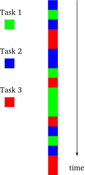

# Concurrency Models - Async

Created: 2018-10-13 10:42:25 +0500

Modified: 2018-12-19 00:10:10 +0500

---

**Single-threaded synchronous model**

Each task is performed one at a time, with one finishing completely before another is started. And if the tasks are always performed in a definite order, the implementation of a later task can assume that all earlier tasks have finished without errors, with all their output available for use.
**Threaded model**

In this model, each task is performed in a separate thread of control. The threads are managed by the operating system and may, on a system with multiple processors or multiple cores, run truly concurrently, or may be interleaved together on a single processor. The point is, in the threaded model the details of execution are handled by the OS and the programmer simply thinks in terms of independent instruction streams which may run simultaneously.
**Asynchronous model**

The tasks are interleaved with one another, but in a single thread of control.
**Async benefits**

There is a condition under which an asynchronous system will simply outperform a synchronous one.

*fig - blocking in an asynchronous program*
The fundamental idea behind the asynchronous model is that an asynchronous program, when faced with a task that would normally block in a synchronous program, will instead execute some other task that can still make progress.
Compared to the synchronous model, the asynchronous model performs best when:

1.  There are a large number of tasks so there is likely always at least one task that can make progress.

2.  The tasks perform lots of I/O, causing a synchronous program to waste lots of time blocking when other tasks could be running.

3.  The tasks are largely independent from one another so there is little need for inter-task communication (and thus for one task to wait upon another).
**References**

<http://krondo.com/in-which-we-begin-at-the-beginning>

