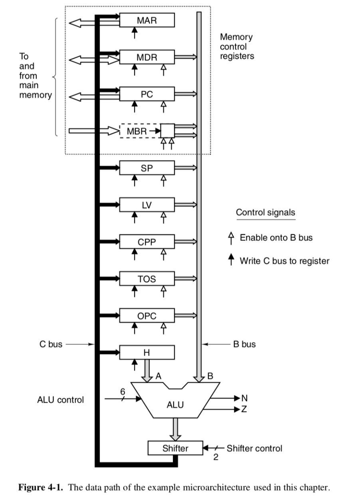

# Microprocessor

Created: 2018-12-08 19:27:10 +0500

Modified: 2021-06-06 16:49:19 +0500

---

**Course - NPTEL - IIT-Guwahati, by Dr. John Jose**

# Multilevel Machine Architecture

![Level 5 Level 4 Level 3 Level 2 Level 1 Level O Problem-oriented language level Translation (compiler) Assembly language level Translation (assembler) Operating system machine level Partial interpretation (operating system) Instruction set architecture level Interpretation (microprogram) or direct execution Microarchitecture level Hardware Digital logic level Figure 1-2. A six-level computer. The support method for each level is indicat- ed below it (along with the name of the supporting program). ](media/Microprocessor-image1.png){width="4.5in" height="4.09375in"}

# Data Path

{width="3.9375in" height="5.6875in"}

# Data Path Timing

{width="5.895833333333333in" height="3.5416666666666665in"}

# Microinstructions

{width="5.5in" height="2.7604166666666665in"}

**Two types of CPU architecture**

1.  RISC Architecture

2.  CISC Architecture

**RISC & CISC Comparison**

{width="5.0in" height="1.9375in"}

**ARM - Advanced RISC Machine**

**References**

<https://www.edgefxkits.com/blog/what-is-risc-and-cisc-architecture/>

