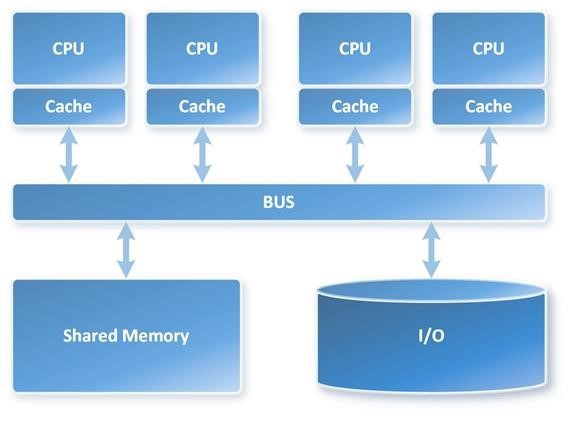
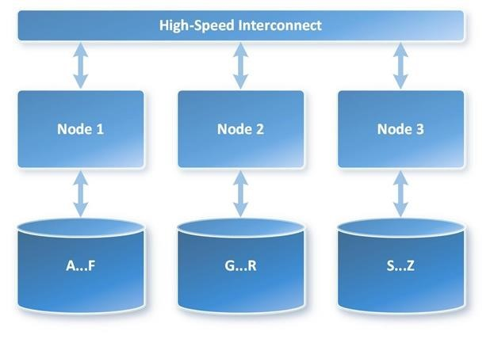

# Parallel Processing

Created: 2019-03-21 22:38:19 +0500

Modified: 2020-03-16 22:46:23 +0500

---

**Parallel Processing, MPP (Massive Parallel Processing)**

**Symmetric Multi-Processing (SMP)** is a tightly coupled multiprocessor system where processors share resources -- single instances of the Operating System (OS), memory, I/O devices and connected using a common bus. SMP is the primary parallel architecture employed in servers and is depicted in the following image.

{width="5.0in" height="3.6770833333333335in"}

**Massively Parallel Processing (MPP)** is the coordinated processing of a single task by multiple processors, each processor using its own OS and memory and communicating with each other using some form of messaging interface. MPP can be setup with a shared nothing or shared disk architecture.

In a shared nothing architecture, there is no single point of contention across the system and nodes do not share memory or disk storage. Data is horizontally partitioned across nodes, such that each node has a subset of rows from each table in the database. Each node then processes only the rows on its own disks. Systems based on this architecture can achieve massive scale as there is no single bottleneck to slow down the system. This is what Emma is looking for.

MPP with shared-nothing architecture is depicted in the following image.

{width="5.0in" height="3.46875in"}

**Message Passing Interface (MPI)**

Message Passing Interface(MPI) is a standardized and portable[message-passing](https://en.wikipedia.org/wiki/Message-passing)standard designed by a group of researchers from academia and industry to function on a wide variety of[parallel computing](https://en.wikipedia.org/wiki/Parallel_computing)architectures. The standard defines the syntax and semantics of a core of library routines useful to a wide range of users writing portable message-passing programs in[C](https://en.wikipedia.org/wiki/C_(programming_language)),[C++](https://en.wikipedia.org/wiki/C%2B%2B), and[Fortran](https://en.wikipedia.org/wiki/Fortran). There are several well-tested and efficient implementations of MPI, many of which are open-source or in the public domain. These fostered the development of a parallel software industry, and encouraged development of portable and scalable large-scale parallel applications.
<https://en.wikipedia.org/wiki/Message_Passing_Interface>