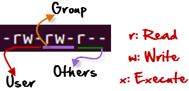
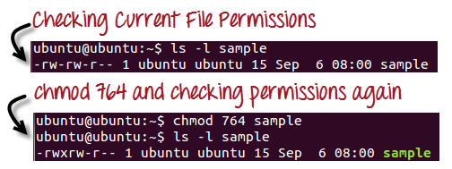
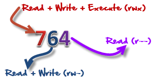
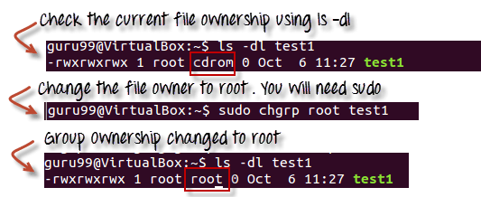

# Unix / Linux File System

Created: 2018-05-20 12:10:58 +0500

Modified: 2022-01-20 20:49:58 +0500

---

Command - man hier (layout of filesystems)
**/**

This is the root directory. This is where whole tree starts
**/bin**

This directory contains basic commands and programs that are needed to achieve a minimal working environment upon booting. These are kept separate from some of the other programs on the system to allow you to boot the system for maintenance even if other parts of the filesystem may be damaged or unavailable.

If you search this directory, you will find that bothlsandpwdreside here. Thecdcommand is actually built into the shell we are using (bash), which is in this directory too.
**/boot**

This directory contains the actual files, images, and kernels necessary to boot the system. While/bincontains basic, essential utilities,/bootcontains the core components that actually allow the system to boot.

If you need to modify the bootloader on your system, or if you would like to see the actual kernel files and initial ramdisk (initrd), you can find them here. This directory must be accessible to the system very early on.
**/dev**

This directory houses the files that represent devices on your system. Every hard drive, terminal device, input or output device available to the system is represented by a file here. Depending on the device, you can operate on the devices in different ways.
For instance, for a device that represents a hard drive, like/dev/sda, you can mount it to the filesystem to access it. On the other hand, if you have a file that represents a line printer like/dev/lpr, you can write directly to it to send the information to the printer.
-   dev/sda-- The 1st SCSI disk or simply Hard Disk..
-   dev/sdb-- The 2nd SCSI disk.
-   dev/sdc --The 3rd SCSI disk.
-   dev/hda-- The master disk on IDE primary controller.
-   dev/hdb-- The slave disk on IDE primary controller.

sda5 = 5th partition on the first HD ('a' is first HD)

sdc8 = 8th partition on the third HD ('c' is third of three active HDs)

sdb3 = 3rd partition on the second HD ('b' is second of two or more active HDs)
**/dev/shm**

**/dev/shm**is nothing but implementation of traditional**shared memory**concept. It is an efficient means of passing data between programs. One program will create a memory portion, which other processes (if permitted) can access. This will result into speeding up things on Linux.
shm / shmfs is also known as tmpfs, which is a common name for a temporary file storage facility on many Unix-like operating systems. It is intended to appear as a mounted file system, but one which uses virtual memory instead of a persistent storage device.
You can use /dev/shm to improve the performance of application software such as Oracle or overall Linux system performance. On heavily loaded system, it can make tons of difference. For example VMware workstation/server can be optimized to improve your Linux host's performance (i.e. improve the performance of your virtual machines).
<https://www.cyberciti.biz/tips/what-is-devshm-and-its-practical-usage.html>

## /etc**

This is one area of the filesystem where you will spend a lot of time if you are working as a system administrator. This directory is basically a configuration directory for various system-wide services.

By default, this directory contains many files and subdirectories. It contains the configuration files for most of the activities on the system, regardless of their function. In cases where multiple configuration files are needed, many times a application-specific subdirectory is created to hold these files. If you are attempting to configure a service or program for the entire system, this is a great place to look.

**Sources**

/etc/apt/sources.list

**User information - /etc/passwd**

Local user information is stored in the/etc/passwdfile. Each line in this file represents login information for one user.

**cat /etc/passwd**

root:*:0:0:System Administrator:/var/root:/bin/sh
-   User name
-   Encrypted password (xmeans that the password is stored in the/etc/shadowfile)
-   User ID number (UID)
-   User's group ID number (GID)
-   Full name of the user (GECOS)
-   User home directory
-   Login shell (defaults to/bin/bash)
**cat /etc/group**

**cat /etc/shadow**

**cat /etc/logrotate.conf**

**cat /etc/hostname**

**cat /etc/host.conf**
**Hosts file - /etc/hosts**

The[computer file](https://en.wikipedia.org/wiki/Computer_file)**hosts**is an operating system file that maps[hostnames](https://en.wikipedia.org/wiki/Hostname)to[IP addresses](https://en.wikipedia.org/wiki/IP_address). It is a[plain text](https://en.wikipedia.org/wiki/Plain_text)file. Originally a file named HOSTS.TXT was manually maintained and made available via file sharing by[Stanford Research Institute](https://en.wikipedia.org/wiki/Stanford_Research_Institute)for the[ARPANET](https://en.wikipedia.org/wiki/ARPANET)membership, containing the hostnames and address of hosts as contributed for inclusion by member organizations. The[Domain Name System](https://en.wikipedia.org/wiki/Domain_Name_System), first described in 1983 and implemented in 1984,automated the publication process and provided instantaneous and dynamic hostname resolution in the rapidly growing network. In modern operating systems, the hosts file remains an alternative name resolution mechanism, configurable often as part of facilities such as the[Name Service Switch](https://en.wikipedia.org/wiki/Name_Service_Switch)as either the primary method or as a fallback method.z
<https://en.wikipedia.org/wiki/Hosts_(file)>

<https://bencane.com/2013/10/29/managing-dns-locally-with-etchosts>

## /home**

This location contains the home directories of all of the users on the system (except for the administrative user, root). If you have created other users, a directory matching their username will typically be created under this directory.

Inside each home directory, the associated user has write access. Typically, regular users only have write access to their own home directory. This helps keep the filesystem clean and ensures that not just anyone can change important configuration files.

Within the home directory, that are often hidden files and directories (represented by a starting dot) that allow for user-specific configuration of tools. You can often set system defaults in the/etcdirectory, and then each user can override them as necessary in their own home directory.
**/lib**

This directory is used for all of the shared system libraries that are required by the/binand/sbin directories. These files basically provide functionality to the other programs on the system. This is one of the directories that you will not have to access often.
**/lost+found**

This is a special directory that contains files recovered by/fsck, the Linux filesystem repair program. If the filesystem is damaged and recovery is undertaken, sometimes files are found but the reference to their location is lost. In this case, the system will place them in this directory.

In most cases, this directory will remain empty. If you experience corruption or any similar problems and are forced to perform recovery operations, it's always a good idea to check this location when you are finished.
**/media**

This directory is typically empty at boot. Its real purpose is simply to provide a location to mount removable media (like cds). In a server environment, this won't be used in most circumstances. But if your Linux operating system ever mounts a media disk and you are unsure of where it placed it, this is a safe bet.
**/mnt**

This directory is similar to the/mediadirectory in that it exists only to serve as a organization mount point for devices. In this case, this location is usually used to mount filesystems like external hard drives, etc.

This directory is often used in a VPS environment for mounting network accessible drives. If you have a filesystem on a remote system that you would like to mount on your server, this is a good place to do that.
**/opt**

This directory's usage is rather ambiguous. It is used by some distributions, but ignored by others. Typically, it is used to store optional packages. In the Linux distribution world, this usually means packages and applications that were not installed from the repositories.

For instance, if your distribution typically provides the packages through a package manager, but you installed program X from source, then this directory would be a good location for that software. Another popular option for software of this nature is in the/usr/localdirectory.
**/proc**

The/procdirectory is actually more than just a regular directory. It is actually a pseudo-filesystem of its own that is mounted to that directory. The proc filesystem does not contain real files, but is instead dynamically generated to reflect the internal state of the Linux kernel.

This means that we can check and modify different information from the kernel itself in real time. For instance, you can get detailed information about the memory usage by typingcat /proc/meminfo.
**/root**

This is the home directory of the administrative user (called "root"). It functions exactly like the normal home directories, but is housed here instead.
**/run**

This directory is for the operating system to write temporary runtime information during the early stages of the boot process. In general, you should not have to worry about much of the information in this directory.
**/sbin**

This directory is much like the/bindirectory in that it contains programs deemed essential for using the operating system. The distinction is usually that/sbincontains commands that are available to the system administrator, while the other directory contains programs for all of the users of the system.
**/selinux**

This directory contains information involving security enhanced Linux. This is a kernel module that is used to provide access control to the operating system. For the most part, you can ignore this.
**/srv**

This directory is used to contain data files for services provided by the computer. In most cases, this directory is not used too much because its functionality can be implemented elsewhere in the filesystem.
**/tmp**

This is a directory that is used to store temporary files on the system. It is writable by anyone on the computer and does not persist upon reboot. This means that any files that you need just for a little bit can be put here. They will be automatically deleted once the system shuts down.
**/usr**

This directory is one of the largest directories on the system. It basically includes a set of folders that look similar to those in the root/directory, such as/usr/binand/usr/lib. This location is basically used to store all non-essential programs, their documentation, libraries, and other data that is not required for the most minimal usage of the system.

This is where most of the files on the system will be stored. Some important subdirectories are/usr/local, which is an alternative to the/optdirectory for storing locally compiled programs. Another interesting thing to check out is the/usr/sharedirectory, which contains documentation, configuration files, and other useful files.
**/var**

This directory is supposed to contain variable data. In practice, this means it is used to contain information or directories that you expect to grow as the system is used.

For example, system logs and backups are housed here. Another popular use of this directory is to store web content if you are operating a web server.**utmp**,**wtmp**,**btmp**and variants such as**utmpx**,**wtmpx**and**btmpx**are files on[Unix-like](https://en.wikipedia.org/wiki/Unix-like)systems that keep track of all[logins](https://en.wikipedia.org/wiki/Logging_(computer_security))and[logouts](https://en.wikipedia.org/wiki/Logout)to the system.

The utmp file allows one to discover information about who is currently using the system. There may be more users currently using the system, because not all programs use utmp logging.

cat /var/run/utmp
**Xinetd**

xinetd, the eXtended InterNET Daemon, is an open-source daemon which runs on many Linux and Unix systems and manages Internet-based connectivity. It offers a more secure extension to or version of inetd, the Internet daemon.
xinetd performs the same function as inetd: it starts programs that provide Internet services. Instead of having such servers started at system initialization time, and be dormant until a connection request arrives, xinetd is he only daemon process started and it listens on all service ports for the services listed in its configuration file. When a request comes in, xinetd starts the appropriate server. Because of the way it operates, xinetd (as well as inetd) is also referred to as a super-server.
<https://www.cyberciti.biz/faq/linux-how-do-i-configure-xinetd-service>

## File Descriptor**

In[Unix](https://en.wikipedia.org/wiki/Unix)and[related](https://en.wikipedia.org/wiki/Unix-like)computer operating systems, afile descriptor(FD, less frequently fildes) is an abstract indicator ([handle](https://en.wikipedia.org/wiki/Handle_(computing))) used to access a[file](https://en.wikipedia.org/wiki/File_(computing))or other [input/output](https://en.wikipedia.org/wiki/Input/output) [resource](https://en.wikipedia.org/wiki/System_resource), such as a[pipe](https://en.wikipedia.org/wiki/Pipe_(Unix))or[network socket](https://en.wikipedia.org/wiki/Network_socket). File descriptors form part of the [POSIX](https://en.wikipedia.org/wiki/POSIX) [application programming interface](https://en.wikipedia.org/wiki/Application_programming_interface). A file descriptor is a non-negative[integer](https://en.wikipedia.org/wiki/Integer), generally represented in the[C](https://en.wikipedia.org/wiki/C_(programming_language))programming language as the typeint(negative values being reserved to indicate "no value" or an error condition).
Each Unix[process](https://en.wikipedia.org/wiki/Process_(computing))(except perhaps a[daemon](https://en.wikipedia.org/wiki/Daemon_(computer_software))) should expect to have three standard POSIX file descriptors, corresponding to the three[standard streams](https://en.wikipedia.org/wiki/Standard_streams):

| Integer value | Name                                                    | symbolic constant | file stream |
|-------------|---------------|--------------------------|-------------------|
| 0             | [Standard input](https://en.wikipedia.org/wiki/Stdin)   | STDIN_FILENO                                                                                                                               | stdin                                                                                                                              |
| 1             | [Standard output](https://en.wikipedia.org/wiki/Stdout) | STDOUT_FILENO                                                                                                                              | stdout                                                                                                                             |
| 2             | [Standard error](https://en.wikipedia.org/wiki/Stderr)  | STDERR_FILENO                                                                                                                              | stderr                                                                                                                             |
/proc/113/fd -> 0,1,2 -> 2>&1
<https://en.wikipedia.org/wiki/File_descriptor>

## Ownership of Linux Files**

**User**

A user is the owner of the file. By default, the person who created a file becomes its owner. Hence, a user is also sometimes called an owner.
**Group**

A user-group can contain multiple users. All users belonging to a group will have the same access permissions to the file. Suppose you have a project where a number of people require access to a file. Instead of manually assigning permissions to each user, you could add all users to a group, and assign group permission to file such that only this group members and no one else can read or modify the files.
**Other**

Any other user who has access to a file. This person has neither created the file, nor he belongs to a usergroup who could own the file. Practically, it means everybody else. Hence, when you set the permission for others, it is also referred as set permissions for the world.
**Permissions of Linux Files**
-   **Read**

This permission give you the authority to open and read a file. Read permission on a directory gives you the ability to lists its content.-   **Write**

The write permission gives you the authority to modify the contents of a file. The write permission on a directory gives you the authority to add, remove and rename files stored in the directory. Consider a scenario where you have to write permission on file but do not have write permission on the directory where the file is stored. You will be able to modify the file contents. But you will not be able to rename, move or remove the file from the directory.-   **Execute**

In Windows, an executable program usually has an extension ".exe" and which you can easily run. In Unix/Linux, you cannot run a program unless the execute permission is set. If the execute permission is not set, you might still be able to see/modify the program code (provided read & write permissions are set), but not run it.

r= read permission

w= write permission

x= execute permission

-= no permission

**Changing file/directory permissions with 'chmod' command**

There are 2 ways to use the command

1.  Absolute mode

2.  Symbolic mode
**Absolute(Numeric) Mode**

In this mode, filepermissions are not represented as characters but a three-digit octal number.
The table below gives numbers for all for permissions types.

| Number | Permission Type       | Symbol |
|--------|-----------------------|--------|
| 0      | No Permission         | ---  |
| 1      | Execute               | --x   |
| 2      | Write                 | -w-    |
| 3      | Execute + Write       | -wx    |
| 4      | Read                  | r--   |
| 5      | Read + Execute        | r-x    |
| 6      | Read + Write          | rw-    |
| 7      | Read + Write +Execute | rwx    |
Let's see the chmod command in action.

In the above-given terminal window, we have changed the permissions of the file 'sample to '764'.

'764' absolute code says the following:
-   Owner can read, write and execute
-   Usergroup can read and write
-   World can only read

This is shown as '-rwxrw-r-

This is how you can change the permissions on file by assigning an absolute number.
**Symbolic Mode**

In the Absolute mode, you change permissions for all 3 owners. In the symbolic mode, you can modify permissions of a specific owner. It makes use of mathematical symbols to modify the file permissions.

| Operator | Description                                                    |
|-------------|-----------------------------------------------------------|
| +       | Adds a permission to a file or directory                       |
| -       | Removes the permission                                         |
| =        | Sets the permission and overrides the permissions set earlier. |

The various owners are represented as -

| User Denotations |           |
|------------------|------------|
| u                | user/owner |
| g                | group      |
| o                | other      |
| a                | all        |

We will not be using permissions in numbers like 755 but characters like rwx. Let's look into an example

**Changing Ownership and Group**

For changing the ownership of a file/directory, you can use the following command:

**chown user**
In case you want to change the user as well as group for a file or directory use the command

**chown user:group filename**
Let's see this in action

In case you want to change group-owner only, use the command

**chgrp group_name filename**
'chgrp'stands for change group.

**Tip**
-   The file /etc/group contains all the groups defined in the system
-   You can use the command "groups" to find all the groups you are a member of

-   You can use the command newgrp to work as a member a group other than your default group

-   You cannot have 2 groups owning the same file.
-   You do not have nested groups in Linux. One group cannot be sub-group of other
-   x- eXecuting a directory means Being allowed to "enter" a dir and gain possible access to sub-dirs
-   There are other permissions that you can set on Files and Directories which will be covered in a later advanced tutorial
-   What does x - eXecuting a directory mean? A: Being allowed to "enter" a dir and gain possible access to sub-dirs.
**Commands**

**Change current directory permissions for user**

chown -R test:test .
**Change current file permission**

sudo chmod +r /var/log/electric_meter.log
**Give sudo access to user**

sudo usermod -a -G adm telegraf

sudo usermod -a -G root telegraf
<https://www.guru99.com/file-permissions.html>

<https://www.freecodecamp.org/news/file-systems-architecture-explained>

