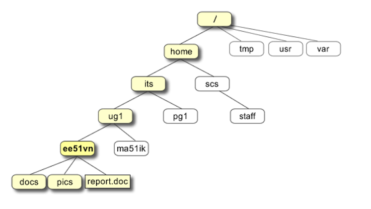
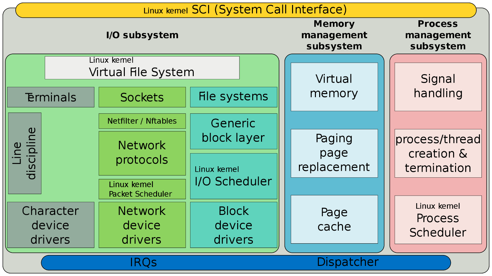
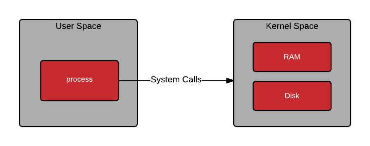
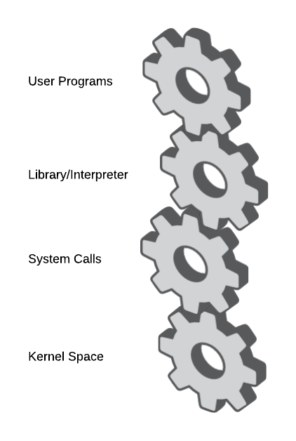
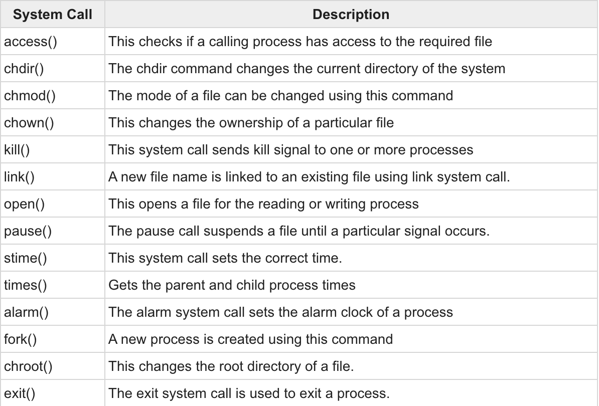

# Unix / Linux

## A UNIX OS is made up of three parts

- **Kernel:** The kernel of UNIX is the hub of the OS: it allocates time and memory to programs and handles the filestore and communications in response to system calls,
- **Shell:** The shell acts as an interface between the user and the kernel. The shell is a command line interpreter (CLI). It interprets the commands the user types in and arranges for them to be carried out,
- **Programs:** The commands are themselves also programs: when they terminate, the shell gives the user another prompt.-  Everything in UNIX is either a file or a process.

Under the hood, everything is actually a file. A text file is a file, a directory is a file, your keyboard is a file (one that the system reads from only), your monitor is a file (one that the system writes to only) etc.

- A process is an executing program identified by a unique PID (process identifier).

Process identifiers (PIDs) are unique identifiers that the Linux kernel gives to each process. PIDs are namespaced, meaning that a container has its own set of PIDs that are mapped to PIDs on the host system. The first process launched when starting a Linux kernel has the PID 1. For a normal operating system, this process is the init system, for example, systemd or SysV. Similarly, the first process launched in a container gets PID 1. Docker and Kubernetes use signals to communicate with the processes inside containers, most notably to terminate them. Both Docker and Kubernetes can only send signals to the process that has PID 1 inside a container.

## Linux is an extensionless system

Files can have any extension they like or none at all.

## Directory Structure

## Unix File Types

There are 6 file types in Unix systems -

1. **Regular file**

This is the most common type of a file in Unix. Being a plain collection of bytes with arbitrary data. There's nothing mysterious about this type. Most of the files you will ever work with are regular.
In long-format output of ls, this type of file is specified by the "-" symbol.
2. **Directory**

This is a special type of a file in Unix, which only contains a list of other files (the contents of a directory). You don't work with directories directly, instead you manage them with standard commands provided with your OS. The whole directory structure of your Unix system is made of such special files with directory content in each of them.
In long-format output of ls, this type of file is specified by the "d" symbol:

$ ls -ld *
-rw-r--r-- 1 greys greys1024 Mar 29 06:31 text
drwxr-xr-x 2 greys greys4096 Aug 21 11:00 mydir
3. **Special Device file**

This type of files in Unix allows access to various devices known to your system. Literally, almost every device has a special file associated with it. This simplifies the way Unix interacts with different devices -- to the OS and most commands each device is still a file, so it can be read from and written to using various commands. Most special device files are owned by root, and regular users cannot create them,

Depending on the way of accessing each device, its special device file can be either a character (shown as "c" in ls output) or a block (shown as "b") device. One device can have more than one device file associated, and it's perfectly normal to have both character and block device files for the same device.

Most special device files are character ones, and devices referred by them are called raw devices. The simple reason behind such a name is that by accessing the device via its special device character file, you're accessing the raw data on the device in a form the device is ready to operate with. For terminal devices, it's one character at a time. For disk devices though, raw access means reading or writing in whole chunks of data -- blocks, which are native to your disk. The most important thing to remember about raw devices is that all the read/write operations to them are direct, immediate and not cached.

Block device file will provide similar access to the same device, only this time the interaction is going to be buffered by the kernel of your Unix OS. Grouping data into logical blocks and caching such blocks in memory allows the kernel to process most I/O requests much more efficiently. No longer does it have to physically access the disk every time a request happens. The data block is read once, and then all the operations to it happen in the cached version of it, with data being synced to the actual device in regular intervals by a special process running in your OS.
Here's how the different types of special device files look in your ls output:

$ ls -al /dev/loop0 /dev/ttys0
brw-rw---- 1 root disk 7, 0 Sep 7 05:03 /dev/loop0
crw-rw-rw- 1 root tty 3, 48 Sep 7 05:04 /dev/ttys0
4. **Named Pipe**

Pipes represent one of simpler forms of Unix interprocess communication. Their purpose is to connect I/O of two Unix processes accessing the pipe. One of the processes uses this pipe for output of data, while another process uses the very same named pipe file for input.
In long-format output of ls, named pipes are marked by the "p" symbol:

$ ls -al /dev/xconsole
prw-r----- 1 root adm 0 Sep 25 08:58 /dev/xconsole
5. **Symbolic Link**

This is yet another file type in Unix, used for referencing some other file of the filesystem. Symbolic link contains a text form of the path to the file it references. To an end user, symlink (sort for symbolic link) will appear to have its own name, but when you try reading or writing data to this file, it will instead reference these operations to the file it points to.
In long-format output of ls, symlinks are marked by the "l" symbol (that's a lower case L). It also show the path to the referenced file:

$ ls -al hosts
lrwxrwxrwx 1 greys www-data 10 Sep 25 09:06 hosts -> /etc/hosts
6. **Socket**

AUnix socket(sometimes also calledIPC socket --inter-process communication socket) is a special file which allows for advanced inter-process communication. In essence, it is a stream of data, very similar to network stream (and network sockets), but all the transactions are local to the filesystem.
In long-format output of ls, Unix sockets are marked by "s" symbol:

$ ls -al /dev/log
srw-rw-rw- 1 root root 0 Sep 7 05:04 /dev/log
<https://www.unixtutorial.org/unix-file-types>

## Linux Capabilities

Normally the root user (or any ID with UID of 0) gets a special treatment when running processes. The kernel and applications are usually programmed to skip the restriction of some activities when seeing this user ID. In other words, this user is allowed to do (almost) anything.
Linux capabilities provide a subset of the available root privileges to a process. This effectively breaks up root privileges into smaller and distinctive units. Each of these units can then be independently be granted to processes. This way the full set of privileges is reduced and decreasing the risks of exploitation.
<https://linux-audit.com/linux-capabilities-101>

<https://blog.container-solutions.com/linux-capabilities-why-they-exist-and-how-they-work>

## Linux kernel

The kernel space is where we have system memory for low level applications on the kernel running. The user space is the environment where our user processes function and execute.

Whenever an applications makes a request to a kernel level function, an interrupt is sent which tells the processor to stop whatever it is doing and attend to that particular request, you can think about it like context switching if it makes it easier to understand. Provided the user space application has relevant permission, there's a context switch to the kernel space, the user space application awaits a response back after the context switch has started and the required program/functionality in the kernel space is executed through the aid of the appropriate interrupt handler.

## Syscalls

Systems Calls aka syscall is an API which allows a**small** part of kernel functionality to be exposed to user level applications. A small part is really stressed to inform whoever reading that syscalls are limited and are generic to serve a purpose. They are not the same across every operating system and do differ in both definition and mode of access.

Sometimes, we have a group of syscalls that we want to group together, we do this using a linux kernel feature called Capabilities. These are predefined sets of privileges which a running program can have access to or be limited by.
Capabilities further enhance syscalls by grouping related ones into defined privileges that can be granted or denied at once. This prevents even root level applications from exploiting restricted kernel spaces with reserved permissions.

## Linux Namespaces

1. CGroups

Basically cgroups virtualize the view of process's cgroups in /proc/[pid]/cgroups. Whenever a process creates a new cgroup it enters in a new namespace in which all current directories become cgroup root directories of the new namespace. So we can say that it isolates cgroup root directory.

2. IPC (Interpolation Communication)

This namespace isolates interpolation communication. For example, In Linux, we have System V IPC (A communication mechanism) and Posfix(for messagequeues) which allows processes to exchange data in form of communication. So in simple words, we can say that IPC namespace isolates communication.

3. Network

This namespace isolates systems related to the network. For example, network devices, IP protocols, Firewall Rules (That's why we can use the single port with single service)

4. Mount

This namespace isolates mount points that can be seen by processes in each namespace. In simple words, you can take an example of filesystem mounting in which we can mount only one device or partition on a mount-point.

5. PID

This namespace isolates the PID. (In this child processes cannot see or trace the parent process but parent process can see or trace the child processes of the namespace. Processes in different PID namespace can have same PID.)

6. User

This namespace isolates security related identifier like group id and user id. In simple words, we can say that the process's group and user id has full privilege inside the namespace but not outside the namespace.

7. UTS

This namespace provides the isolation on hostname and domain name. It means processes has a separate copy of domain name or hostname so while changing hostname or domain name it will not affect the rest of the system.

## Namespace Management

This is the most advanced topic of Linux namespaces which should be done on kernel level. For the namespace management, you have to write aCprogram.
For management of namespace, we have these functions available in Linux

- clone()

If we use standalone clone() it will create a new process only, but if we pass one or more flags like CLONE_NEW*, then the new namespace will be created and child process will become the member of it.

- setns()

This allows joining existing namespace. The namespace is specified by the file descriptor referenced to process.

- unshare()

This allows calling process to disassociate from parts of current namespace. Basically, this function works on the processes that are being shared by other's namespace as well for ex - mount namespace.
What are the things a child process inherits from its parents?

- User + groups
- Environment variables
- Working directory
- Namespace & Capabilities
Name two pieces of information you can get from proc/$PID directory
- Environment variables
- Links to every open file
- Memory maps
- Current working directory
- Command line arguments
When 2 programs use the same library (like openssl) are there 2 copies of that library in memory?
- No, if it's dynamically linked library (or shared library), then you can just have 1 copy in memory and hundreds of programs can share the same copy

## CGroups

Control groups, usually referred to as cgroups, are a Linux kernel feature which allow processes to be organized into hierarchical groups whose usage of various types of resources can then be limited and monitored. The kernel's cgroup interface is provided through a pseudo-filesystem called cgroupfs. Grouping is implemented in the core cgroup kernel code, while resource tracking and limits are implemented in a set of per-resource-type subsystems (memory, CPU, and so on).
Functions

- **Resource limiting:**a group can be configured not to exceed a specified memory limit or use more than the desired amount of processors or be limited to specific peripheral devices.
- **Prioritization:**one or more groups may be configured to utilize fewer or more CPUs or disk I/O throughput.
- **Accounting:**a group's resource usage is monitored and measured.
- **Control:**groups of processes can be frozen or stopped and restarted.
<https://itnext.io/breaking-down-containers-part-0-system-architecture-37afe0e51770>

## POSIX

ThePortable Operating System Interface(POSIX)is a family of [standards](https://en.wikipedia.org/wiki/Standardization) specified by the [IEEE Computer Society](https://en.wikipedia.org/wiki/IEEE_Computer_Society) for maintaining compatibility between [operating systems](https://en.wikipedia.org/wiki/Operating_system). POSIX defines the [application programming interface](https://en.wikipedia.org/wiki/Application_programming_interface)(API), along with command line [shells](https://en.wikipedia.org/wiki/Unix_shell) and utility interfaces, for software compatibility with variants of [Unix](https://en.wikipedia.org/wiki/Unix) and other operating systems.
<https://en.wikipedia.org/wiki/POSIX>

## Boot Process

## Distributions

<https://dev.to/pluralsight/which-distribution-of-linux-should-i-use-51g7>
Ubuntu

Fedora

DebianOS

CentOS

GlassFish server by sunmicrosystems

Rasbian OS

## Debian Family

The Debian distribution is the upstream for several other distributions, including Ubuntu, Linux Mint and others. Debian is a pure open source project, and focuses on a key aspect: stability. It also provides the largest and most complete software repository to its users.
Ubuntu aims at providing a good compromise between long term stability and ease of use. Since Ubuntu gets most of its packages from Debian's unstable branch, we decided to use Ubuntu as the reference Debian-based distribution for our lab exercises:

- Commonly used on both servers and desktops
- DPKG-based, uses apt-get and front-ends for installing and updating
- Upstream for Ubuntu, Linux Mint and others
- Current material based upon the latest release of Ubuntu and should work well with later versions
- x86 and x86-64 - Long Term Release (LTS)

## Red Hat / Fedora Family

Fedora is the community distribution that forms the basis of Red Hat Enterprise Linux, CentOS, Scientific Linux and Oracle Linux. Fedora contains significantly more software than Red Hat's enterprise version. One reason for this is that a diverse community is involved in building Fedora; it is not just one company
The Fedora community produces new versions every six months or so. For this reason, we decided to standardize the Red Hat / Fedora part of the course material on the lastest version of CentOS 7, which provides much longer release cycles. Once installed, CentOS is also virtually identical to Red Hat Enterprise Linux (RHEL), which is the most popular Linux distribution in enterprise enviroments:

- Current material is based upon the latest release of Red Hat Enterprise Linux (RHEL) - 7.x at the time of publication, and should work well with later versions
- Supports x86, x86-64, Itanium, PowerPC and IBM System Z
- RPM-based, uses yum (or dnf) to install and update
- Long release cycle; targets enterprise server environments
- Upstream for CentOS, Scientific Linux and Oracle Linux

## OpenSUSE Family

The relationship between openSUSE and SUSE Linux Enterprise Server is similar to the one we just described between Fedora and Red Hat Enterprise Linux. In this case, however, we decided to use openSUSE as the reference distribution for the openSUSE family, due to the difficulty of obtaining a free version of SUSE Linux Enterprise Server. The two products are extremely similar and material that covers openSUSE can typically be applied to SUSE Linux Enterprise Server with no problem:

- Current material is based upon the latest release of openSUSE, and should work well with later versions
- RPM-based, uses zypper to install and update
- YaST available for administration purposes
- x86 and x86-64
- Upstream for SUSE Linux Enterprise Server (SLES)

## New Distribution Similarities

Current treds and changes to the distributions have reduced some of the differences between the distributions

- **systemd** (system startup and service management)

systemd is used by the most common distributions, replacing the SysVinit and Upstart packages. Replaces service and chkconfig commands

- **journald** (manages system logs)

journald is a systemd service that collects and stores logging data. It creates and maintains structured, indexed journals based on loggin information that is received from a variety of sources. Depeding on the distribution, text-based system logs may be replaced

- **firewalld** (firewall management daemon)

firewalld provides a dynamically managed firewall with support for network/firewall zones to define the trust level of network connections or interfaces. It has support for IPv4, IPv6 firewall settings and Ethernet bridges. This replaces the iptables configurations

- **ip** (network display and configuration tool)

The ip program is part of the net-tools package, and is designed to be a replacement for the ifconfig command. The ip command will show or manipulate routing, network devices, routing information and tunnels
<https://www.freecodecamp.org/news/securing-linux-servers-with-se-linux>
