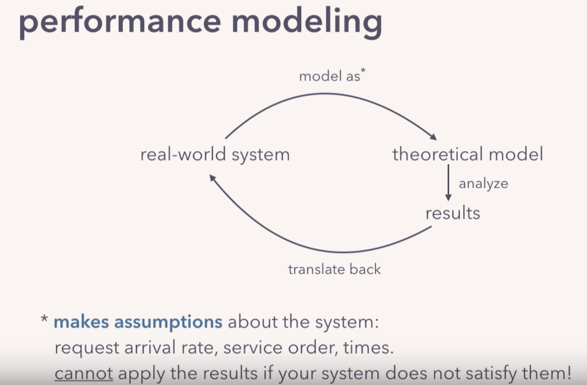
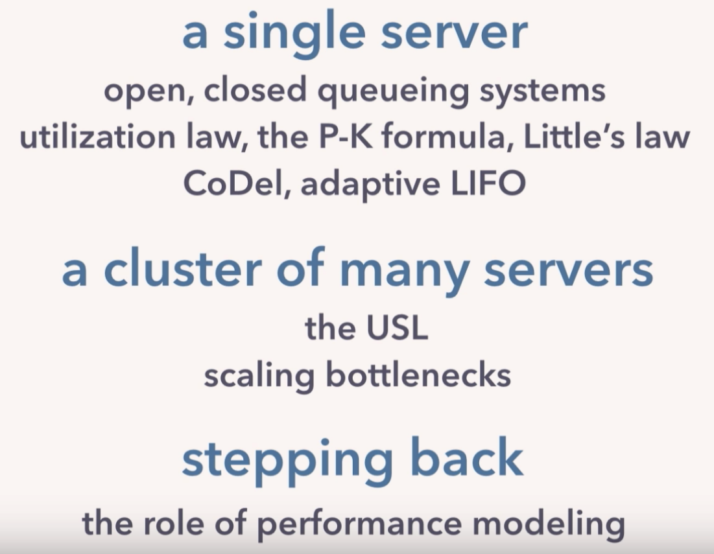

# Others

Created: 2018-05-03 22:40:45 +0500

Modified: 2022-04-09 13:11:28 +0500

---

**Gamification**

The use of game elements and game design techniques in non-game contexts

Common game elements

| **Game element** | **Definition**                                                                            |
|---------------|---------------------------------------------------------|
| Feedback         | Immediate notification that keep users constantly aware of progress or failures           |
| Goals            | Activity goals that are adapted as challenges for the user                                |
| Badges           | Optional rewards and goals outside the scope of a service's core activities               |
| Point system     | Reward for completing actions (that is, a numeric value that's added to the total points) |
| Leaderboard      | Tracking and displaying desired actions to drive desired behavior through competition     |
| User levels      | Indication of the user's proficiency in the overall gaming experience over time           |
Two types of users -

1.  **Achievers -** are eager to complete the many challenges with which they're confronted.

2.  **Explorers -** trive to find hid- den items they can likely collect by exploring a software system's differ- ent areas
**Performance Modelling**

**Software defined radio**

**WHAT IS SOFTWARE-DEFINED RADIO USED FOR?**

Software-defined radio can be used for all traditional radio applications, but much more flexibly. This allows for the prototyping and development of next-generation radio applications. In this article, though, we use an RTL-SDR for simply receiving narrow-band FM signals.
**HOW DOES SOFTWARE-DEFINED RADIO WORK?**

A software-defined radio works by implementing traditionally hardware components in software on a personal computer or embedded system.
**WHAT IS A WAVEFORM IN SOFTWARE-DEFINED RADIO?**

A waveform is a representation of a wave over a time period. In software-defined radio, it is the same as a waveform in regular radio. It can be used to represent the sound being modulated or demodulated, the signal being transmitted, radiated, or received, or any other waves in the process.
**WHAT IS SDR IN HAM RADIO?**

SDR can be used in ham radio like any other radio application. Amateur radio is a hobby about exploration, and so hams can use the SDR as a receiver, or as a transmitter. They can even use it to create completely new radio applications.
**WHAT IS RTL IN RTL-SDR?**

RTL is short for RTL2832U. The Realtek RTL2832U chipset was a popular choice for digital video broadcast (DVB-T) receivers, whose original purpose was to receive video. It was discovered that these could be hacked and turned into wideband SDR receivers. These devices have come to be known as the RTL-SDR.
**CAN YOU TRANSMIT WITH SDR?**

It depends on the SDR. If you have the right hardware, yes you can, but not with the RTL-SDR. Some transmission capable SDRs include the HackRF, PlutoSDR, LimeSDR, LimeSDR Mini, and more.
<https://www.toptal.com/software/software-defined-radio-tutorial-rtl-sdr>

## Virtual Reality (VR / WebVR / AR - Augmented realityƒ)**

[https://www.toptal.com/virtual-reality/webvr-and-edge-computing](https://www.toptal.com/virtual-reality/webvr-and-edge-computing?)

<https://www.gather.town>

## GIS (Geographic Information System)**

AGeographic Information System(GIS) is a system designed to capture, store, manipulate, analyze, manage, and present spatial or[geographic data](https://en.wikipedia.org/wiki/Geographic_data_and_information). GIS applications are tools that allow users to create interactive queries (user-created searches), analyze spatial information, edit data in maps, and present the results of all these operations.GIS (more commonly GIScience) sometimes refers to[geographic information science (GIScience)](https://en.wikipedia.org/wiki/Geographic_information_science), the science underlying geographic concepts, applications, and systems.Since the mid-1980s, geographic information systems have become valuable tool used to support a variety of city and regional planning functions.
GIS can refer to a number of different technologies, processes, techniques and methods. It is attached to many operations and has many applications related to engineering, planning, management, transport/logistics, insurance, telecommunications, and business.For that reason, GIS and[location intelligence](https://en.wikipedia.org/wiki/Location_intelligence)applications can be the foundation for many location-enabled services that rely on analysis and visualization.
GIS can relate unrelated information by using location as the key index variable. Locations or extents in the Earth[space--time](https://en.wikipedia.org/wiki/Space%E2%80%93time)may be recorded as dates/times of occurrence, and x, y, and z[coordinates](https://en.wikipedia.org/wiki/Coordinate)representing,[longitude](https://en.wikipedia.org/wiki/Longitude),[latitude](https://en.wikipedia.org/wiki/Latitude), and[elevation](https://en.wikipedia.org/wiki/Elevation_(geography)), respectively. All Earth-based spatial--temporal location and extent references should be relatable to one another and ultimately to a "real" physical location or extent. This key characteristic of GIS has begun to open new avenues of scientific inquiry.
<https://en.wikipedia.org/wiki/Geographic_information_system>

## Supercomputer Architecture**

Approaches to**supercomputer architecture**have taken dramatic turns since the earliest systems were introduced in the 1960s. Early[supercomputer](https://en.wikipedia.org/wiki/Supercomputer)architectures pioneered by[Seymour Cray](https://en.wikipedia.org/wiki/Seymour_Cray)relied on compact innovative designs and local[parallelism](https://en.wikipedia.org/wiki/Parallel_computing)to achieve superior computational peak performance.[^[1]^](https://en.wikipedia.org/wiki/Supercomputer_architecture#cite_note-chen-1)However, in time the demand for increased computational power ushered in the age of[massively parallel](https://en.wikipedia.org/wiki/Massively_parallel)systems.
<https://en.wikipedia.org/wiki/Supercomputer_architecture>

