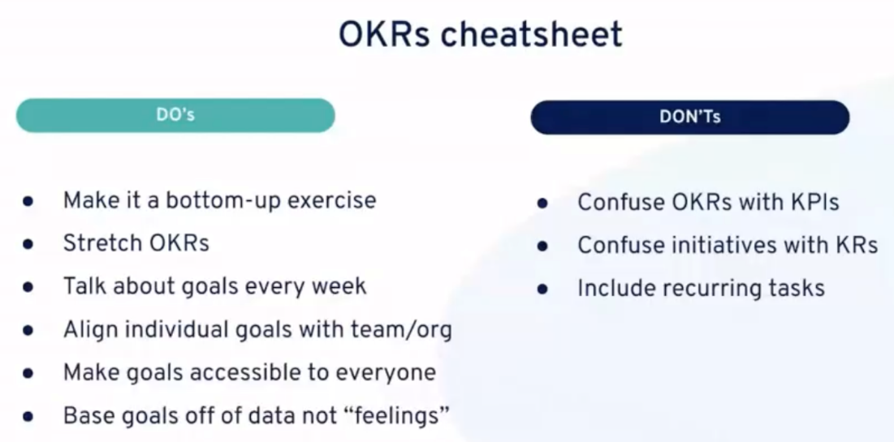
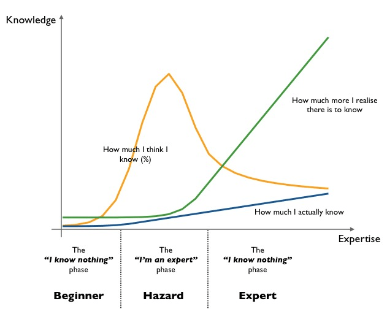
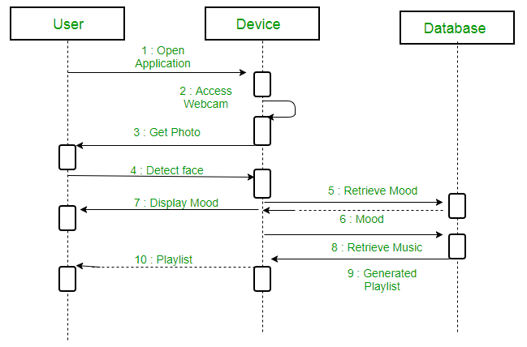
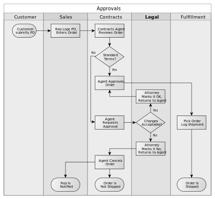
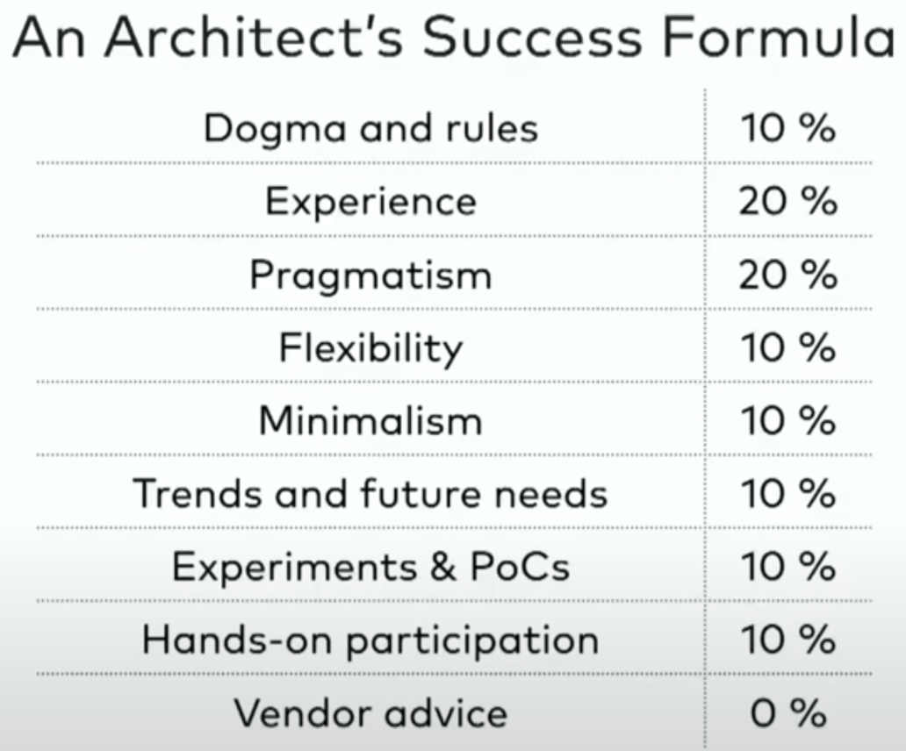
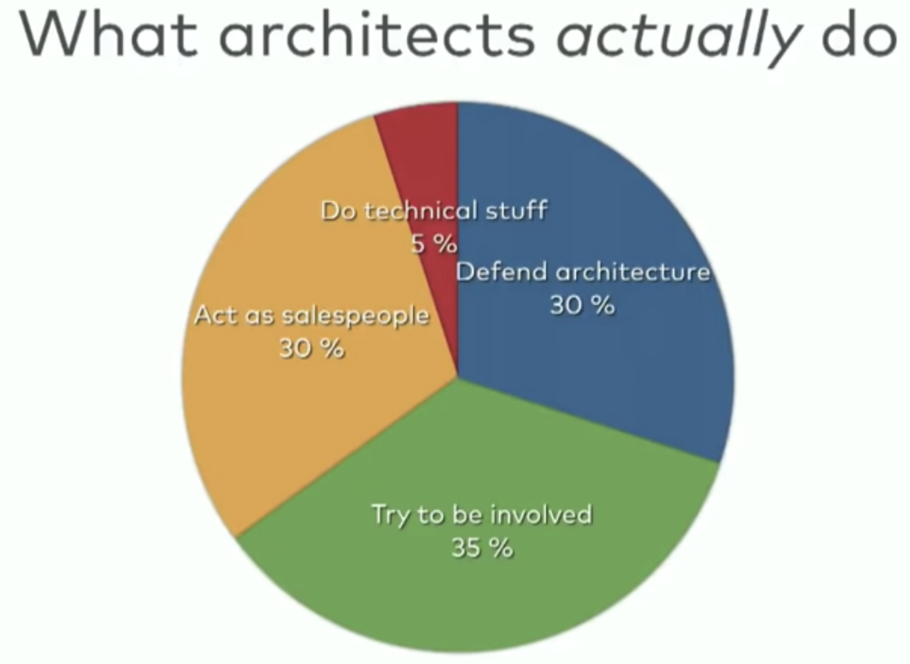
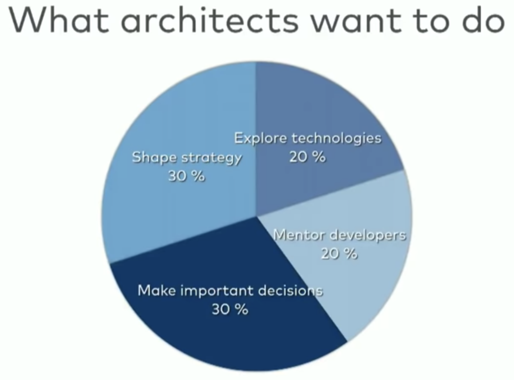
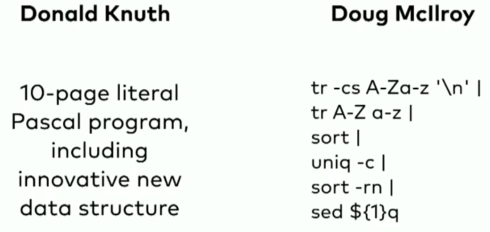
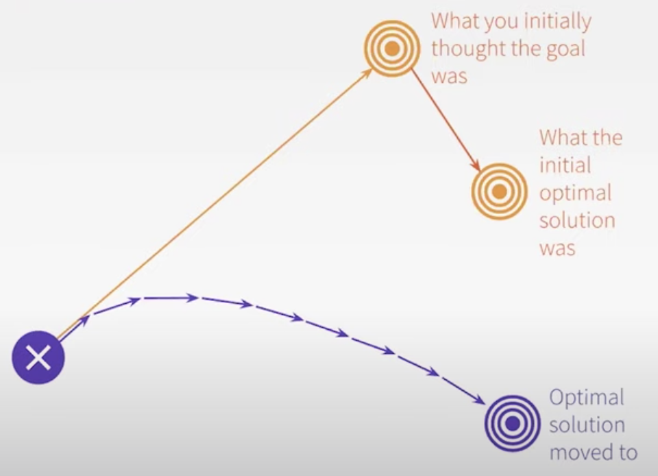

# Software/Coding / Development/Engineering

Created: 2018-05-01 20:28:03 +0500

Modified: 2022-09-29 00:05:52 +0500

---

- **Learning and Discovery -** Iteration, Feedback, Incrementalism, Experimentation and Empiricism
- **Managing Complexity -** Modularity, Information Hiring, Seperation of Concerns, Loose-Coupling, Cohesion
<https://dont.build>
Making great software is more about managing complexity and thinking through details than it is about design or pretty pixels. One of the biggest misunderstandings of our era.

## Research first code later

## Principles of sofware design

## YAGNI - You Ain't Gonna Need It. (For new features)

"You aren't gonna need it"(YAGNI)is a principle of [extreme programming](https://en.wikipedia.org/wiki/Extreme_programming)(XP) that states a [programmer](https://en.wikipedia.org/wiki/Programmer) should not add functionality until deemed necessary.

## KISS - Keep It Simple Stupid

## DRY - Don't Repeat Yourself

## DIE - Duplication Is Evil

## SoC - Separation of Concerns

## Objectives and Key Results (OKR)

Used for setting, communicating and monitoring quarterly goals and results in organizations.

<https://soapboxhq.com/goal-examples/engineering>

<https://okrexamples.co/technology-engineering-rnd-okr-examples>

## TPM - Total Productive Maintainence**

## MVP - Minimum Viable Products

## RAT - Riskiest Assumption Test

<https://hackernoon.com/the-mvp-is-dead-long-live-the-rat-233d5d16ab02>

## Yak Shaving

Yak shaving is programming lingo for the seemingly endless series of small tasks that have to be completed before the next step in a project can move forward.

## Example

- You start with the desire to wax your car.
- To wax your car, you need a water hose. Only, your water hose is busted so you need to go down to the hardware store to get a new hose.
- To get to the hardware store, you have to drive across a bridge. The bridge requires a pass or ticket. You can't find your pass, but you know your neighbor has one.
- However, your neighbor won't lend you his pass until you return a pillow that you borrowed. The reason you haven't returned it is because the pillow is missing some stuffing.
- The pillow was originally stuffed with yak hair. In order to re-stuff the pillow you need to get some new yak hair.
- And that's how you end up shaving a yak, when all you really wanted to do was wax your car.

## SLAP - Single Level of Abstraction Principle

## Legacy code

One of the definitions - The code without test cases.

## Greenfield code

In many disciplines agreenfield projectis one that lacks constraints imposed by prior work. The analogy is to that of construction on [greenfield land](https://en.m.wikipedia.org/wiki/Greenfield_land) where there is no need to work within the constraints of existing buildings or infrastructure.
In [software development](https://en.m.wikipedia.org/wiki/Software_development), a greenfield project could be one of developing a system for a totally new environment, without concern for integrating with other systems, especially not [legacy systems](https://en.m.wikipedia.org/wiki/Legacy_system). Such projects are deemed as higher risk, as they are often for new infrastructure, new customers, and even new owners. For this reason, [agile software development](https://en.m.wikipedia.org/wiki/Agile_software_development) is often deemed the best approach, as it proposes how to handle those risks by developing small slices of complete functionality and getting them in the hands of customers (internal or external) quickly for immediate feedback.

## Brownfield code

Those facilities which are modified/upgraded are called [brownfield land](https://en.m.wikipedia.org/wiki/Brownfield_land) projects (often the pre-existing site/facilities are contaminated/polluted.)
Brownfield development is a term commonly used in the IT industry to describe problem spaces needing the development and deployment of new software systems in the immediate presence of existing (legacy) software applications/systems. This implies that any new software architecture must take into account and coexist with live software already in situ.

## Self Contained System (SCS)

The Self-contained System (SCS) approach is an architecture that focuses on a separation of the functionality into many independent systems, making the complete logical system a collaboration of many smaller software systems. This avoids the problem of large monoliths that grow constantly and eventually become unmaintainable.

<https://scs-architecture.org>
[**http://engineering-principles.onejl.uk/**](http://engineering-principles.onejl.uk/)

- ARCHITECTURE
  - [Build Differentiators](http://engineering-principles.onejl.uk/architecture/Build_Differentiators.html)
  - [Design for Emergent Reuse](http://engineering-principles.onejl.uk/architecture/Design_for_Emergent_Reuse.html)
  - [Evolutionary Systems](http://engineering-principles.onejl.uk/architecture/Evolutionary_Systems.html)
  - [Scale Horizontally](http://engineering-principles.onejl.uk/architecture/Scale_Horizontally.html)
  - [Small and Simple](http://engineering-principles.onejl.uk/architecture/Small_and_Simple.html)
  - [Smarts in the Nodes not the Network](http://engineering-principles.onejl.uk/architecture/Smarts_in_the_Nodes_not_the_Network.html)
- OPERATIONAL
  - [Cloud Native](http://engineering-principles.onejl.uk/operational/Cloud_Native.html)
  - [Data Stewardship](http://engineering-principles.onejl.uk/operational/Data_Stewardship.html)
  - [Production Ready](http://engineering-principles.onejl.uk/operational/Production_Ready.html)
- ORGANISATION
  - [Keep Pace with Technological Change](http://engineering-principles.onejl.uk/organisation/Keep_Pace_with_Technological_Change.html)
  - [Model the Business Domain](http://engineering-principles.onejl.uk/organisation/Model_the_Business_Domain.html)
- TECHNOLOGY & PRACTICES
  - [Secure by Design](http://engineering-principles.onejl.uk/practices/Secure_by_Design.html)
  - [Automate by Default](http://engineering-principles.onejl.uk/practices/Automate_by_Default.html)
  - [Consistent Environments](http://engineering-principles.onejl.uk/practices/Consistent_Environments.html)
  - [Understandability](http://engineering-principles.onejl.uk/practices/Understandability.html)
  - [Performance Importance](http://engineering-principles.onejl.uk/practices/Performance_Importance.html)
  - [Get Feedback Early and Often](http://engineering-principles.onejl.uk/practices/Get_Feedback_Early_and_Often.html)
  - [Design for Testability](http://engineering-principles.onejl.uk/practices/Testability.html)

## Lean Software Development

- Eliminate Waste
- Build Quality In
- Create Knowledge
- Defer Commitment
- Deliver Fast
- Respect People
- Optimize the Whole

## OCL (Object Constraint Language)

## UML (Unified Modeling Language)

Unified Modelling Language (UML)is a modeling language in the field of software engineering which aims to set standard ways to visualize the design of a system. UML guides the creation of multiple types of diagrams such as interaction , structure and behaviour diagrams.

## Types of UML

- Interaction diagram

An interaction diagram is used to show theinteractive behaviorof a system. Since visualizing the interactions in a system can be a cumbersome task, we use different types of interaction diagrams to capture various features and aspects of interaction in a system.

- Sequence diagram

A sequence diagram simply depicts interaction between objects in a sequential order i.e. the order in which these interactions take place. We can also use the terms event diagrams or event scenarios to refer to a sequence diagram. Sequence diagrams describe how and in what order the objects in a system function. These diagrams are widely used by businessmen and software developers to document and understand requirements for new and existing systems.

<https://www.geeksforgeeks.org/unified-modeling-language-uml-sequence-diagrams>-  Flowchart

- Usecase diagram
- Class diagram
- Activity diagram
- Component diagram
- State machine diagram
- Object diagram
- Deployment diagram
- Timing diagram
- Package diagram
- Composite structure diagram
- Profile diagram
- Communication diagram
[**https://www.freecodecamp.org/news/uml-diagrams-full-course/**](https://www.freecodecamp.org/news/uml-diagrams-full-course/)

## Non-UML diagrams

- Wireframe graphical interface

<https://www.freecodecamp.org/news/what-is-a-wireframe-ux-design-tutorial-website>-  Archimate diagram

- Specification and Description Language (SDL)
- Ditaa diagram
- Gantt diagram
<http://plantuml.com>

<https://mermaidjs.github.io> (Can be rendered using markdown in gitlab)

## Business Process Model and Notation (BPMN)

Business Process Model and Notation(BPMN) is a [graphical representation](https://en.wikipedia.org/wiki/Information_visualization) for specifying [business processes](https://en.wikipedia.org/wiki/Business_process) in a [business process model](https://en.wikipedia.org/wiki/Business_process_modeling).
Originally developed by the [Business Process Management Initiative](https://en.wikipedia.org/wiki/Business_Process_Management_Initiative)(BPMI), BPMN has been maintained by the [Object Management Group](https://en.wikipedia.org/wiki/Object_Management_Group)(OMG) since the two organizations merged in 2005. Version 2.0 of BPMN was released in January 2011, at which point the name was amended toBusiness Process ModelandNotationto reflect the introduction of execution semantics, which were introduced alongside the existing notational and diagramming elements. Though it is an OMG specification, BPMN is also ratified as [ISO](https://en.wikipedia.org/wiki/International_Organization_for_Standardization) 19510. The latest version is BPMN 2.0.2, published in January 2014.
<https://en.wikipedia.org/wiki/Business_Process_Model_and_Notation>

<http://www.bpmn.org>

<https://camunda.com>

## Workflow

A Workflow is a series of decisions made by different people that determines what happens to a particular request that one of those people made, according to a defined and repeatable process.

## SwimLane

Aswimlane(orswimlane diagram) is used in [process flow diagrams](https://www.wikiwand.com/en/Flowchart), or flowcharts, that visually distinguishes [job sharing](https://www.wikiwand.com/en/Job_sharing) and responsibilities for sub-processes of a [business process](https://www.wikiwand.com/en/Business_process). Swimlanes may be arranged either horizontally or vertically.

<https://www.wikiwand.com/en/Swim_lane>

## Life Critical System

A life-critical system is a system whose failure or malfunction may result in death or serious injury. It comprises all software and hardware necessary to perform a critical function.

## Dependability

Dependability is a measure of a system's availability, reliability, and maintainability. In general, it is a measure of the confidence that a system will perform as expected.

## Safety-critical element

Safety-critical elements are systems or components that are designed to prevent, control, mitigate, or respond to system malfunctions or accidents that could lead to injury or death.

## Examples

- Automotive
- Aviation
- Communications
<https://www.toptal.com/software/life-critical-systems>

## Non Functional Requirements

<https://en.wikipedia.org/wiki/Non-functional_requirement>

## Junior developer training guide

- Message format for asking question
- technical private messages, all messages with pain points should be public. So if anyone else has the same question, they can refer to previous conversations
- There is no such question as a stupid question
- Business knowledge
- Tooling
- Remove or document prolific abstractions
  - Dependencies
  - Abstractions
  - Patterns
- Domain level documentation
- Make the macro intent of small classes explicit
- Screencasts as documentation
- Pair programming
- Watch other devs work
- Pairing is great, but sometimes watching is better. Just watching senior developer work you can learn a lot.
- Retention
- Promotion
- Support time-wasting
- Better use of investment time (learning lunches)
- Prioritize depth over breadth
- Occasionally, allocate full days
- Long form technical writing
- Solidifies there knowledge
- Creates documentation
- Build authority and brand
- Let devs audit extra meetings

## Developers Tips

- Draw more pictures (architecture diagram / UML diagram)
- Critique your design
- Read and write (documentation)
- Invent it here (don't use libraries for simple things)
- Learn to test
- Master the tools (ide, cli)
- Focus on fundamentals
- Value the individual
- Feel the fear
- Remember what matters

[What We Left Behind - 10 Valuable Skills From The 1990s • Garth Gilmour & Eamonn Boyle • GOTO 2020](https://www.youtube.com/watch?v=DrBPXSiUWbI)

## Concurrent Engineering

## Concurrent engineering(**CE**) is a work methodology emphasizing the parallelisation of tasks (i.e. performing tasks concurrently), which is sometimes called**simultaneous engineering**or**integrated product development**(**IPD) using an [integrated product team](https://en.wikipedia.org/wiki/Integrated_product_team) approach. It refers to an approach used in [product development](https://en.wikipedia.org/wiki/Product_development) in which functions of design engineering, manufacturing engineering, and other functions are integrated to reduce the time required to bring a new product to market

## The Four Keys To Rapid Response Software Development

- Impeccable, reliable, automated build and deployment system
- Effective, low-friction collaboration
- Constant learning and skills improvement
- Design of replaceable, disposable software
<https://toolshed.com/2019/01/FourKeys.html>

## Lean Software Development

- [Eliminate waste](https://en.wikipedia.org/wiki/Lean_software_development#Eliminate_waste)
- [Amplify learning](https://en.wikipedia.org/wiki/Lean_software_development#Amplify_learning)
- [Decide as late as possible](https://en.wikipedia.org/wiki/Lean_software_development#Decide_as_late_as_possible)
- [Deliver as fast as possible](https://en.wikipedia.org/wiki/Lean_software_development#Deliver_as_fast_as_possible)
- [Empower the team](https://en.wikipedia.org/wiki/Lean_software_development#Empower_the_team)
- [Build integrity in](https://en.wikipedia.org/wiki/Lean_software_development#Build_integrity_in)
- [See the whole](https://en.wikipedia.org/wiki/Lean_software_development#See_the_whole)
<https://en.wikipedia.org/wiki/Lean_software_development>

## Unified Process

TheUnified Software Development ProcessorUnified Processis an [iterative and incremental](https://en.wikipedia.org/wiki/Iterative_and_incremental_development)[software development process](https://en.wikipedia.org/wiki/Software_development_process) framework. The best-known and extensively documented refinement of the Unified Process is the [Rational Unified Process](https://en.wikipedia.org/wiki/Rational_Unified_Process)(RUP). Other examples are [OpenUP](https://en.wikipedia.org/wiki/OpenUP) and [Agile Unified Process](https://en.wikipedia.org/wiki/Agile_Unified_Process).
<https://en.wikipedia.org/wiki/Unified_Process>

## STAR method (Situation-Task-Action-Result)**

Here's the Action-Result method:

- Action:Given the task at hand, how did you accomplish it? Once again, be clear and concise.
- Result:This is the most important part of the A-R method. Here you'll want to describe using relevant metrics what your impact was from completing the task. This is how you communicate you are a high performer.
An example:Launched Facebook Messenger from concept to launch, a way for users to message each other privately within the app, increasing D60 retention by 65% and user stickiness by 325%.
Here, the applicant clearly describes what they did (launch Facebook Messenger), and the direct result from their action (increasing D60 retention and stickiness). It's important when you articulate your result that you use numbers - they help communicate their story with more impact and believability.

## Best Practices

<https://blog.usejournal.com/10-signs-you-will-suck-at-programming-5497a6a52c5c>

[Software Is Details • Kevlin Henney • GOTO 2020](https://www.youtube.com/watch?v=kX0prJklhUE)

- Any program is a model of a model within a theory of a model of an abstraction of some portion of the world or of some universe of discourse
- It is an attitude that can be encapsulated in a simple but demanding rule: always think both big picture and fine detail -- Will Gompertz - Think Like an Artist

## Cycle time compression

## Time Estimation

There is a huge difference between precision and accuracy

precise != accurate
How to estimate

- Compare new work with old
- Identify work of similar complexity
- Use the actual time it took as estimate for new work
[How To Estimate Software Development Time](https://www.youtube.com/watch?v=v21jg8wb1eU)

## Antipatterns

- Centralized control and ownership: One size doesn't fit all
  - (Dis)economies of scale
  - Overzealous guardrails
  - Modification is ticket-driven
- Fragmented platform implementation
- Slow development loops: less time coding, more time toiling

## Technical Debt

## Kiss of death

## Lehman's Laws of Software Evolution

- **Continuing Change**

A system must be continually adapted or it becomes progressively less satisfactory

- **Increasing Complexity**

As a system evolves, it's complexity increases unless work is done to maintan or reduce it-  Are we treating symptoms instead of real issues

- Quantifying technical debt
- There's always a trade off between improving existing code versus adding new features-  **Symptoms of low code health**
  - **Low cohension,** many responsibilities
  - **Bumpy road code smell,** lack of encapsulation
  - **Deeply nested logic**, if-statements inside if-statements
  - **Primitive obsession,** missing a domain language
  - **Excess function arguments,** missing abstractions
<https://alexkreilein.medium.com/death-by-tech-debt-f5146836d2be>

<https://news.ycombinator.com/item?id=13416935>
[Prioritizing Technical Debt as if Time and Money Matters • Adam Tornhill • GOTO 2020](https://www.youtube.com/watch?v=FnmYGqZAAuI)

<https://zerodha.tech/blog/being-future-ready-with-common-sense>

- Slow down to speed up
- Organisations often overestimate the importance of the features they continuously ship (and underestimate the importance of features they don't ship)
- Don't fix what is not broken, but fix what might soon break
- Technical debt is a reality of life
  - No business goals, vision, strategy, or competitive advantage changes the fact that technical debt is inevitable and that it needs to be handled.
- A developer should know why something is being done to the software they write and maintain. That is when they can truly "own" it, maintain a current mental model without outright hating the codebase, and assimilate changes meaningfully rather than shoehorning them in.

## No Silver Bullet-- Essence and Accident in Software Engineering

"No Silver Bullet-- Essence and Accident in Software Engineering" is a widely discussed paper on [software engineering](https://en.wikipedia.org/wiki/Software_engineering) written by [Turing Award](https://en.wikipedia.org/wiki/Turing_Award) winner [Fred Brooks](https://en.wikipedia.org/wiki/Fred_Brooks) in 1987.Brooks argues that "there is no single development, in either technology or management technique, which by itself promises even one [order of magnitude](https://en.wikipedia.org/wiki/Order_of_magnitude) (tenfold) improvement within a decade in productivity, in reliability, in simplicity." He also states that "we cannot expect ever to see two-fold gains every two years" in software development, as there is in hardware development ([Moore's law](https://en.wikipedia.org/wiki/Moore%27s_law)).

## Summary

Brooks distinguishes between two different types of complexity: **accidental complexity and essential complexity.** This is related to [Aristotle](https://en.wikipedia.org/wiki/Aristotle)'s classification. Accidental complexity relates to problems which engineers create and can fix; for example, the details of writing and optimizing [assembly](https://en.wikipedia.org/wiki/Assembly_language) code or the delays caused by batch processing. Essential complexity is caused by the problem to be solved, and nothing can remove it; if users want a program to do 30 different things, then those 30 things are essential and the program must do those 30 different things.
Brooks claims that the accidental complexity has decreased substantially, and today's programmers spend most of their time addressing essential complexity. Brooks argues that this means that shrinking all the accidental activities to zero will not give the same order-of-magnitude improvement as attempting to decrease essential complexity. While Brooks insists that there is no one [silver bullet](https://en.wikipedia.org/wiki/Silver_bullet), he believes that a series of innovations attacking essential complexity could lead to significant improvements. One technology that had made significant improvement in the area of accidental complexity was the invention of [high-level programming languages](https://en.wikipedia.org/wiki/High-level_programming_language), such as [Ada](https://en.wikipedia.org/wiki/Ada_(programming_language)).Today's languages, such as [C](https://en.wikipedia.org/wiki/C_(programming_language)), [C++](https://en.wikipedia.org/wiki/C%2B%2B), [C#](https://en.wikipedia.org/wiki/C_Sharp_(programming_language)) and [Java](https://en.wikipedia.org/wiki/Java_(programming_language)), are considered to be improvements, but not of the same order of magnitude.
Brooks advocates "growing" software organically through incremental development. He suggests devising and implementing the main and subprograms right at the beginning, filling in the working sub-sections later. He believes that programming this way excites the engineers and provides a working system at every stage of development.
Brooks goes on to argue that there is a difference between "good" designers and "great" designers. He postulates that as programming is a creative process, some designers are inherently better than others. He suggests that there is as much as a tenfold difference between an ordinary designer and a great one. He then advocates treating star designers equally well as star managers, providing them not just with equal [remuneration](https://en.wikipedia.org/wiki/Remuneration), but also all the perks of higher status: large office, staff, travel funds, etc.
<https://en.wikipedia.org/wiki/No_Silver_Bullet>

## Joel Test

- Do you use source control?
- Can you make a build in one step?
- Do you make daily builds?
- Do you have a bug database?
- Do you fix bugs before writing new code?
- Do you have an up-to-date schedule?
- Do you have a spec?
- Do programmers have quiet working conditions?
- Do you use the best tools money can buy?
- Do you have testers?
- Do new candidates write code during their interview?
- Do you do hallway usability testing?
<https://www.joelonsoftware.com/2000/08/09/the-joel-test-12-steps-to-better-code>

<https://medium.com/squad-engineering/squad-takes-the-joel-test-9189709a6235>

## The 7 R's: Common use cases and deployment**

- Rehost (also known as "lift-and-shift")

Quickly moving applications to the cloud without changing them.

- Refactor (also known as rearchitect)

Changing the way applications are architected and developed, usually by employing cloud-native features.

- Re-platform (sometimes referred to as "lift-tinker-and-shift")

Making a few optimizations to applications---but without changing their core architecture, like moving from self-managed Kubernetes to Amazon EKS.

- Repurchase (casually known as "drop and shop")

Replacing your current environment by moving to a newer version of software or purchasing an entirely new solution.

- Relocate

Using VMware Cloud on AWS to quickly relocate up to hundreds of applications virtualized on vSphere to the AWS Cloud in days and without changing them.

- Retire

Identifying assets that are no longer useful and turning them off, strengthening your business case by focusing on more widely used resources.

- Retain

Leaving the application on-premises---for now, at least.

## When building a full-stack feature, start where the data is

## Exposing some data from the database?

Start with the backend. Build the API first and then consume it in the front end

## Is it coming from a user input?

Start with the front end. Build the form and then build an API to publish it to
This helps as you no longer have to make assumptions about

- the format of the data,
- the data types of each field, or
- what data is even available

## Resources

[Top 10 Things That Destroy Developer Productivity](https://www.youtube.com/watch?v=O-U11s-Rk_w&ab_channel=CodingTech)

[Top 10 Traits of The Great Technical Leaders](https://youtu.be/3AZi49wyvds)
