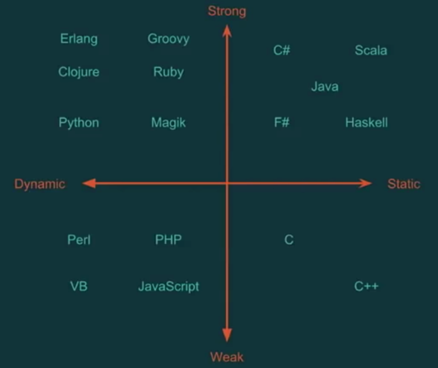

# Type Systems

Created: 2018-11-30 12:01:05 +0500

Modified: 2021-04-28 11:47:26 +0500

---

In[programming languages](https://en.wikipedia.org/wiki/Programming_language), atype systemis a set of rules that assigns a property called[type](https://en.wikipedia.org/wiki/Type_(computer_science))to the various constructs of a[computer program](https://en.wikipedia.org/wiki/Computer_program), such as [variables](https://en.wikipedia.org/wiki/Variable_(computer_science)), [expressions](https://en.wikipedia.org/wiki/Expression_(computer_science)), [functions](https://en.wikipedia.org/wiki/Function_(computer_science)) or [modules](https://en.wikipedia.org/wiki/Modular_programming).These types formalize and enforce the otherwise implicit categories the programmer uses for[algebraic data types](https://en.wikipedia.org/wiki/Algebraic_data_type), data structures, or other components (e.g. "string", "array of float", "function returning boolean").
**Type System Goals**
-   Check for bad program behavior
-   Early detection of program errors
-   Enable abstractions
-   Protect integrity of user defined abstractions
-   Documentation
    -   Easy to reason code's purpose
    -   Doesn't drift like code comments
Statically typed language
-   Types must be defined for every variable at compile time

Dynamically typed language
-   Types are not required to be defined at compile time
Weakly typed
-   Types can be changed at run time.

Strongly typed
-   Types are fixed and cannot be changed at run time

Dependent types (first class types)
# Statically Typed vs Dynamically Typed language

A language is statically typed if the **type of a variable is known at compile time**. For some languages this means that you as the programmer must specify what type each variable is (e.g.: Java, C, C++); other languages offer some form oftype inference, the capability of the type system to deduce the type of a variable (e.g.: OCaml, Haskell, Scala, Kotlin, Python)
The main advantage here is that all kinds of checking can be done by the compiler, and therefore a lot of trivial bugs are caught at a very early stage.
A language is dynamically typed if the **type is associated with run-time values,** and not named variables/fields/etc. This means that you as a programmer can write a little quicker because you do not have to specify types every time (unless using a statically-typed language withtype inference). Example: Perl, Ruby, Python.

**(In dynamically typed languages, types are associated with the variable's value, not the variable itself)**
Most scripting languages have this feature as there is no compiler to do static type-checking anyway, but you may find yourself searching for a bug that is due to the interpreter misinterpreting the type of a variable. Luckily, scripts tend to be small so bugs have not so many places to hide.
**Static Typing Checking**
-   Early feedback
-   More reliable
-   More optimizable
-   Longer edit-test-compile cycle
**Dynamic Typing Checking**
-   Shorter edit-test-compile cycle
-   More flexible
-   Good for prototyping
-   Better at metaprogramming
-   Get ready for lots and lots of unit testing
<table>
<colgroup>
<col style="width: 47%" />
<col style="width: 52%" />
</colgroup>
<thead>
<tr class="header">
<th>Static</th>
<th>Dynamic</th>
</tr>
</thead>
<tbody>
<tr class="odd">
<td><ul class="incremental">
<li>
C
</li>
<li>
C++
</li>
<li>
Java
</li>
<li>
C#
</li>
<li>
Scala
</li>
<li>
Haskell
</li>
<li>
Rust
</li>
<li>
Kotlin
</li>
<li>
Go
</li>
</ul></td>
<td><ul class="incremental">
<li>
JavaScript
</li>
<li>
Ruby
</li>
<li>
Python
</li>
<li>
Perl
</li>
<li>
PHP
</li>
<li>
Lisp
</li>
<li>
Closure
</li>
<li>
R
</li>
<li>
Bash
</li>
</ul></td>
</tr>
</tbody>
</table>
{width="3.3229166666666665in" height="2.7916666666666665in"}
<https://www.sitepoint.com/typing-versus-dynamic-typing/>
# Strong Typed vs Weak Typed language

In strongly typed languages, variables are necessarily bound to a particular data type. Python is strong typed, and so is Java.
As opposed to strong typed languages, weak typed languages are those in which variables are not of a specific data type. It should be noted that this does not imply that variables do not have types; it does mean that variables are not "bound" to a specific data type. PHP and C are examples of weak typed languages.
Thus, Python is dynamic typed and strong typed; Java is static typed and strong typed; PHP is dynamic typed and weak typed; C is static typed and weak typed (owing to its casting ability).
**See Also**
-   Programming Styles > Duck typing
**Others**
-   Algebraic Data Types (ADT)
**References**

[Functional Programming: Type Systems](https://www.youtube.com/watch?v=hy1wjkcIBCU)
{width="3.3229166666666665in" height="1.8645833333333333in"}