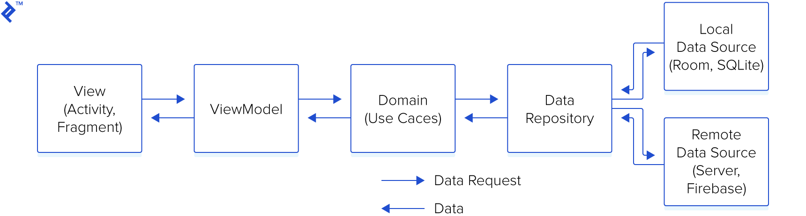

# Architectural - MVVM

Created: 2018-12-08 23:15:26 +0500

Modified: 2018-12-08 23:15:58 +0500

---

**Data Flow**

{width="5.0in" height="1.3333333333333333in"}

**References**

<https://www.toptal.com/android/android-apps-mvvm-with-clean-architecture>

