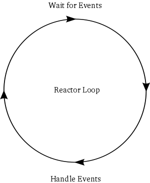

# Concurrency - Reactor

Created: 2018-10-13 21:50:31 +0500

Modified: 2018-10-13 21:52:00 +0500

---

The reactor[design pattern](https://en.wikipedia.org/wiki/Design_pattern_(computer_science))is an[event handling](https://en.wikipedia.org/wiki/Event_handling)pattern for handling service requests delivered[concurrently](https://en.wikipedia.org/wiki/Concurrency_(computer_science))to a service handler by one or more inputs. The service handler then[demultiplexes](https://en.wikipedia.org/wiki/Demultiplex)the incoming requests and dispatches them synchronously to the associated request handlers.
{width="3.125in" height="3.8125in"}

*fig - the reactor loop*
**References**

<https://en.wikipedia.org/wiki/Reactor_pattern>

