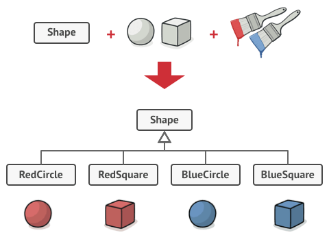
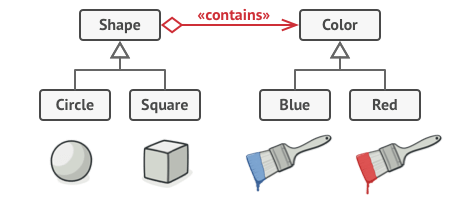

# Structural - Bridge

Created: 2018-08-20 16:24:26 +0500

Modified: 2018-08-20 16:37:33 +0500

---

**Bridge**is a structural design pattern that divides one or more classes into two separate hierarchies - abstraction and implementation, allowing them to be changed independently of each other.
Let's take a simple example. You have a class called Figure that has the subclasses - Circle and Square. You want to expand the shapes hierarchy in color, that is, to have the Red and Blue figures. But to combine all of this, you'll have to create 4 combinations of subclasses, like BlueCircle and RedSquare.

When adding new types of shapes and colors, the number of combinations will grow exponentially. For example, to introduce triangles into the program, you'll have to create two new subclasses of triangles for each color. After this, a new color will require the creation of three classes for all kinds of figures. It only gets worse. Visually, it can be featured as:

The root of the problem lies in the fact that we're trying to expand the classes of shapes in two independent planes - in form and color, which leads to the class tree growth.

The Bridge pattern suggests replacing inheritance with delegation. In order to do this, one of these "planes" needs to be established as a separate hierarchy and you'll have to refer to the object of this hierarchy, instead of storing its state and behavior within one class.

Thus, we can make Color a separate class with the Red and Blue subclasses. The Figure class gets a link to the Color object and can delegate the work to it, if necessary. This connection will become the bridge between Figure and Color. When adding new color classes, you won't need to touch the shape classes, and vice versa. Schematically it will look like this:

**Situations in which the Bridge pattern can help out:**

**1)**When you want to divide a monolithic class that contains several different implementations of some kind of functionality (for example, if the class can work with the different database systems).

The larger the class, the harder it is to understand its code, and the more it drags out the development. In addition, changes made to one of the implementations lead to editing the entire class, which can cause random errors in the code. The bridge allows you to divide a monolithic class into several separate hierarchies. After that you can change their code independently from each other. This simplifies the work on the code and reduces the likelihood of making errors.

**2)**When a class needs to be expanded in two independent planes.

The bridge proposes to allocate one of these planes to a separate hierarchy of classes, storing a link to one of its objects in the original class.

**3)**When you want to be able to change the implementation during the execution of the program.

The bridge allows you to replace the implementation even during the program execution, since a particular implementation is not included in the abstraction class.

By the way, because of this point Bridge is often confused with Strategy. Note that this function is the lowest on the scale on importance for Bridge, since its main task is structural.

**Pros:**

- Allows to build platform-independent programs.

- Hides unnecessary or dangerous implementation details from the client code.

**Cons:**

- Complicates the program code due to the introduction of additional classes.
**References**

<https://py.checkio.org/blog/design-patterns-part-3/>