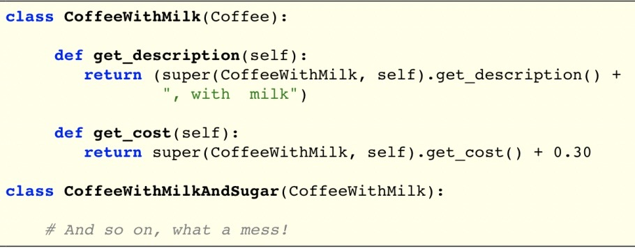

# Structural - Decorator

Created: 2018-04-05 00:17:55 +0500

Modified: 2021-08-29 13:15:15 +0500

---

In[object-oriented programming](https://en.wikipedia.org/wiki/Object-oriented_programming), the**decorator pattern**is a[design pattern](https://en.wikipedia.org/wiki/Design_pattern_(computer_science))that allows behavior to be added to an individual[object](https://en.wikipedia.org/wiki/Object_(computer_science)), either statically or dynamically, without affecting the behavior of other objects from the same[class](https://en.wikipedia.org/wiki/Class_(computer_science)).The decorator pattern is often useful for adhering to the[Single Responsibility Principle](https://en.wikipedia.org/wiki/Single_responsibility_principle), as it allows functionality to be divided between classes with unique areas of concern.The decorator pattern is structurally nearly identical to the[chain of responsibility pattern](https://en.wikipedia.org/wiki/Chain_of_responsibility_pattern), the difference being that in a chain of responsibility, exactly one of the classes handles the request, while for the decorator, all classes handle the request.
**Starbuzz Coffee**

{width="5.0in" height="3.78125in"}
**Adding Ingredients: First Try**

{width="5.0in" height="3.9166666666666665in"}-   But what if we want more ingredients? Open-closed principle?
**Adding Ingredients: Second Try**

{width="5.0in" height="1.9479166666666667in"}
What we want:
-   Adding a new ingredient like soy milk should not modify the original beverage classes
-   Adding new ingredients should be simple and work automatically across all beverages
**Solution: Decorator Pattern**

{width="5.0in" height="2.1979166666666665in"}
-   Composition solves the problem
-   Note: Do not confuse this with Python function decorators

