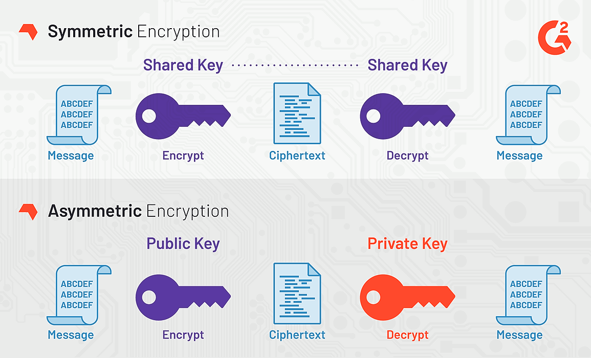
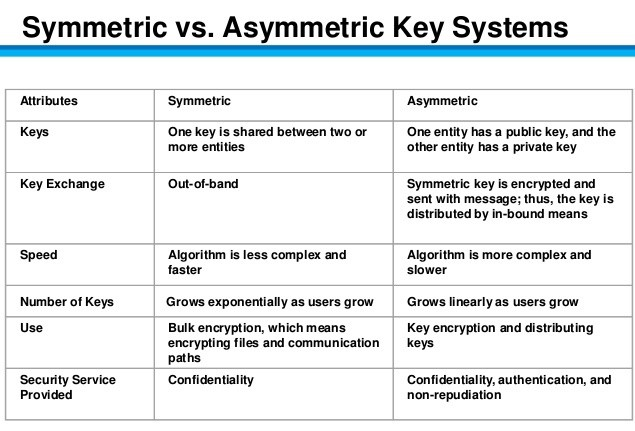

# Cryptographic Algorithms

Created: 2018-04-26 23:57:41 +0500

Modified: 2022-02-16 18:25:11 +0500

---

## Stream Ciphers (OTP)

- RC4
- A5/1, A5/2
- Salsa

## Block Ciphers

Message (M) divided into multiple blocks

## Symmetric Encryption

Symmetric encryption uses the same keyfor encryption and decryption.

Symmetricencryption is preferred when you are encryptingonly for yourself.

## Asymmetric Encryption

Asymmetric encryption uses different keys.

Asymmetricencryption is preferred when you want someone to be able to send you encrypted data, butyou don't want to give them your private key.



## Ceaser Cipher / Substitution Cipher / Shift Cipher

Shift characters

## Vigenere Cipher (Polyalphabetic substitution)

## Vernam Cipher (One Time Pads)

## DES

- 16 round Feistel Network

## 3DES - Triple Data Encryption Algorithm

3DES is a symmetric key block cipher which applies DES algorithm three times to each data block.
3DES uses 3 keys for all 3 rounds of DES. The 3 rounds consists of encryption, decryption and then again encryption.

## AES (Advanced Encryption Standard)

Is a specification that has selected the Rijndael cipher as its symmetric key ciphering algorithm.-  Subs-Perm network

- AES - 128
- randomized enryption
- nonce-based enryption
- CBC (Cipher Block Chain) with random IV (Intialization Vector)
<https://hackernoon.com/very-basic-intro-to-aes-256-cipher-qxr32yk>

[**https://www.devglan.com/online-tools/aes-encryption-decryption**](https://www.devglan.com/online-tools/aes-encryption-decryption)

## Fernet (symmetric encryption)

Fernet guarantees that a message encrypted using it cannot be manipulated or read without the key.[Fernet](https://github.com/fernet/spec/) is an implementation of symmetric (also known as "secret key") authenticated cryptography. Fernet also has support for implementing key rotation via [MultiFernet](https://cryptography.io/en/latest/fernet/#cryptography.fernet.MultiFernet).
Fernet is a symmetric encryption method which makes sure that the message encrypted cannot be manipulated/read without the key. It uses URL safe encoding for the keys. Fernet also uses 128-bit AES in CBC mode and PKCS7 padding, with HMAC using SHA256 for authentication. The IV is created from os.random().

<https://medium.com/coinmonks/if-youre-struggling-picking-a-crypto-suite-fernet-may-be-the-answer-95196c0fec4b>

```bash
python -c "from cryptography.fernet import Fernet; print(Fernet.generate_key().decode())"
```

<https://cryptography.io/en/latest/fernet>

### Galois/Counter Mode (GCM)

In [cryptography](https://en.wikipedia.org/wiki/Cryptography), Galois/Counter Mode(GCM) is a [mode of operation](https://en.wikipedia.org/wiki/Block_cipher_mode_of_operation) for symmetric-key cryptographic [block ciphers](https://en.wikipedia.org/wiki/Block_cipher) which is widely adopted for its performance. GCM throughput rates for state-of-the-art, high-speed communication channels can be achieved with inexpensive hardware resources.The operation is an [authenticated encryption](https://en.wikipedia.org/wiki/Authenticated_encryption) algorithm designed to provide both data authenticity (integrity) and confidentiality. GCM is defined for block ciphers with a block size of 128 bits.Galois Message Authentication Code(GMAC) is an authentication-only variant of the GCM which can form an incremental message authentication code. Both GCM and GMAC can accept initialization vectors of arbitrary length.
Different block cipher modes of operation can have significantly different performance and efficiency characteristics, even when used with the same block cipher. GCM can take full advantage of parallel processing and implementing GCM can make efficient use of an [instruction pipeline](https://en.wikipedia.org/wiki/Instruction_pipeline) or a hardware pipeline. By contrast, the [cipher block chaining](https://en.wikipedia.org/wiki/Cipher_block_chaining)(CBC) mode of operation incurs [pipeline stalls](https://en.wikipedia.org/wiki/Pipeline_stall) that hamper its efficiency and performance.

<https://en.wikipedia.org/wiki/Galois/Counter_Mode>
AES-GCM-SIVis a [mode of operation](https://en.wikipedia.org/wiki/Block_cipher_mode_of_operation) for the [Advanced Encryption Standard](https://en.wikipedia.org/wiki/Advanced_Encryption_Standard) which provides similar performance to [Galois/Counter Mode](https://en.wikipedia.org/wiki/Galois/Counter_Mode) as well as misuse resistance in the event of the reuse of a [cryptographic nonce](https://en.wikipedia.org/wiki/Cryptographic_nonce). The construction is defined in RFC 8452.

<https://en.wikipedia.org/wiki/AES-GCM-SIV>

## Kerberos

- Uses symmetric keys
- Used to authenticate users and allow nodes to communicate with one another over a non-secure medium. Confidentiality and forward secrecy assured.
- Designed for client-server environment wherein a user might want to use a service over an insecure medium (e.g. LAN)

## Entities

1. Server - resource that could be accessed by the client and TGS
2. Client - wants to access the resource
3. Ticket - a temporal access privilege assurance to the resource
4. Ticket Granting Server (TGS) - the server that issues the ticket
5. Key Distribution Server (KDC) - knows about the private keys of all entities.

## Drawbacks

- Availability of KDC + centralized point of failures and vulnerabilities
- Time synchronization and strict deadlines
- No standardized implementations
- Scalability - Every user and server needs its own private keys

## Elliptic-curve Cryptography

## Elliptic-curve cryptography**(**ECC) is an approach to [public-key cryptography](https://en.wikipedia.org/wiki/Public-key_cryptography) based on the [algebraic structure](https://en.wikipedia.org/wiki/Algebraic_structure) of [elliptic curves](https://en.wikipedia.org/wiki/Elliptic_curve) over [finite fields](https://en.wikipedia.org/wiki/Finite_field). ECC requires smaller keys compared to non-EC cryptography (based on plain [Galois fields](https://en.wikipedia.org/wiki/Galois_field)) to provide equivalent security

Elliptic curves are applicable for [key agreement](https://en.wikipedia.org/wiki/Key_agreement), [digital signatures](https://en.wikipedia.org/wiki/Digital_signature), [pseudo-random generators](https://en.wikipedia.org/wiki/CPRNG) and other tasks. Indirectly, they can be used for [encryption](https://en.wikipedia.org/wiki/Encryption) by combining the key agreement with a symmetric encryption scheme. They are also used in several [integer factorization](https://en.wikipedia.org/wiki/Integer_factorization)[algorithms](https://en.wikipedia.org/wiki/Algorithm) based on elliptic curves that have applications in cryptography, such as [Lenstra elliptic-curve factorization](https://en.wikipedia.org/wiki/Lenstra_elliptic-curve_factorization).
<https://en.wikipedia.org/wiki/Elliptic-curve_cryptography>

## ECDSA (Elliptic Curve Digital Signature Algorithm)

In [cryptography](https://en.wikipedia.org/wiki/Cryptography), theECDSA offers a variant of the [Digital Signature Algorithm](https://en.wikipedia.org/wiki/Digital_Signature_Algorithm)(DSA) which uses [elliptic curve cryptography](https://en.wikipedia.org/wiki/Elliptic_curve_cryptography).
As with elliptic-curve cryptography in general, the bit [size](https://en.wikipedia.org/wiki/Key_size) of the [public key](https://en.wikipedia.org/wiki/Public_key) believed to be needed for ECDSA is about twice the size of the [security level](https://en.wikipedia.org/wiki/Security_level), in bits. For example, at a security level of 80 bits (meaning an attacker requires a maximum of about280operations to find the private key) the size of an ECDSA public key would be 160 bits, whereas the size of a DSA public key is at least 1024 bits. On the other hand, the signature size is the same for both DSA and ECDSA: approximately4tbits, wheretis the security level measured in bits, that is, about 320 bits for a security level of 80 bits.
<https://en.wikipedia.org/wiki/Elliptic_Curve_Digital_Signature_Algorithm>

## RSA

## RSA(**Rivest--Shamir--Adleman) is one of the first [public-key cryptosystems](https://en.wikipedia.org/wiki/Public-key_cryptography) and is widely used for secure data transmission. In such a [cryptosystem](https://en.wikipedia.org/wiki/Cryptosystem), the [encryption key](https://en.wikipedia.org/wiki/Encryption_key) is public and it is different from the [decryption key](https://en.wikipedia.org/wiki/Decryption_key) which is kept secret (private). In RSA, this asymmetry is based on the practical difficulty of the [factorization](https://en.wikipedia.org/wiki/Factorization) of the product of two large [prime numbers](https://en.wikipedia.org/wiki/Prime_number), the "[factoring problem](https://en.wikipedia.org/wiki/Factoring_problem)". The [acronym](https://en.wikipedia.org/wiki/Acronym) RSA is made of the initial letters of the surnames of [Ron Rivest](https://en.wikipedia.org/wiki/Ron_Rivest), [Adi Shamir](https://en.wikipedia.org/wiki/Adi_Shamir), and [Leonard Adleman](https://en.wikipedia.org/wiki/Leonard_Adleman), who first publicly described the algorithm in 1978.[Clifford Cocks](https://en.wikipedia.org/wiki/Clifford_Cocks), an English mathematician working for the British intelligence agency [Government Communications Headquarters](https://en.wikipedia.org/wiki/Government_Communications_Headquarters)(GCHQ), had developed an equivalent system in 1973, but this was not [declassified](https://en.wikipedia.org/wiki/Classified_information) until 1997

A user of RSA creates and then publishes a public key based on two large [prime numbers](https://en.wikipedia.org/wiki/Prime_number), along with an auxiliary value. The prime numbers must be kept secret. Anyone can use the public key to encrypt a message, but with currently published methods, and if the public key is large enough, only someone with knowledge of the prime numbers can decode the message feasibly.Breaking RSA [encryption](https://en.wikipedia.org/wiki/Encryption) is known as the [RSA problem](https://en.wikipedia.org/wiki/RSA_problem). Whether it is as difficult as the factoring problem remains an open question.
RSA is a relatively slow algorithm, and because of this, it is less commonly used to directly encrypt user data. More often, RSA passes encrypted shared keys for [symmetric key](https://en.wikipedia.org/wiki/Symmetric-key_algorithm) cryptography which in turn can perform bulk encryption-decryption operations at much higher speed.
<https://en.wikipedia.org/wiki/RSA_(cryptosystem)>

<https://en.wikipedia.org/wiki/RSA_(cryptosystem)#Operation>

## Shamir's Secret Sharing

Shamir's Secret Sharingis an [algorithm](https://en.wikipedia.org/wiki/Algorithm) in [cryptography](https://en.wikipedia.org/wiki/Cryptography) created by [Adi Shamir](https://en.wikipedia.org/wiki/Adi_Shamir). It is a form of [secret sharing](https://en.wikipedia.org/wiki/Secret_sharing), where a secret is divided into parts, giving each participant its own unique part.
To reconstruct the original secret, a minimum number of parts is required. In the threshold scheme this number is less than the total number of parts. Otherwise all participants are needed to reconstruct the original secret.
<https://en.wikipedia.org/wiki/Shamir%27s_Secret_Sharing>
