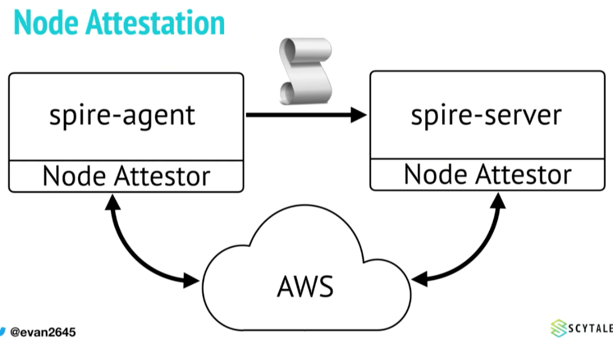
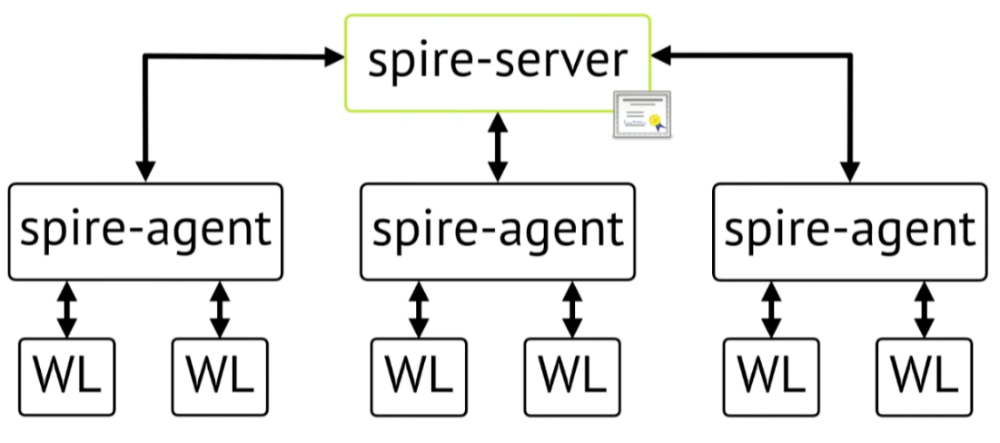
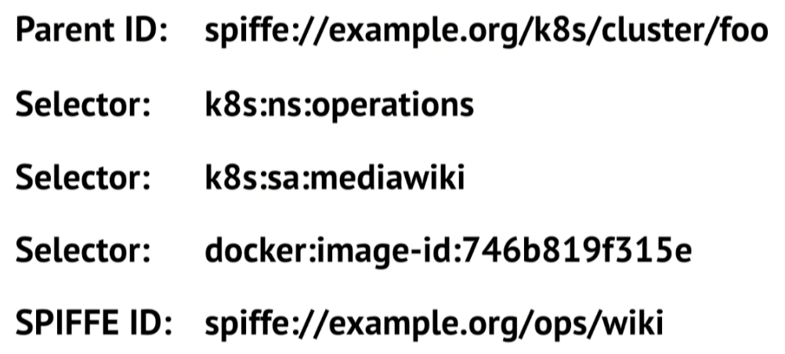

# Tools

Created: 2019-12-28 22:47:16 +0500

Modified: 2022-08-11 15:37:07 +0500

---

**dex**

Dex is an identity service that uses[OpenID Connect](https://openid.net/connect/)to drive authentication for other apps.
Dex acts as a portal to other identity providers through["connectors."](https://github.com/dexidp/dex#connectors)This lets dex defer authentication to LDAP servers, SAML providers, or established identity providers like GitHub, Google, and Active Directory. Clients write their authentication logic once to talk to dex, then dex handles the protocols for a given backend.
<https://github.com/dexidp/dex>

## SPIFFE (Secure Production Identity Framework for Everyone)**

Inspired by the production infrastructure of Google and others, SPIFFE is a set of open-source standards for securely identifying software systems in dynamic and heterogeneous environments.
SPIFFE is a set of open-source specifications for a framework capable of bootstrapping and issuing identity to services across heterogeneous environments and organizational boundaries. The heart of these specifications is the one that defines short lived cryptographic identity documents -- called[SVIDs](http://localhost:1313/spiffe/concepts/#spiffe-verifiable-identity-document-svid)via a[simple API](https://spiffe.io/spiffe/concepts/#spiffe-workload-api). Workloads can then use these identity documents when authenticating to other workloads, for example by establishing a TLS connection or by signing and verifying a JWT token.
SPIFFE - set of specifications

Implementations
-   The SPIRE project
-   Istio Citadel
-   HashiCorp Consul
**SPIRE**

SPIRE (the[SPIFFE](https://github.com/spiffe/spiffe)Runtime Environment) is a tool-chain for establishing trust between software systems across a wide variety of hosting platforms. Concretely, SPIRE exposes the[SPIFFE Workload API](https://github.com/spiffe/go-spiffe/blob/master/proto/spiffe/workload/workload.proto), which can attest running software systems and issue[SPIFFE IDs](https://github.com/spiffe/spiffe/blob/master/standards/SPIFFE-ID.md)and[SVID](https://github.com/spiffe/spiffe/blob/master/standards/SPIFFE-ID.md)s to them. This in turn allows two workloads to establish trust between each other, for example by establishing an mTLS connection or by signing and verifying a JWT token. Or for a workload to securely authenticate to a secret store, a database, or a cloud provider service.
spire-server
-   Identity Mapping
-   Node Attestation

-   SVID Issuance
spire-agent
-   Workload Attestation

-   Workload API
**SPIRE Overview**

**Workload Identity**

<https://spiffe.io/spiffe>

[Zero Trust Service Mesh with Calico, SPIRE, and Envoy - Shaun Crampton & Evan Gilman](https://www.youtube.com/watch?v=rKOEYoINdOE)

[Securing Multi-Cloud Cross-Cluster Communication with SPIFFE and SPIRE - Evan Gilman, Scytale, Inc.](https://www.youtube.com/watch?v=sLN11qAFAC4)
**Casbin**

An authorization library that supports access control models like ACL, RBAC, ABAC in Golang
<https://casbin.org>

<https://github.com/casbin/casbin>

## Lavabit**

Secure emailfor the world
<https://lavabit.com>

## Android**

<https://github.com/google/nogotofail>

## Cryptographic tools**

<https://www.devglan.com/online-tools/aes-encryption-decryption>

## NaCl**

<http://nacl.cr.yp.to>

## libsodium**

Sodium is a new, easy-to-use software library for encryption, decryption, signatures, password hashing and more.

<https://github.com/jedisct1/libsodium>

## cert-manager**

cert-manager builds on top of Kubernetes, introducing certificate authorities and certificates as first-class resource types in the Kubernetes API. This makes it possible to provide 'certificates as a service' to developers working within your Kubernetes cluster.
**Highlights**
-   Provide easy to use tools to manage certificates.
-   A standardised API for interacting with multiple certificate authorities (CAs).
-   Gives security teams the confidence to allow developers to self-server certificates.
-   Support for ACME (LetsEncrypt), HashiCorp Vault, Venafi, self signed and internal certificate authorities.
-   Extensible to support custom, internal or otherwise unsupported CAs.
**Concepts**
-   Issuer
-   Certificate
-   CertificateRequest
-   ACME Orders and Challenges
-   Webhook
-   CA Injector

<https://cert-manager.io>

<https://cert-manager.io/docs/concepts>

<https://cert-manager.io/docs/installation/kubernetes>
<https://www.youtube.com/watch?v=JJTJfl-V_UM>

[Use cert-manager with Let's Encrypt® Certificates Tutorial: Automatic Browser-Trusted HTTPS](https://www.youtube.com/watch?v=etC5d0vpLZE)
**Letsencrypt**

<https://letsencrypt.org/getting-started>

## certbot**

<https://certbot.eff.org>

## SASS**

<https://www.crowdstrike.com>

<https://snyk.io>

