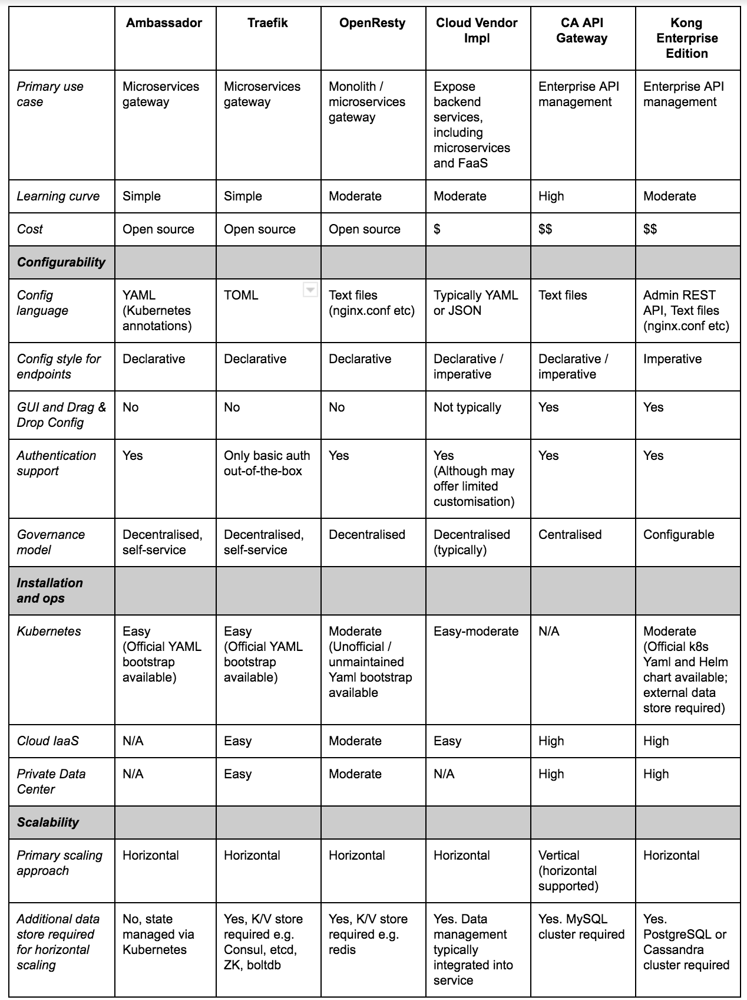

# API Gateway

Created: 2019-04-14 20:11:23 +0500

Modified: 2022-02-05 01:13:53 +0500

---

## API Design

[Designing APIs: Less Data is More || Damir Svrtan](https://www.youtube.com/watch?v=DC9032_nkyc)

## Features

1. Authentication

2. Authorization

3. Security

4. SSL termination

5. DDOS protection / Throttling

6. Adaptor (that will consolidate all information from all services and return as one response)

7. Serve static content

8. Cache responses

9. Request routing

10. Router & Load Balancer

11. A/B Testing

12. Canary Testing

13. Protocol Adapter

14. Monitoring all api's performance

15. Rate Limiting

16. Expose as API service

## Using an API gateway has the following benefits

- Insulates the clients from how the application is partitioned into microservices
- Insulates the clients from the problem of determining the locations of service instances
- Provides the optimal API for each client
- Reduces the number of requests/roundtrips. For example, the API gateway enables clients to retrieve data from multiple services with a single round-trip. Fewer requests also means less overhead and improves the user experience. An API gateway is essential for mobile applications.
- Simplifies the client by moving logic for calling multiple services from the client to API gateway
- Translates from a "standard" public web-friendly API protocol to whatever protocols are used internally

## The API gateway pattern has some drawbacks

- Increased complexity - the API gateway is yet another moving part that must be developed, deployed and managed
- Increased response time due to the additional network hop through the API gateway - however, for most applications the cost of an extra roundtrip is insignificant.

## Tools

1. **Cloud**

    a.  Apigee

    b.  AWS API Gateway

    c.  Azure API Gateway

    d.  Google cloud endpoints

    e.  WSO2 API Manager

2. **Self Managed**

    a.  Apache

    b.  HAProxy

    c.  Nginx

    d.  Spring cloud gateway

    e.  <https://apisix.apache.org>

## API Gateways**

## Gloo

The Hybrid Application Gateway built on top of Envoy
Gloo is a feature-rich, Kubernetes-native ingress controller, and next-generation API gateway. Gloo is exceptional in its function-level routing; its support for legacy apps, microservices and serverless; its discovery capabilities; its numerous features; and its tight integration with leading open-source projects. Gloo is uniquely designed to support hybrid applications, in which multiple technologies, architectures, protocols, and clouds can coexist
<https://github.com/solo-io/gloo>

## Ambassador**

[Ambassador](https://www.getambassador.io/) is an open source Kubernetes-native API Gateway built on [Envoy](https://www.envoyproxy.io/), designed for microservices. Ambassador essentially serves as an Envoy ingress controller, but with many more features.
Key features include:

- Self-service configuration, via Kubernetes annotations
- First class [gRPC and HTTP/2 support](https://www.getambassador.io/user-guide/grpc)
- Support for CORS, timeouts, weighted round robin ([canary](https://www.getambassador.io/reference/canary)),[rate limiting](https://www.getambassador.io/reference/services/rate-limit-service)
- [Istio integration](https://www.getambassador.io/user-guide/with-istio)
- [Authentication](https://www.getambassador.io/reference/services/auth-service)
- Robust TLS support, including TLS client-certificate authentication
<https://github.com/datawire/ambassador>

<https://microservices.io/patterns/apigateway.html>

Rate Limiting Service

[What is an API Gateway?](https://www.youtube.com/watch?v=vHQqQBYJtLI)

<https://blog.christianposta.com/microservices/do-i-need-an-api-gateway-if-i-have-a-service-mesh>

<https://developer.ibm.com/apiconnect/2018/11/13/service-mesh-vs-api-management>

<https://blog.christianposta.com/microservices/api-gateways-are-going-through-an-identity-crisis>

<https://konghq.com/blog/the-difference-between-api-gateways-and-service-mesh>
