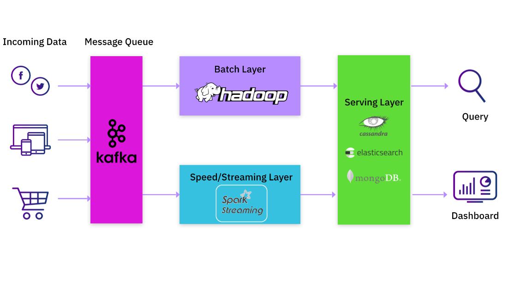

# Lambda Architecture

Created: 2019-04-20 17:44:07 +0500

Modified: 2019-11-22 13:26:35 +0500

---

Lambda architectureis a[data-processing](https://en.wikipedia.org/wiki/Data_processing)architecture designed to handle massive quantities of data by taking advantage of both[batch](https://en.wikipedia.org/wiki/Batch_processing)and[stream-processing](https://en.wikipedia.org/wiki/Stream_processing)methods. This approach to architecture attempts to balance[latency](https://en.wikipedia.org/wiki/Latency_(engineering)),[throughput](https://en.wikipedia.org/wiki/Throughput), and[fault-tolerance](https://en.wikipedia.org/wiki/Fault-tolerance)by using batch processing to provide comprehensive and accurate views of batch data, while simultaneously using real-time stream processing to provide views of online data. The two view outputs may be joined before presentation. The rise of lambda architecture is correlated with the growth of[big data](https://en.wikipedia.org/wiki/Big_data), real-time analytics, and the drive to mitigate the latencies of[map-reduce](https://en.wikipedia.org/wiki/Map-reduce).
Lambda architecture depends on a data model with an append-only, immutable data source that serves as a system of record.It is intended for ingesting and processing timestamped events that are appended to existing events rather than overwriting them. State is determined from the natural time-based ordering of the data.
{width="5.0in" height="1.4375in"}

{width="5.0in" height="2.8020833333333335in"}

**Overview**

Lambda architecture describes a system consisting of three layers: batch processing, speed (or real-time) processing, and a serving layer for responding to queries.The processing layers ingest from an immutable master copy of the entire data set.
**Batch layer**

The batch layer precomputes results using a distributed processing system that can handle very large quantities of data. The batch layer aims at perfect accuracy by being able to processallavailable data when generating views. This means it can fix any errors by recomputing based on the complete data set, then updating existing views. Output is typically stored in a read-only database, with updates completely replacing existing precomputed views.
[Apache Hadoop](https://en.wikipedia.org/wiki/Hadoop)is the de facto standard batch-processing system used in most high-throughput architectures.
**Speed layer**

The speed layer processes data streams in real time and without the requirements of fix-ups or completeness. This layer sacrifices throughput as it aims to minimize latency by providing real-time views into the most recent data. Essentially, the speed layer is responsible for filling the "gap" caused by the batch layer's lag in providing views based on the most recent data. This layer's views may not be as accurate or complete as the ones eventually produced by the batch layer, but they are available almost immediately after data is received, and can be replaced when the batch layer's views for the same data become available.
Stream-processing technologies typically used in this layer include[Apache Storm](https://en.wikipedia.org/wiki/Storm_(event_processor)),[SQLstream](https://en.wikipedia.org/wiki/Sqlstream)and[Apache Spark](https://en.wikipedia.org/wiki/Apache_Spark). Output is typically stored on fast NoSQL databases.
**Serving layer**

Output from the batch and speed layers are stored in the serving layer, which responds to ad-hoc queries by returning precomputed views or building views from the processed data.
Examples of technologies used in the serving layer include[Druid](https://en.wikipedia.org/wiki/Druid_(open-source_data_store)), which provides a single cluster to handle output from both layers.Dedicated stores used in the serving layer include[Apache Cassandra](https://en.wikipedia.org/wiki/Apache_Cassandra),[Apache HBase](https://en.wikipedia.org/wiki/Apache_HBase),[MongoDB](https://en.wikipedia.org/wiki/MongoDB),[VoltDB](https://en.wikipedia.org/wiki/VoltDB)or[Elasticsearch](https://en.wikipedia.org/wiki/Elasticsearch)for speed-layer output, and[Elephant DB](https://github.com/nathanmarz/elephantdb),[Apache Impala](https://en.wikipedia.org/wiki/Apache_Impala),[SAP HANA](https://en.wikipedia.org/wiki/SAP_HANA)or[Apache Hive](https://en.wikipedia.org/wiki/Apache_Hive)for batch-layer output.
<https://en.wikipedia.org/wiki/Lambda_architecture>
**Common Lambda Architectures: Kafka, Spark, and MongoDB/Elasticsearch**

If you are a data practitioner, you would probably have either implemented or used a data processing platform that incorporates the Lambda architecture. A common implementation would have large batch jobs in Hadoop complemented by an update stream stored in Apache Kafka. Apache Spark is often used to read this data stream from Kafka, perform transformations, and then write the result to another Kafka log. In most cases, this would not be a single Spark job but a pipeline of Spark jobs. Each Spark job in the pipeline would read data produced by the previous job, do its own transformations, and feed it to the next job in the pipeline. The final output would be written to a serving system like Apache Cassandra, Elasticsearch or MongoDB.
**Shortcomings of Lambda Architecture**

1.  Maintaining two different processing paths, one via the batch system and another via the real-time streaming system, is inherently difficult. If you ship new code functionality to the streaming software but fail to make the necessary equivalent change to the batch software, you could get erroneous results.

2.  If you are an application developer or data scientist who wants to make changes to your streaming or batch pipeline, you have to either learn how to operate and modify the pipeline, or you have to wait for someone else to make the changes on your behalf. The former option requires you to pick up data engineering tasks and detracts from your primary role, while the latter forces you into a holding pattern waiting on the pipeline team for resolution.

3.  Most of the data transformation happens as new data enters the system at write time, whereas the serving layer is a simpler key-value lookup that does not handle complex transformations. This complicates the job of the application developer because she/he cannot easily apply new transformations retroactively on pre-existing data.
<https://rockset.com/blog/aggregator-leaf-tailer-an-architecture-for-live-analytics-on-event-streams/>
**Others - ALT (Aggregator Leaf Tailer)**