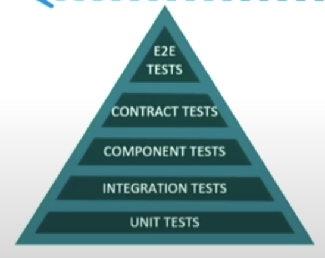
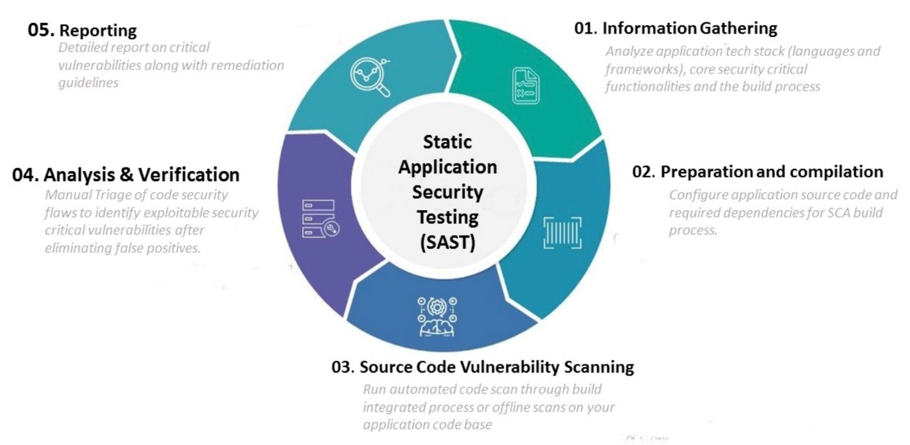

# Test Pyramid

Created: 2019-03-19 16:01:01 +0500

Modified: 2021-05-15 23:50:40 +0500

---

## Typical Test Pyramid

## Unit tests

Tests that cover the smallest piece of testable functionality in your software.
Unit testing the process of testing an atomic function by passing known values into that function and asserting an expected result is produced by the function.

## Integration tests

Integration tests, in this context, deal with testing integrations and interface defects for components within your service; these are more granular tests.

## Component tests

When you look at component tests for microservices, a component is a service that exposes certain functionalities. Therefore, component tests for microservice can just be acceptance tests for services and your tests need to validate whether the service provides the functionality that it promises to.

## Contract tests

Another category of tests that's very applicable to microservices are contract tests. They test the contracts of APIs of your services to see if the API is valid or if the microservice honors its API. A cool variation of these contract tests is consumer driven contract tests. These tests are written by consumer services of an API; the consumers codify this contract in a suite of tests that get run on every change to the API. That way, if a change to the API breaks a contract that one of its consumers expect, this breaking change is caught early in the CD pipeline.

## End-to-end tests

The test suites we discussed earlier are applicable to testing individual services. End-to-end tests, however, are more coarse-grained and try to test the functionality of an overall system. Depending on the deployment architecture you're going for, if you are deploying all of your services in a pre-production environment in an aggregate manner, you can run end-to-end tests there. Since end-to-end tests are usually brittle and take a long time to run, you'll usually want to restrict the number of these tests to as few as possible. If you have microservices that are completely independent and don't get deployed to a pre-production test environment, then consider approaches that test in production.

## Fault Injection

Introducing errors in a controlled manner in production to see if your system can hold up to those errors.

## Multivariate testing

Another interesting variation of this kind of testing is multivariate testing, where you're not really testing your new service against defects, instead, you are A/B testing new release features behind A/B testing toggles. The purpose of this type of testing is to see how well these features are received. You can decide roll it out to your entire set of users or make fixes where necessary.
<https://martinfowler.com/articles/practical-test-pyramid.html>

## Automated vs. Manual Testing

Exploratory testing (Manual Testing) is a form of testing that is done without a plan. In an exploratory test, you're just exploring the application

This is where **automated testing** comes in. Automated testing is the execution of your test plan (the parts of your application you want to test, the order in which you want to test them, and the expected responses) by a script instead of a human. Python already comes with a set of tools and libraries to help you create automated tests for your application. We'll explore those tools and libraries in this tutorial.

## Unit vs Integration Tests

Think of how you might test the lights on a car. You would turn on the lights (known as thetest step) and go outside the car or ask a friend to check that the lights are on (known as thetest assertion). Testing multiple components is known asintegration testing.
A major challenge with integration testing is when an integration test doesn't give the right result. It's very hard to diagnose the issue without being able to isolate which part of the system is failing. If the lights didn't turn on, then maybe the bulbs are broken. Is the battery dead? What about the alternator? Is the car's computer failing?
If you have a fancy modern car, it will tell you when your light bulbs have gone. It does this using a form of**unit test.**
A unit test is a smaller test, one that checks that a single component operates in the right way. A unit test helps you to isolate what is broken in your application and fix it faster.
You have just seen two types of tests:

1. An integration test checks that components in your application operate with each other.

2. A unit test checks a small component in your application.

## Application Security Testing

Security testing helps you identify application vulnerabilities that could be exploited by hackers and correct them before you release your product or app.
There are a [range of application security tests](https://securityboulevard.com/2020/03/application-security-testing-trends-in-2020/) available to you with different tests that are applicable at different parts of the software development life cycle.

## Static Application Security Testing (SAST)

SAST analyzes the code itself rather than the final application, and you can run it without actually executing the code.

## Dynamic Application Security Testing (DAST)

Runs on fully compiled application. You design and run these tests without any knowledge of the underlying structures or code.
Because DAST applies the hacker's perspective, it is known as black box, or outside in, testing.
DAST operates by attacking the running code and seeking to exploit potential vulnerabilities. DAST may employ such common attack techniques as cross-site scripting and SQL injection.

## Interactive Application Security Testing

Interactive application security testing (IAST) is a newer testing methodology that [combines the effectiveness of SAST and DAST](https://developer.ibm.com/recipes/tutorials/what-is-interactive-application-security-testing/) while overcoming the issues associated with these more established tests.
IAST conducts continuous real-time scanning of an application for errors and vulnerabilities using an inserted monitoring agent. Even though IAST operates in a running application, it is considered an early SDLC test process.

## Compatibility Testing

Compatibility testing assesses how your application operates and how secure it is on various devices and environments, including mobile devices and on different operating systems.
Compatibility testing can also assess whether a current version of software is compatible with other software versions. Version testing can be backward or forward facing.

Examples of compatibility testing include:

- browser testing (checking to make sure your website or mobile site is fully compatible with different browsers)
- mobile testing (making sure your application is compatible with iOS and Android)
- or software testing (if you're going to be creating multiple software applications that need to be interacting with one another, you'll need to conduct compatibility testing to ensure that they actually do so).
<https://www.freecodecamp.org/news/types-of-software-testing>
