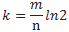
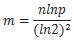

# Bloom Filters

Created: 2018-01-28 09:33:59 +0500

Modified: 2019-12-30 15:56:07 +0500

---

A**Bloom filter**is a space-efficient[probabilistic](https://en.wikipedia.org/wiki/Probabilistic)[data structure](https://en.wikipedia.org/wiki/Data_structure), conceived by[Burton Howard Bloom](https://en.wikipedia.org/w/index.php?title=Burton_Howard_Bloom&action=edit&redlink=1)in 1970, that is **used to test whether an[element](https://en.wikipedia.org/wiki/Element_(mathematics))is a member of a[set](https://en.wikipedia.org/wiki/Set_(computer_science))**.[False positive](https://en.wikipedia.org/wiki/Type_I_and_type_II_errors)matches are possible, but[false negatives](https://en.wikipedia.org/wiki/Type_I_and_type_II_errors)are not -- in other words, a query returns either "possibly in set" or "definitely not in set". Elements can be added to the set, but not removed (though this can be addressed with a "counting" filter); the more elements that are added to the set, the larger the probability of false positives. So if our design can tolerate false positive then we should consider using bloom filters because it's very space efficient.
-   Fast, compressed storage-free data structure used to check for set membership
-   Implemented as a set of hash functions pointing to locations in a bit array
-   No Retrieval
-   No Removal
**Applications -**

1.  Checking availability of username is a set membership problem, where the set is the list of all registered username. The price we pay for efficiency is that it is probabilistic in nature that means, there might be some False Positive results.**False positive means**, it might tell that given username is already taken but actually it's not.

2.  Early spellcheckers

3.  List of forbidden passwords

4.  Network routers
**Interesting Properties of Bloom Filters**
-   Unlike a standard hash table, a Bloom filter of a fixed size can represent a set with an arbitrarily large number of elements.
-   Adding an element never fails. However, the false positive rate increases steadily as elements are added until all bits in the filter are set to 1, at which point all queries yield a positive result.
-   Bloom filters never generate**false negative**result, i.e., telling you that a username doesn't exist when it actually exists.
-   Deleting elements from filter is not possible because, if we delete a single element by clearing bits at indices generated by k hash functions, it might cause deletion of few other elements. Example -- if we delete "geeks" (in given example below) by clearing bit at 1, 4 and 7, we might end up deleting "nerd" also Because bit at index 4 becomes 0 and bloom filter claims that "nerd" is not present.
A Bloom filter is a bit array of m bits initialized to 0. To add an element, feed it to k hash functions to get k array position and set the bits at these positions to 1. To query an element, feed it to k hash functions to obtain k array positions. **If any of the bits at these positions is 0, then the element is definitely not in the set.** If the bits are all 1, then the element might be in the set. A Bloom filter with 1% false positive rate only requires 9.6 bits per element regardless of the size of the elements.
**Bloom filter requires the following inputs:**

m: size of the bit array

n: estimated insertion

p: false positive probability
The optimum number of hash functions k can be determined using the formula:

{width="0.71875in" height="0.3333333333333333in"}

Given false positive probabilitypand the estimated number of insertionsn, the length of the bit array can be calculated as:

{width="0.7604166666666666in" height="0.40625in"}

The hash functions used for bloom filter should generally be faster than cryptographic hash algorithms with good distribution and collision resistance. Commonly used hash functions for bloom filter include Murmur hash, fnv series of hashes and Jenkins hashes. Murmur hash is the fastest among them. MurmurHash3 is used by Google Guava library's bloom filter implementation. 
The solution is we can't support Remove operation in this simple bloom filters. But if we really need to have a Removal functionality we can use a variation of the bloom filter known as"**Counting bloom filter**". The idea is simple. Instead of storing a single bit of values, we will store an integer value and our bit vector will then be an integer vector. This will increase the size and costs more space to gives us the Removal functionality. Instead of just marking a bit value to '1' when inserting a value, we will increment the integer value by 1. To check if an element exists, check if the corresponding indexes after hashing the element is greater than 0.
{width="7.479166666666667in" height="5.604166666666667in"}
**References -**

<https://www.geeksforgeeks.org/bloom-filters-introduction-and-python-implementation/>

<https://en.wikipedia.org/wiki/Bloom_filter>

<https://blog.medium.com/what-are-bloom-filters-1ec2a50c68ff>

<https://www.quora.com/What-are-the-best-applications-of-Bloom-filters>

Python Implentation - <https://diogodanielsoaresferreira.github.io/bloom-filter/>
