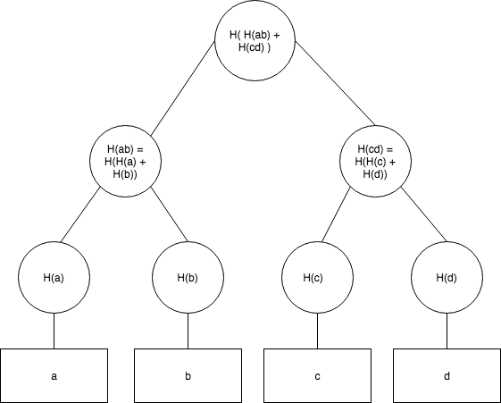

# Merkle Trees

Created: 2018-09-08 17:33:06 +0500

Modified: 2021-12-29 00:11:04 +0500

---

A merkle tree, also known as a binary hash tree, is a data structure used for efficiently summarizing and verifying the integrity of large sets of data.
A Merkle tree is a [hash-based data structure](https://brilliant.org/wiki/hash-based-data-structure/) that is a generalization of the [hash list](https://brilliant.org/wiki/hash-list/). It is a [tree](https://brilliant.org/wiki/trees-basic/) structure in which each leaf node is a hash of a block of data, and each non-leaf node is a hash of its children. Typically, Merkle trees have a branching factor of 2, meaning that each node has up to 2 children.
Merkle trees are used in distributed systems for efficient data verification. They are efficient because they use hashes instead of full files. Hashes are ways of encoding files that are much smaller than the actual file itself. Currently, their main uses are in [peer-to-peer networks](https://brilliant.org/wiki/peer-to-peer-networks/?wiki_title=peer-to-peer%20networks) such as Tor,[Bitcoin](https://brilliant.org/wiki/bitcoin/), and Git.

Image - A basic Merkle Tree. I've abbreviated the middle nodes as H(cd) and H(ab) respectively, but without this shorthand the root hash could also be called H(H(H(a) + H(b)) + H(H(c) +H(d)))
<https://brilliant.org/wiki/merkle-tree>

<https://hackernoon.com/merkle-tree-introduction-4c44250e2da7>
