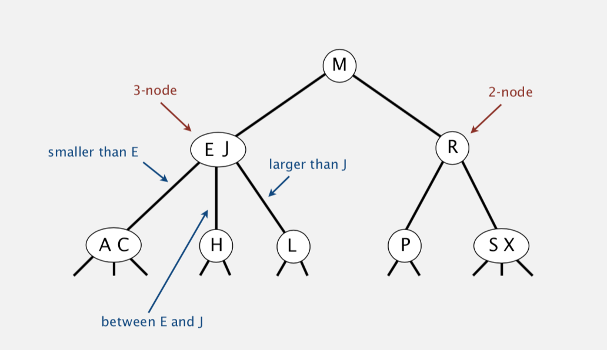

# 2-3 Search Trees

---

## Properties

- Every non-leaf is a 2-node or a 3-node. A 2-node contains one data item and has two children. A 3-node contains two data items and has 3 children.
- All leaves are at the same level (the bottom level)
- All data is kept in sorted order
- Every non-leaf node will contain 1 or 2 fields.**2-3 Tree**

Allow 1 or 2 keys per node -

- 2-node: one key, two children
- 3-node: two keys, three children

Symmetric order: Inorder traversal yields keys in ascending order

Perfect balance: Every path from root to null links has same length

Each transformation maintains symmetric order and perfect balance

## Search

・Compare search key against keys in node.

・Find interval containing search key.

・Follow associated link (recursively).

## Insertion into a 3-node at bottom

・Add new key to 3-node to create temporary 4-node.

・Move middle key in 4-node into parent.

・Repeat up the tree, as necessary.

・If you reach the root and it's a 4-node, split it into three 2-nodes.

## Height of a 2-3 tree increases only when root node of the tree splits

## Tree height

・Worst case: lg *N*. [all 2-nodes]

・Best case: log3 *N* ≈ .631 lg *N*. [all 3-nodes]

・Between 12 and 20 for a million nodes.

・Between 18 and 30 for a billion nodes.

Guaranteed logarithmic performance for search and insert

## Direct implementation is complicated, because

・Maintaining multiple node types is cumbersome.

・Need multiple compares to move down tree.

・Need to move back up the tree to split 4-nodes.

・Large number of cases for splitting.

