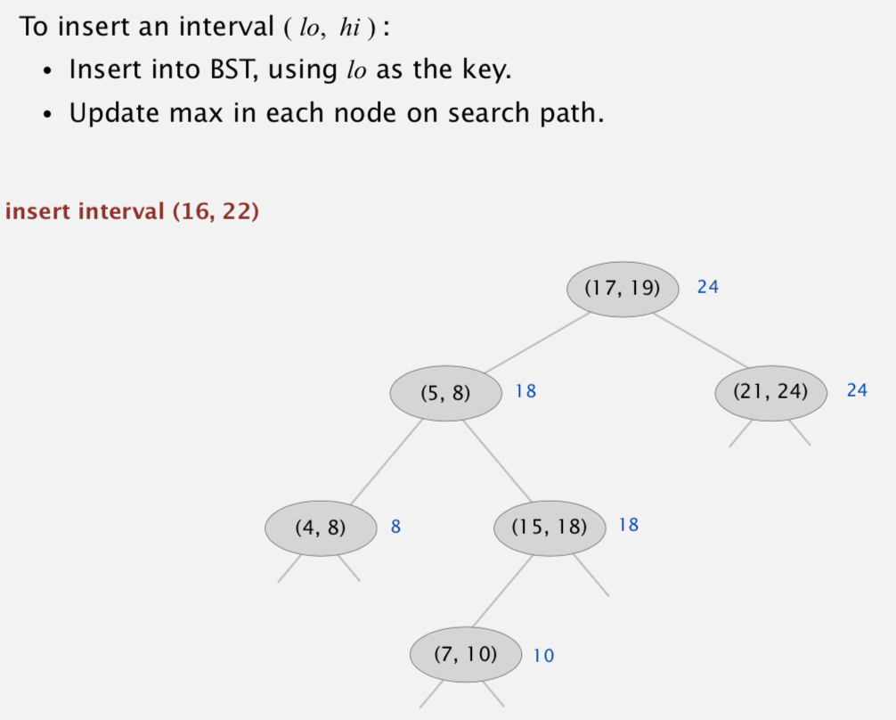
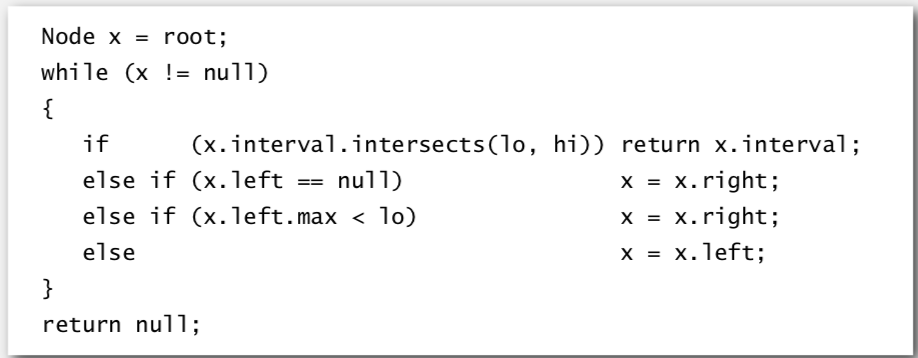

# Interval Search Tree

Created: 2018-02-06 20:08:03 +0500

Modified: 2018-02-07 08:20:57 +0500

---

Operations
-   Insert an interval
-   Search for an interval
-   Delete an interval
-   Interval intersection query: Given an interval (lo, hi), find all intervals (or one interval) in data structure that intersects (lo, hi)

**Implementation -** Use a red-black BST to guarantee performance
| operation                                          | brute | interval search tree | best in theory |
|---------------------------------|----------|------------------|-------------|
| insert interval                                    | 1     | log N                | log N          |
| find interval                                      | N     | log N                | log N          |
| delete interval                                    | N     | log N                | log N          |
| find any one interval that intersects (*lo*, *hi*) | N     | log N                | log N          |
| find all intervals that intersects (*lo*, *hi*)    | N     | R log N              | R + log N      |