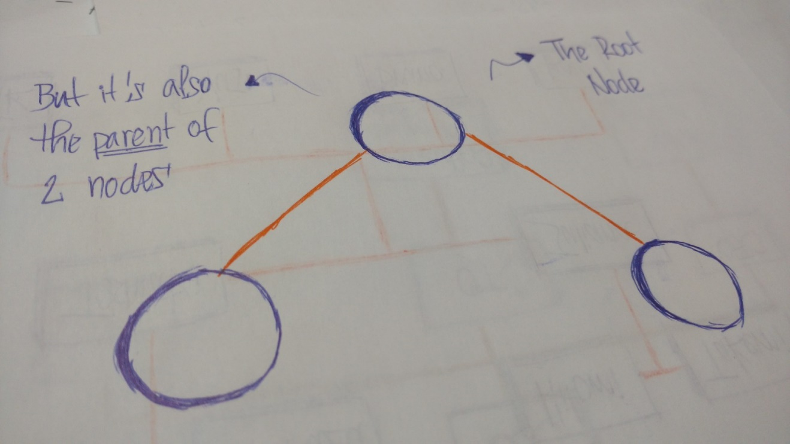
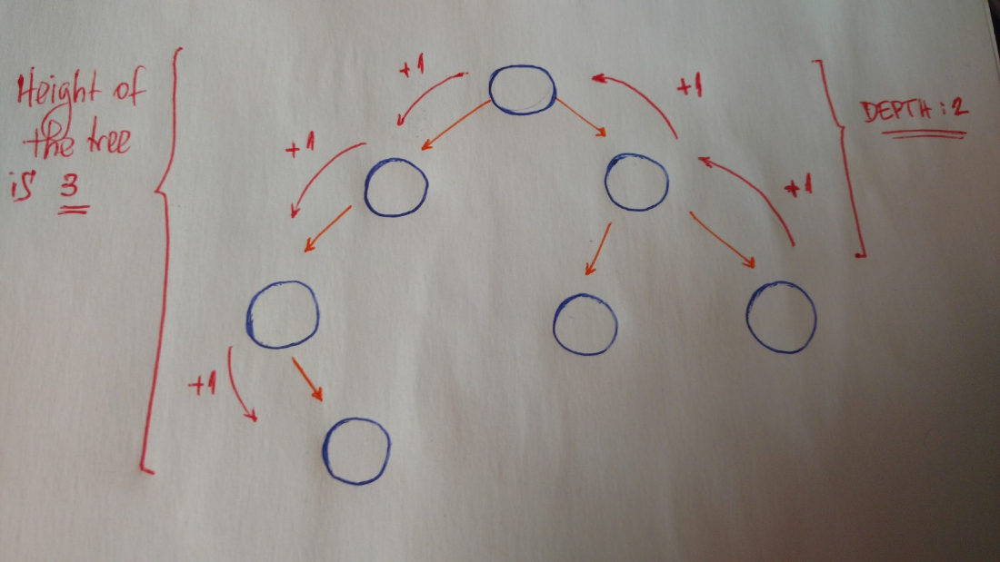
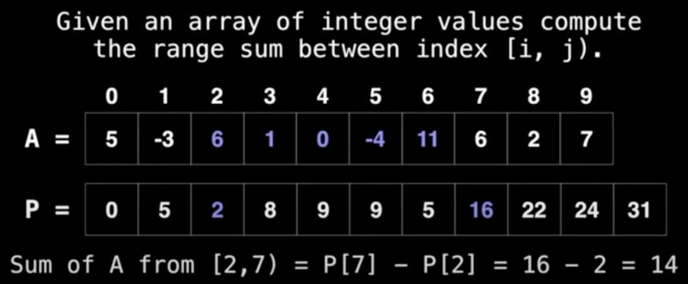
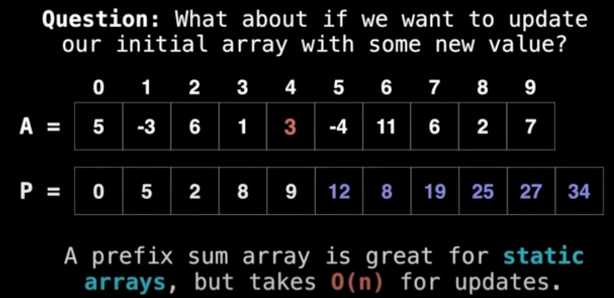

# Tree DS

Created: 2017-11-29 21:16:37 +0500

Modified: 2021-06-11 22:06:50 +0500

---

1. A Tree with N vertices has N-1 Edges

2. For a tree withnvertices andn -- 1edges, sum of all degrees should be2 * (n -- 1).3.  ***In a k-ary tree where every node has either 0 or k children, following property is always true.***

L = (k - 1)*I + 1
Where L = Number of leaf nodes
I = Number of internal nodes
4.  If tree is a complete binary tree, then total number of nodes at last level is (N+1)/2, where N is the total number of nodes.

    a.  If tree is a complete binary tree, then total number of nodes at last level is 2 ^ (N-1), where N is the depth of the tree starting from 1

## Complete tree - Perfectly balanced, except for bottom level

Property

- Height of complete tree with N nodes is floor(lg N)
- Height only increases when N is a power of 2
A tree is a collection of entities called nodes. Nodes are connected by edges. Each node contains a value or data, and it may or may not have a child node.

The first node of the tree is called the root. If this root node is connected by another node, the root is then a parent node and the connected node is a child.

All Tree nodes are connected by links called edges. It's an important part of trees, because it's manages the relationship between nodes.

Leaves are the last nodes on a tree. They are nodes without children. Like real trees, we have the root, branches, and finally the leaves.

Other important concepts to understand are height and depth.

The height of a tree is the length of the longest path to a leaf.

The depth of a node is the length of the path to its root.

Terminology summary

- Root is the topmost node of the tree
- Edge is the link between two nodes
- Child is a node that has a parent node
- Parent is a node that has an edge to a child node
- Leaf is a node that does not have a child node in the tree
- Height is the length of the longest path to a leaf
- Depth is the length of the path to its root

## Interview Question

- Find the height of a binary tree
- Find kth maximum value in a binary search tree
- Find nodes at "k" distance from the root
- Find ancestors of a given node in a binary tree

## Fenwick Tree (Binary Indexed Trees)

A**Fenwick tree**or**binary indexed tree**is a data structure that can efficiently update elements and calculate[prefix sums](https://en.wikipedia.org/wiki/Prefix_sum)in a table of numbers.
When compared with a flat array of numbers, the Fenwick tree achieves a much better balance between two operations: element update and prefix sum calculation. In a flat array ofnnumbers, you can either store the elements, or the prefix sums. In the first case, computing prefix sums requires linear time; in the second case, updating the array elements requires linear time (in both cases, the other operation can be performed in constant time). Fenwick trees allow both operations to be performed inO(log n)time. This is achieved by representing the numbers as a[tree](https://en.wikipedia.org/wiki/Tree_(data_structure)), where the value of each node is the sum of the numbers in that subtree. The tree structure allows operations to be performed using onlyO(log n)node accesses.

<https://en.wikipedia.org/wiki/Fenwick_tree>

<https://www.geeksforgeeks.org/binary-indexed-tree-or-fenwick-tree-2>
<https://www.geeksforgeeks.org/handshaking-lemma-and-interesting-tree-properties>
