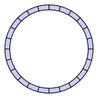

# Circular Buffer

Created: 2019-12-03 23:15:17 +0500

Modified: 2019-12-03 23:16:10 +0500

---

Acircular buffer,circular queue,cyclic bufferorring bufferis a[data structure](https://en.wikipedia.org/wiki/Data_structure)that uses a single, fixed-size[buffer](https://en.wikipedia.org/wiki/Buffer_(computer_science))as if it were connected end-to-end. This structure lends itself easily to buffering[data streams](https://en.wikipedia.org/wiki/Data_stream).

## Uses

The useful property of a circular buffer is that it does not need to have its elements shuffled around when one is consumed. (If a non-circular buffer were used then it would be necessary to shift all elements when one is consumed.) In other words, the circular buffer is well-suited as a[FIFO](https://en.wikipedia.org/wiki/FIFO_(computing_and_electronics))buffer while a standard, non-circular buffer is well suited as a[LIFO](https://en.wikipedia.org/wiki/LIFO_(computing))buffer.

Circular buffering makes a good implementation strategy for a[queue](https://en.wikipedia.org/wiki/Queue_(data_structure))that has fixed maximum size. Should a maximum size be adopted for a queue, then a circular buffer is a completely ideal implementation; all queue operations are constant time. However, expanding a circular buffer requires shifting memory, which is comparatively costly. For arbitrarily expanding queues, a[linked list](https://en.wikipedia.org/wiki/Linked_list)approach may be preferred instead.

In some situations, overwriting circular buffer can be used, e.g. in multimedia. If the buffer is used as the bounded buffer in the[producer-consumer problem](https://en.wikipedia.org/wiki/Producer-consumer_problem)then it is probably desired for the producer (e.g., an audio generator) to overwrite old data if the consumer (e.g., the[sound card](https://en.wikipedia.org/wiki/Sound_card)) is unable to momentarily keep up. Also, the[LZ77](https://en.wikipedia.org/wiki/LZ77)family of lossless data compression algorithms operates on the assumption that strings seen more recently in a data stream are more likely to occur soon in the stream. Implementations store the most recent data in a circular buffer.
<https://en.wikipedia.org/wiki/Circular_buffer>

